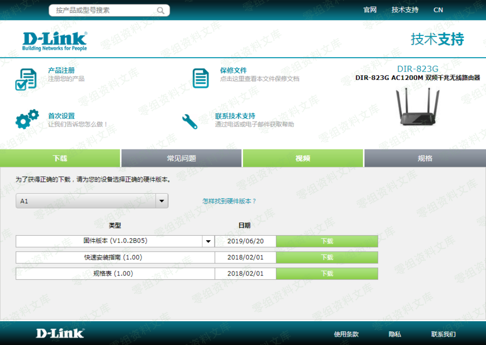
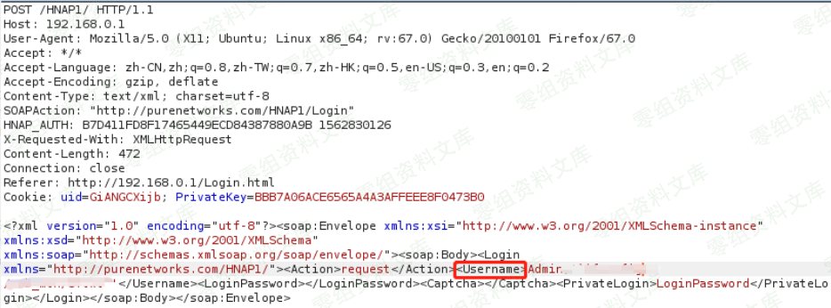
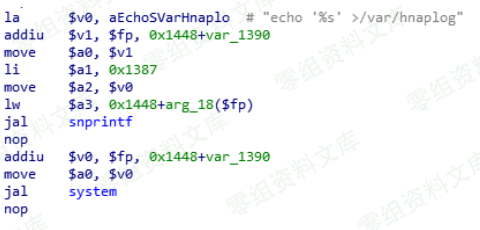
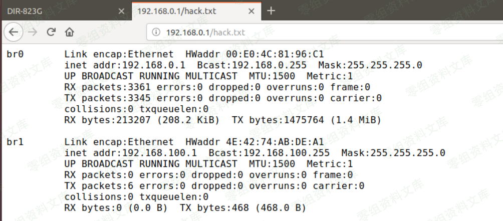

# （CVE-2019-15529）D-Link DIR-823G

<!-- article-review:devices:begin -->
## 技术校订与证据边界（2026-10-02）

- 产品/组件：D-Link DIR823G A1 FW102B05
- 本文讨论：CVE-2019-15529 HNAP用户名命令注入
- 版本、权限与配置前提：登录请求username字段，具体认证顺序未文本给出
- 资料类型：摄像路由固件截图复现；本次仅核对归档正文，未执行 PoC、未请求目标，未把原作者的“复现成功”继承为本库验证结果

### 逐项校订

- 无H1，攻击载荷/细节/落文件全部图片，文本无法核对请求
- 通过注入进行登录与命令执行关系未解释，缺修复信息
- 已落实的文本修订：补齐文章标题。上列仍描述旧文问题时，以此落实项及下列限定为准；修订不代表运行验证

### 操作风险与恢复

- 执行文中载荷可能以目标进程权限启动命令或加载代码；权限受认证角色、操作系统账户及依赖版本约束，不能把 root/200 等通用字符串当成功证据

### 待核与来源

- CVE真实性/参数、图证与补丁待核
- 引用图片未查看，截图内容及有效性待核验
- 文内原始链接和图片引用继续保留；未检查图片像素、未下载或执行外部附件。版本边界、修复/在野状态及厂商归属若缺一手依据，均不能视为本次已确认
- 下方保留原技术正文与载荷；其中历史时间表述和成功主张应按本节限定阅读
<!-- article-review:devices:end -->

## 一、漏洞简介

D-Link DIR-823G是中国台湾友讯（D-Link）公司的一款无线路由器。 使用1.0.2B05版本固件的D-Link DIR-823G中的HNAP1存在命令注入漏洞。该漏洞源于外部输入数据构造可执行命令过程中，网络系统或产品未正确过滤其中的特殊元素。攻击者可利用该漏洞执行非法命令。

## 二、漏洞影响

DIR823GA1_FW102B05

## 三、复现过程

1.下载D-Link DIR-823G固件，http://support.dlink.com.cn/ProductInfo.aspx?m=DIR-823G

2.在固件版本为V1.0.2B05的D-Link DIR823G设备上存在一个问题，能偶通过用户名字段中注入命令进行登录。

3.攻击载荷

4.漏洞细节

5.写入文件

## 参考链接

> https://github.com/TeamSeri0us/pocs/blob/master/iot/dlink/823G-102B05-1.pdf