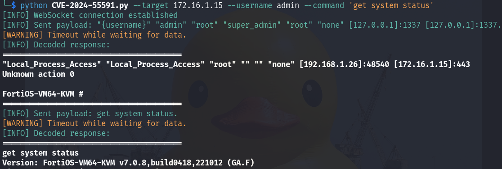

（CVE-2024-55591）Fortinet FortiOS/FortiProxy Node.js WebSocket 认证绕过漏洞
====================================================================

一、漏洞简介
------------

2025 年 1 月 14 日，Fortinet 发布安全公告 FG-IR-24-535，披露 FortiOS /
FortiProxy 管理界面的认证绕过漏洞 CVE-2024-55591。watchTowr Labs 在
公告当天即发布了可运行的公开 PoC，并确认该漏洞**在野被作为零日利用**；
CISA 随后将其列入 KEV 目录。

漏洞位于管理界面 Node.js WebSocket 模块：攻击者向 `/ws/cli/open` 发起
WebSocket 连接，通过**竞态条件向连接中注入认证上下文**，绕过身份验证，
以 super-admin 权限在 FortiGate CLI 上执行任意命令。CVSS 3.1 评分为
**9.8**（NVD；Fortinet 官方评级 9.6）。

*上图：watchTowr PoC 成功绕过认证并执行 `get system status`（来源：
watchTowr 公开 PoC 仓库，已本地化保存）。*

二、漏洞影响
------------

-   产品：Fortinet FortiOS（FortiGate）、FortiProxy
-   版本：**FortiOS 7.0.0–7.0.16；FortiProxy 7.0.0–7.0.19、7.2.0–7.2.12**
    （修复版：FortiOS 7.0.17+、FortiProxy 7.0.20+/7.2.13+，以 Fortinet
    官方公告为准）
-   组件/攻击向量：远程，管理界面（HTTPS 443）Node.js WebSocket 模块，
    `/ws/cli/open` 连接竞态注入认证上下文
-   前提条件：无，攻击者无需任何凭证；管理界面需暴露在网络可达位置

三、复现过程
------------

### 漏洞分析

FortiOS 管理界面的 WebSocket CLI 通道在处理 `/ws/cli/open` 连接时，
认证状态与连接建立存在竞态窗口。攻击者通过大量并发 WebSocket 连接
进行暴力竞态，可将一个已认证的会话上下文"注入"到未认证的连接中，
从而在未提供任何凭证的情况下获得 super-admin CLI 会话，直接执行
任意 FortiOS 命令。watchTowr 的技术文章对该竞态机制有完整分析。

### PoC（来源：https://github.com/watchtowrlabs/fortios-auth-bypass-poc-CVE-2024-55591，仅限授权测试）

仓库 README 已实际打开验证（HTTP 200），PoC 可运行：

    python CVE-2024-55591-PoC.py --host 192.168.1.5 --port 443 --command "get system status" --user watchTowr --ssl

脚本先做预检（确认目标为 FortiOS 管理界面），随后发起 WebSocket
竞态连接；成功后回显 `FAKESERIAL #` 提示符并执行指定 CLI 命令。
注意：该脚本的预检逻辑面向 FortiGate 管理界面，FortiProxy 需自行
适配，但底层技术同样适用。

四、修复建议
------------

1.  升级到修复版本（FortiOS 7.0.17+ / FortiProxy 7.0.20+ / 7.2.13+）；
2.  管理界面不要暴露在互联网，如必须远程管理，限制源 IP 并配合 VPN；
3.  检查管理日志中是否存在异常的 `/ws/cli/open` 高频连接、未知来源的
    super-admin 会话，按 watchTowr 文章中的 IoC 做排查。

### 附录

参考链接：

-   Fortinet 公告 FG-IR-24-535：https://www.fortiguard.com/psirt/FG-IR-24-535
-   watchTowr 技术分析：https://labs.watchtowr.com/（CVE-2024-55591 相关文章）
-   公开 PoC：https://github.com/watchtowrlabs/fortios-auth-bypass-poc-CVE-2024-55591
