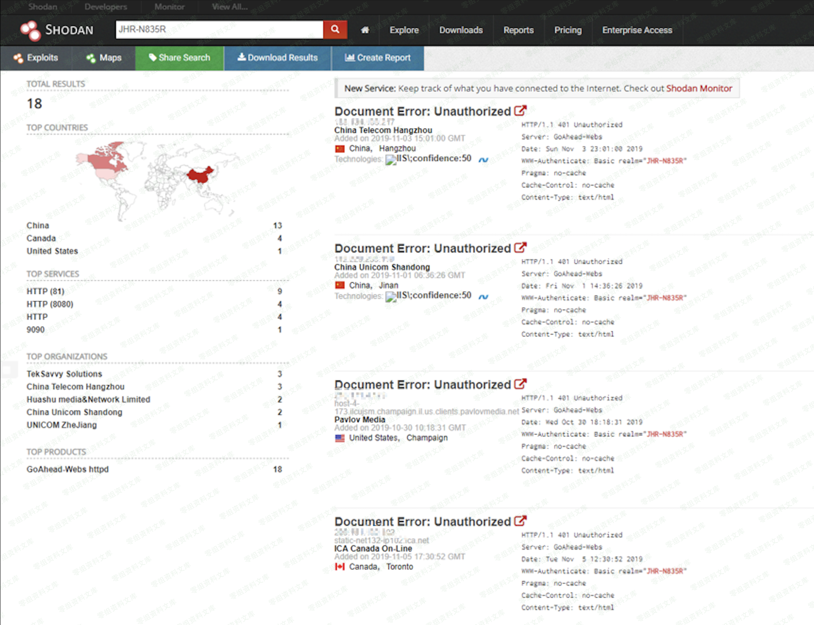
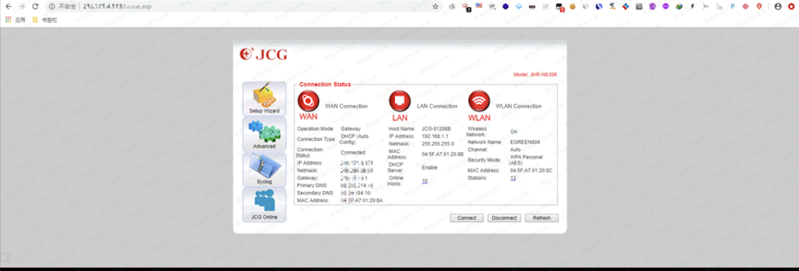
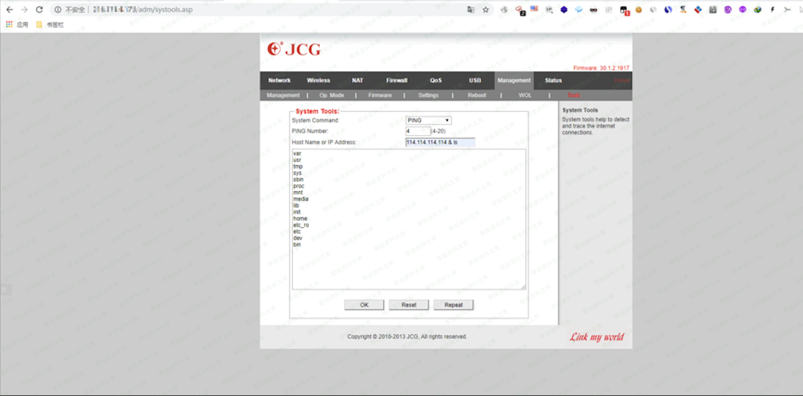

# JCG路由器命令执行漏洞

<!-- article-review:devices:begin -->
## 技术校订与证据边界（2026-10-02）

- 产品/组件：JCG路由器，型号未给
- 本文讨论：后台系统工具命令执行，根因未写
- 版本、权限与配置前提：默认admin/admin登录；固件未知
- 资料类型：图片依赖复现笔记；本次仅核对归档正文，未执行 PoC、未请求目标，未把原作者的“复现成功”继承为本库验证结果

### 逐项校订

- 几乎全部触发和结果在图片，文字未说明是否ping注入或正常管理功能
- 保留了公网实例IP，应替换实验地址；Shandan拼写错误
- 漏洞环境节为空、无原始出处、型号版本

### 操作风险与恢复

- 执行文中载荷可能以目标进程权限启动命令或加载代码；权限受认证角色、操作系统账户及依赖版本约束，不能把 root/200 等通用字符串当成功证据

### 待核与来源

- 图片未检不能认定同JHR-N835R入口；无文字证据验证漏洞
- 引用图片未查看，截图内容及有效性待核验
- 文内原始链接和图片引用继续保留；未检查图片像素、未下载或执行外部附件。版本边界、修复/在野状态及厂商归属若缺一手依据，均不能视为本次已确认
- 下方保留原技术正文与载荷；其中历史时间表述和成功主张应按本节限定阅读
<!-- article-review:devices:end -->

### 漏洞环境

### 漏洞复现

Shandan上搜到相关信息

选择一个测试：http://216.171.4.173/home.asp

默认密码：admin/admin

在系统工具中可执行命令

如图

