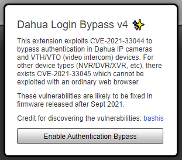

# （CVE-2021-33044）大华设备认证绕过漏洞

<!-- article-review:devices:begin -->
## 技术校订与证据边界（2026-10-02）

- 产品/组件：Dahua摄像机/对讲及录像机
- 本文讨论：CVE-2021-33044主、33045关联认证绕过
- 版本、权限与配置前提：声称2021年9月前固件；Web可达；扩展仅33044
- 资料类型：双CVE公告与扩展使用指南；本次仅核对归档正文，未执行 PoC、未请求目标，未把原作者的“复现成功”继承为本库验证结果

### 逐项校订

- 月份前后不是严格所有型号修复矩阵，2021年9月之后全部修复过度泛化
- 将根因写前端认证状态，真正服务端信任特制报文需说明，不是改UI即可绕过
- 源码jamesjaq与release bp2008不同repo关系/版本未解释，无具体报文
- 两CVE应分别建实体，不将33045也标为扩展可利用；图片损坏为作者历史描述未独立核实

### 操作风险与恢复

- 本篇未提供足以确认无副作用的完整验证流程；应依正文所述配置、权限与交互前提评估，不能把通告或截图当成可直接运行的检测脚本

### 待核与来源

- 真实发布日期/受影响产品矩阵/扩展对应版本待核
- 引用图片未查看，截图内容及有效性待核验
- 文内原始链接和图片引用继续保留；未检查图片像素、未下载或执行外部附件。版本边界、修复/在野状态及厂商归属若缺一手依据，均不能视为本次已确认
- 下方保留原技术正文与载荷；其中历史时间表述和成功主张应按本节限定阅读
<!-- article-review:devices:end -->

一、漏洞简介
------------

2021年9月，安全研究员 bashis（mcw0）发现大华（Dahua）设备认证实现缺陷：攻击者伪造认证报文即可无需密码直接登录设备，对应 CVE-2021-33044（IP 摄像头 / VTH / VTO 可视对讲设备）与 CVE-2021-33045（NVR / DVR / XVR 录像机）。

其中 CVE-2021-33044 可用普通浏览器配合 Chrome 扩展直接利用；CVE-2021-33045 影响录像机类设备，不能用普通浏览器完成利用。2021年9月之后发布的固件已修复。

二、漏洞影响
------------

-   产品：大华 IP 摄像头、VTH/VTO 可视对讲（CVE-2021-33044）；大华 NVR / DVR / XVR（CVE-2021-33045）
-   版本：**2021年9月之前发布的固件**（修复版：2021年9月之后固件）
-   组件/攻击向量：Web 登录认证逻辑，伪造认证报文绕过密码校验
-   前提条件：网络可达设备 Web 登录页面

三、复现过程
------------

### 漏洞分析

设备前端登录流程中，认证状态的判定存在逻辑缺陷：攻击者构造特定的认证报文即可让设备误认为已通过身份验证，从而直接进入管理界面，无需知道任何账号密码。

### PoC（来源：https://github.com/jamesjaq/dahualoginbypass，仅限授权测试）

Chrome 扩展安装步骤（扩展包见 https://github.com/bp2008/DahuaLoginBypass/releases）：

1.  下载 release 的 `.zip` 并解压到本地；
2.  打开 `chrome://extensions`，开启右上角**开发者模式**；
3.  点击"加载已解压的扩展程序"，选择解压出的 DahuaLoginBypass 文件夹；
4.  打开目标大华 IP 摄像头的登录页面，点击地址栏右侧的扩展图标，面板中会出现新的登录按钮，点击即可以绕过认证登录。

四、修复建议
------------

1.  升级到 2021年9月之后发布的大华官方固件；
2.  不要将摄像头/录像机 Web 界面暴露在公网，确需远程访问请走 VPN；
3.  排查设备用户列表与日志，确认是否存在未知登录行为。

### 附录

参考链接：

-   扩展源码：https://github.com/jamesjaq/dahualoginbypass
-   扩展 release 包：https://github.com/bp2008/DahuaLoginBypass/releases
-   漏洞详情（PacketStorm）：https://packetstormsecurity.com/files/164423/Dahua-Authentication-Bypass.html

图片说明：原仓库 README 中的第一张图标截图（136862312）下载后仅 486 字节已损坏，予以舍弃；上图为扩展注入登录面板后的截图。
