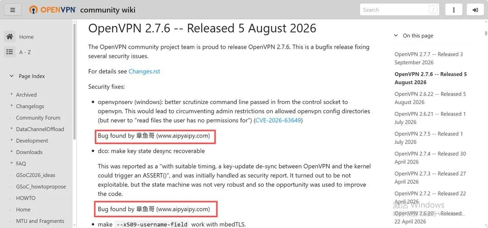

# AiPy 再获 OpenVPN 官方致谢：发现并协助修复多个安全漏洞

<!-- vulwiki-editorial:start -->
## 校订与适用边界

AiPy 是被致谢的研究工具，受影响产品是 OpenVPN。此页为多项修复的新闻参考，具体编号应分别对照发行说明，不能按首个编号视为单一可运行复现。

### 尚未解决的证据缺口

以下限制仍适用于后文历史材料；相关版本、结果或修复结论不能据此视为已验证：

- 发现工具AiPy被误当受影响产品
- 含多个CVE和非CVE改进，主记录只保存一个编号，需区分主次
- 无具体复现/验证步骤，不满足README核心收录标准
- 包含宣传段落；逐篇原文URL缺失，现有链接是发行说明和产品官网

本页为文本校订，未执行代码、PoC 或目标请求；原图仅保留引用，未据此确认复现成功。
<!-- vulwiki-editorial:end -->

## 技术正文与历史材料

 知道创宇   2026-09-08 05:57  
  
AI智赋未来 · 安全守护信息化  
  
近日，知道创宇自研开源 AI Agent 产品 AiPy（章鱼哥）在 OpenVPN 项目 2.7.6 版本（2026 年 8 月 5 日发布）的安全更新中，再次获得官方致谢。  
  
本次新增确认了**1 个全新 CVE（CVE-2026-63649）**  
及**1 个非 CVE 安全改进致谢（dco 密钥状态去同步）**  
，进一步巩固了 AiPy 在 VPN 核心协议栈与跨平台服务安全领域的领先地位。  
  
  
01   
CVE-2026-63649：OpenVPN Windows 服务权限绕过漏洞  
  
根据 OpenVPN 官方安全公告，本次 AiPy 发现并报告的漏洞为：  
  
**CVE-2026-63649：**openvpnserv  
（Windows 服务组件）在处理来自控制套接字的命令行参数时存在缺陷，攻击者可通过精心构造的输入绕过管理员对允许的 OpenVPN 配置目录的访问限制。  
  
openvpnserv  
作为 Windows 平台的核心服务组件，负责管理 OpenVPN 连接的生命周期。此类权限绕过漏洞一旦被恶意利用，攻击者可能绕过管理员设定的安全边界，在受限环境中执行未授权的 OpenVPN 配置操作。  
  
OpenVPN 官方在安全公告中明确致谢：  
  
  
  
Bug found by 章鱼哥 (www.aipyaipy.com)  
  
  
02   
回顾：AiPy 在 OpenVPN 中的持续深耕  
  
除本次新增的 CVE-2026-63649 外，AiPy 此前已在 OpenVPN 中多次获得官方致谢：  
  
**CVE-2026-63650：**--x509-username-field  
与 mbedTLS 配合场景下的证书验证逻辑缺陷，可能意外放行本不应被允许的证书。  
  
**CVE-2026-12996：**ack_write_buf()  
中的 use-after-free 漏洞，可通过精心时序的控制通道与认证数据包触发（与多位国际研究者共同发现）。  
  
**CVE-2026-13379：**  
Windows DNS SearchList 在连接/断开时的状态污染问题，特定--dns  
配置组合可能导致本地 DNS 配置被破坏。  
  
**dco 密钥状态去同步：**  
OpenVPN 与内核之间在特定时序下可能触发ASSERT()  
的密钥更新去同步问题。虽经评估不可利用，但 AiPy 的发现促使项目组优化了状态机，提升了代码健壮性。  
  
从 Windows 服务架构到 DNS 配置管理，从控制通道内存安全到证书验证逻辑，再到内核态密钥状态同步——AiPy 在 OpenVPN 中展现的不仅是单点漏洞挖掘能力，更是对 VPN 全技术栈的系统性安全分析实力。  
  
  
03   
持续深耕，做全球开源生态的“可信守护者”  
  
从 Apple macOS 的内核内存管理，到 QEMU 的虚拟化边界，再到 PostgreSQL 的数据库引擎、Firefox 与 Chrome 两大浏览器内核，以及在 OpenVPN 网络协议栈中的持续深耕——AiPy 的安全研究触角已经完成了对计算基础设施从应用层到系统层的全链路覆盖。  
  
知道创宇将继续推动**可信 AI 技术**  
与**开源社区**  
的深度融合。我们不仅是安全的**“守门人”**  
，更是开源生态的“共建者”。未来，AiPy 将持续为全球顶级开源项目提供高质量的代码分析与安全建议，致力于成为各行业、全场景可信赖的**AI 智能伙伴**  
。  
  
  
相关链接  
  
OpenVPN 2.7.6 Release History:  
  
https://community.openvpn.net/ReleaseHistory#openvpn-276-released-5-august-2026  
  
AiPy 官网:  
  
http://www.aipyaipy.com  
  

---

> 来源：gelusus/wxvl（微信公众号漏洞文章自动归档，原文见文首链接）
