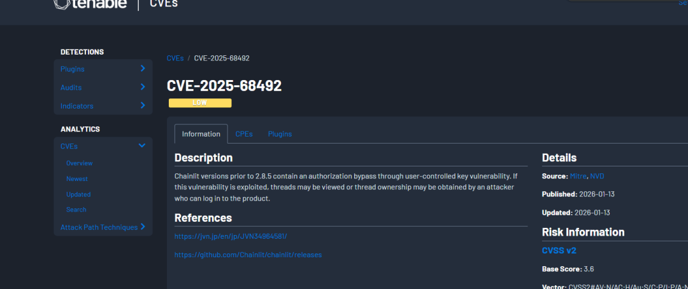

# Chainlit 被曝访问控制漏洞：已登录用户可非法查看并劫持他人对话线程（CVE-2025-68492）

<!-- vulwiki-editorial:start -->
## 校订与适用边界


### 本次正文校订

- 按实际内容修正 1 处代码围栏语言标记，保留其中方法与请求内容。

### 尚未解决的证据缺口

以下限制仍适用于后文历史材料；相关版本、结果或修复结论不能据此视为已验证：

- 已登录及已知他人thread_id前提清楚但未metadata
- 未给重连WebSocket消息/实际验证方法
- 线程ID可预测仅假设不能当事实
- CVSS3/4多个分值需向量/评分来源
- 版本2.8.5和JVN应链接具体公告，非releases总页
- 夸张修辞/重复空白可缩减

本页为文本校订，未执行代码、PoC 或目标请求；原图仅保留引用，未据此确认复现成功。
<!-- vulwiki-editorial:end -->

## 技术正文与历史材料

云梦DC
                    云梦DC  云梦安全   2026-01-28 01:00  
  
如果你用 Chainlit 做过多用户 AI 对话系统，  
  
那这条漏洞信息，**你不能当没看见。**  
  
  
  
****  
近日，日本 JVN（JPCERT/CC）披露：  
  
👉 **Chainlit 存在访问控制缺陷（CVE-2025-68492）**  
  
👉 **已登录用户可越权查看、接管他人对话线程**  
  
👉 **本质是一次典型的“横向权限提升”**  
  
这不是“信息显示异常”，  
  
而是**权限边界被打穿**  
。  
## 一、Chainlit 是什么？为什么这个洞值得被单独点名  
  
Chainlit 是一个**用于构建对话式 AI 应用的开源框架**  
，  
  
很多开发者用它来：  
- 快速搭 ChatGPT 式 UI  
  
- 构建内部 AI 助手  
  
- 做原型、Demo，甚至直接上线服务  
  
它的一个重要能力是：  
  
👉 **支持多用户 + 保存 / 恢复聊天线程**  
  
而这次的漏洞，  
**正是出在“多用户线程管理”这里。**  
## 二、漏洞一句话说明（先给结论）  
  
**在受影响版本中：**  
> 只要你是一个“已登录用户”，  
  
只要你知道（或猜到）别人的线程 ID，  
**就可以直接恢复、查看、甚至接管对方的对话线程。**  
  
  
不校验线程归属，不验证所有权。  
  
这在安全上有一个非常标准的名字👇  
  
👉 **CWE-639：用户控制的密钥导致授权绕过**  
## 三、这到底能干什么？不是“偷看聊天”这么简单  
### 1️⃣ 未经授权查看他人对话（信息泄露）  
  
在企业或团队环境中，对话里可能包含：  
- 内部方案  
  
- 代码片段  
  
- 业务数据  
  
- 个人信息  
  
这个漏洞意味着：  
**内部任意一个普通用户，都可能看到这些内容。**  
### 2️⃣ 更危险的：线程劫持（所有权被夺走）  
  
问题不止“看”。  
  
Chainlit 的逻辑是：  
  
👉 **谁连接上线程，谁就成了当前活跃控制者**  
  
所以攻击者可以：  
- 以“原用户身份”继续对话  
  
- 向 AI 发送新的指令  
  
- 污染、篡改原有对话上下文  
  
从效果上看，这已经接近**会话劫持**  
。  
## 四、攻击是怎么发生的？现实场景并不复杂  
  
一个典型攻击流程是这样的：  
1. 攻击者 A 正常登录 Chainlit  
  
1. 获取或猜测到用户 B 的线程 ID  
  
1. 通过前端或 WebSocket 请求恢复该线程  
  
1. **服务器未校验线程是否属于 A**  
  
1. 直接返回 B 的完整对话内容，并授予控制权  
  
如果线程 ID 是连续的、可预测的，  
  
攻击难度会进一步降低。  
  
  
  
## 五、为什么 CVSS 只有 4.2？但你不能掉以轻心  
  
官方给出的评级是：  
- **CVSS v3.0：4.2（中等）**  
  
- **CVSS v4.0：2.3（低）**  
  
原因很现实：  
- 攻击者必须是已登录用户  
  
- 必须知道目标线程 ID  
  
**但问题在于——**  
> 这是一个“内部攻击模型”的漏洞  
  
在多用户系统里，风险并不低  
  
  
尤其是：  
- 内部 AI 工具  
  
- 公司内部部署  
  
- 多部门共用系统  
  
**这个洞，一旦被人盯上，横向影响非常大。**  
## 六、根因在哪？几行代码级别的失误  
  
问题出在 Chainlit 的 **WebSocket 线程重连逻辑**  
中：  
- 服务端只校验“是否登录”  
  
- **未校验“是否是线程所有者”**  
  
- 用户可直接指定 thread_id  
 进行连接  
  
这是典型的：  
> **信任了用户可控参数，却没做资源级授权校验**  
  
  
修复方案也很直接：  
  
👉 **在连接线程前，强制校验线程归属**  
## 七、哪些版本受影响？  
  
📌 **Chainlit 2.8.5 之前的所有版本**  
- 包括 2.8.4 及更早版本  
  
- 官方已在 **2.8.5**  
 中修复  
  
## 八、官方建议 & 实际应对  
### ✅ 最优解（强烈建议）  
```shell
pip install -U chainlit
```  
  
升级到 **2.8.5 或更高版本**  
### ⚠️ 如果暂时无法升级（临时止血）  
- 暂时关闭/限制线程恢复功能  
  
- 加强日志监控（异常 thread_id 访问）  
  
- 内部明确告知风险，防止“好奇型滥用”  
  
但说实话：  
**这些都只是权宜之计。**  
## 九、这个漏洞真正给我们的提醒  
  
这次事件再次说明了一件老生常谈、但总被忽略的事：  
> **“已登录 ≠ 已授权”**  
**“能访问接口 ≠ 有权访问资源”**  
  
  
哪怕是 AI 框架、UI 工具，  
  
只要涉及多用户，  
**访问控制就是生命线。**  
  
github：  
https://github.com/Chainlit/chainlit/releases  
  


---

> 来源：gelusus/wxvl（微信公众号漏洞文章自动归档，原文见文首链接）
