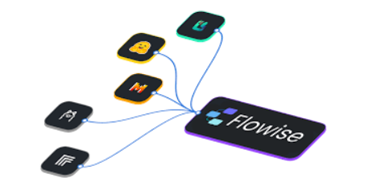

# 攻击者利用 Flowise 严重漏洞 CVE-2025-59528 实现远程代码执行

<!-- vulwiki-editorial:start -->
## 校订与适用边界

### 尚未解决的证据缺口

以下限制仍适用于后文历史材料；相关版本、结果或修复结论不能据此视为已验证：

- API token前提只在正文，metadata缺少鉴权
- 在野利用与暴露数量无直接证据URL/时间字段
- 无PoC/请求/验证方法，原始报道URL缺失
- 正文另外两个CVE为背景，需防止污染主编号

本页为文本校订，未执行代码、PoC 或目标请求；原图仅保留引用，未据此确认复现成功。
<!-- vulwiki-editorial:end -->

## 技术正文与历史材料

鹏鹏同学
                    鹏鹏同学  黑猫安全   2026-04-08 00:52  
  
  
  
  
攻击者正在积极利用 Flowise 中的一个严重漏洞（编号 CVE-2025-59528）进行攻击，该漏洞允许远程代码执行和文件系统访问。该漏洞源于对配置函数中用户提供的 JavaScript 进行不当验证，使系统面临全面沦陷的风险。  
  
Flowise 是一个开源平台，允许用户构建和管理定制化的 LLM（大语言模型）工作流和自主代理。它提供拖放界面来设计 AI 流程、连接模型以及集成外部工具或 API，无需深入的编程知识。本质上，它简化了创建 AI 驱动的应用程序和自动化流程的过程。  
  
Flowise 中的 CustomMCP 节点允许用户配置与外部 MCP 服务器的连接，但它不安全地处理 mcpServerConfig 输入。系统不对其进行验证，而是将其作为 JavaScript 执行。convertToValidJSONString 函数将用户输入直接传递给 Function() 构造函数，以完整的 Node.js 权限运行。这允许访问敏感模块如 child_process 和 fs，从而实现命令执行和文件系统访问，使该漏洞极其危险。  
  
该漏洞允许攻击者在 Flowise 服务器上运行任意 JavaScript，导致系统完全沦陷、文件访问、命令执行和数据窃取。由于利用该漏洞仅需 API 令牌，因此对业务运营和敏感客户数据构成严重威胁。  
  
该漏洞影响 Flowise 3.0.5 及以下版本，已在 2025 年 9 月发布的 3.0.6 版本中修复。  
  
VulnCheck 检测到 CVE-2025-59528 的首次利用活动，活动似乎来自单个 Starlink IP，目前有 12,000 至 15,000 个实例暴露在网上。  
  
CVE-2025-59528 是继 CVE-2025-8943（CVSS 评分：9.8）和 CVE-2025-26319（CVSS 评分：8.9）之后，第三个被积极利用的 Flowise 漏洞。  
  
  

---

> 来源：gelusus/wxvl（微信公众号漏洞文章自动归档，原文见文首链接）
