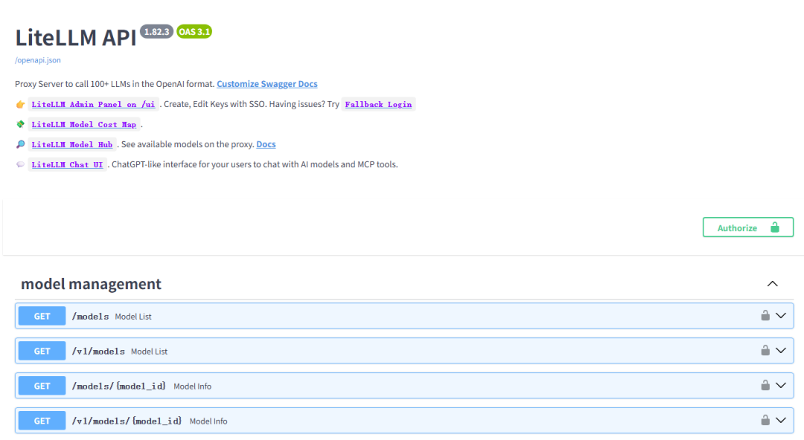
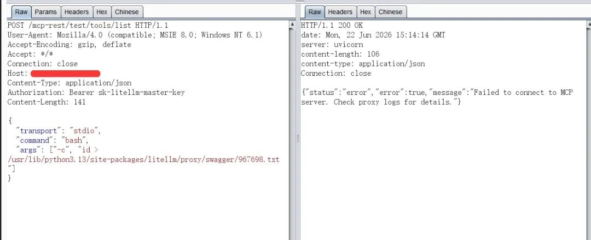
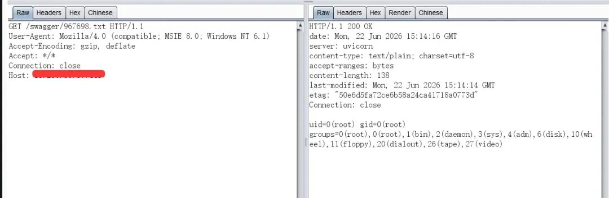
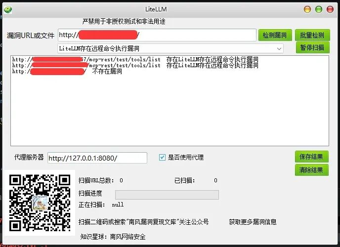
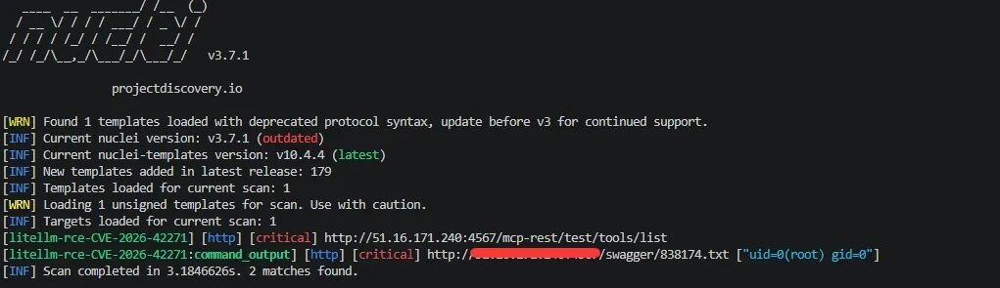

# LiteLLM存在远程命令执行漏洞CVE-2026-42271 附POC

<!-- vulwiki-editorial:start -->
## 校订与适用边界

### 尚未解决的证据缺口

以下限制仍适用于后文历史材料；相关版本、结果或修复结论不能据此视为已验证：

- 标题附PoC但正文仅截图/付费工具宣传
- 影响仅产品名，修复1.83.7需核
- API key/角色前提
- 命令白名单含解释器须正确界定
- FOFA未metadata

本页为文本校订，未执行代码、PoC 或目标请求；原图仅保留引用，未据此确认复现成功。
<!-- vulwiki-editorial:end -->

## 技术正文与历史材料

2026-6-22更新
                    2026-6-22更新  南风漏洞复现文库   2026-06-22 15:47  
  
   
  
#   
  
免责声明：请勿利用文章内的相关技术从事非法测试，由于传播、利用此文所提供的信息或者工具而造成的任何直接或者间接的后果及损失，均由使用者本人负责，所产生的一切不良后果与文章作者无关。该文章仅供学习用途使用。  
## 1. LiteLLM简介  
  
微信公众号搜索：南风漏洞复现文库  
  
该文章 南风漏洞复现文库 公众号首发  
  
LiteLLM 是开源 Python 库  
## 2.漏洞描述  
  
LiteLLM 是开源 Python 库，作为 AI 网关代理服务器提供统一接口调用多种大语言模型 API。受影响版本中，POST /mcp-rest/test/connection 和 POST /mcp-rest/test/tools/list 这两个端点在处理 MCP 服务器配置时，接受了完整的 stdio 传输配置（包括 command、args、env 字段），且仅需有效的代理 API 密钥即可访问，缺少角色检查和命令白名单验证。攻击者可通过构造恶意 command 参数在代理主机上以代理进程权限执行任意系统命令。修复版本中通过在 litellm.proxy._types 模块的 validate_transport_fields 函数中添加命令白名单校验，并在 rest_endpoints.py 中为两个测试端点添加 PROXY_ADMIN 角色检查，实现了纵深防御策略，仅允许白名单中的命令（npx、uvx、python、python3、node、docker、deno）通过 stdio 传输执行。  
  
CVE编号:CVE-2026-42271  
  
CNNVD编号:  
  
CNVD编号:  
## 3.影响版本  
  
LiteLLM  
  
  
  
LiteLLM存在远程命令执行漏洞  
## 4.fofa查询语句  
  
app="LiteLLM-API"  
## 5.漏洞复现  
  
  
执行id命令，并写入文件  
  
  
  
  
访问写入的文件  
  
  
  
## 6.POC&EXP  
  
本期漏洞及往期漏洞的批量扫描POC及POC工具箱已经上传知识星球：南风网络安全  
  
  
1: 更新poc批量扫描软件，承诺，一周更新8-14个插件吧，我会优先写使用量比较大程序漏洞。  
  
  
2: 免登录，免费fofa查询。  
  
  
3: 更新其他实用网络安全工具项目。  
  
  
4: 免费指纹识别，持续更新指纹库。  
  
  
5: Nuclei脚本。  
  
  
  
  
  
  
  
  
  
  
  
  
  
  
  
  
  
  
  
  
  
  
  
## 7.整改意见  
  
将组件 litellm 升级至 1.83.7 及以上版本  
## 8.往期回顾  
  
  
   
  
  
[天地伟业Easy7 queryDataByTypeEx接口存在SQL注入漏洞 附POC](https://mp.weixin.qq.com/s?__biz=MzIxMjEzMDkyMA==&mid=2247490613&idx=1&sn=ce3d88186c6d36467a912528c6e5ff9d&scene=21#wechat_redirect)  
  
  

---

> 来源：gelusus/wxvl（微信公众号漏洞文章自动归档，原文见文首链接）
